## In-Lab Task

### Task 1: Loading of Dataset and NumPy, Pandas Basics for Data Exploration


```python
import numpy as np

# ===========================
# Creating Arrays
# ===========================

arr1 = np.array([10, 20, 30, 40, 50])
print("1D Array:", arr1)

arr2 = np.array([[1, 2, 3],
                     [4, 5, 6]])
print("\n2D Array:\n", arr2)

# ===========================
# Special Arrays
# ===========================

print("\nZeros Array:")
print(np.zeros((2, 3)))

print("\nOnes Array:")
print(np.ones((3, 3)))

print("\nIdentity Matrix:")
print(np.eye(4))

print("\nArray with Range:")
print(np.arange(1, 11))

print("\nEven Numbers:")
print(np.arange(2, 21, 2))

print("\nLinearly Spaced Values:")
print(np.linspace(0, 10, 5))

# ===========================
# Array Properties
# ===========================

print("\nShape:", arr2.shape)
print("Size:", arr2.size)
print("Dimensions:", arr2.ndim)
print("Data Type:", arr2.dtype)

# ===========================
# Mathematical Operations
# ===========================

print("\nAddition:", arr1 + 5)
print("Subtraction:", arr1 - 5)
print("Multiplication:", arr1 * 2)
print("Division:", arr1 / 2)
print("Square:", arr1 ** 2)
print("Square Root:", np.sqrt(arr1))

# ===========================
# Statistical Functions
# ===========================

print("\nSum:", np.sum(arr1))
print("Mean:", np.mean(arr1))
print("Median:", np.median(arr1))
print("Maximum:", np.max(arr1))
print("Minimum:", np.min(arr1))
print("Standard Deviation:", np.std(arr1))
print("Variance:", np.var(arr1))


```

    1D Array: [10 20 30 40 50]
    
    2D Array:
     [[1 2 3]
     [4 5 6]]
    
    Zeros Array:
    [[0. 0. 0.]
     [0. 0. 0.]]
    
    Ones Array:
    [[1. 1. 1.]
     [1. 1. 1.]
     [1. 1. 1.]]
    
    Identity Matrix:
    [[1. 0. 0. 0.]
     [0. 1. 0. 0.]
     [0. 0. 1. 0.]
     [0. 0. 0. 1.]]
    
    Array with Range:
    [ 1  2  3  4  5  6  7  8  9 10]
    
    Even Numbers:
    [ 2  4  6  8 10 12 14 16 18 20]
    
    Linearly Spaced Values:
    [ 0.   2.5  5.   7.5 10. ]
    
    Shape: (2, 3)
    Size: 6
    Dimensions: 2
    Data Type: int64
    
    Addition: [15 25 35 45 55]
    Subtraction: [ 5 15 25 35 45]
    Multiplication: [ 20  40  60  80 100]
    Division: [ 5. 10. 15. 20. 25.]
    Square: [ 100  400  900 1600 2500]
    Square Root: [3.16227766 4.47213595 5.47722558 6.32455532 7.07106781]
    
    Sum: 150
    Mean: 30.0
    Median: 30.0
    Maximum: 50
    Minimum: 10
    Standard Deviation: 14.142135623730951
    Variance: 200.0
    


```python
# ===========================
# Indexing and Slicing
# ===========================

print("\nFirst Element:", arr1[0])
print("Last Element:", arr1[-1])
print("Elements from Index 1 to 3:", arr1[1:4])

# ===========================
# Reshaping Arrays
# ===========================

a = np.arange(1, 13)
print("\nOriginal Array:")
print(a)

print("\nReshaped to 3x4:")
print(a.reshape(3, 4))

# ===========================
# Array Concatenation
# ===========================

a = np.array([1, 2, 3])
b = np.array([4, 5, 6])

print("\nConcatenated Array:")
print(np.concatenate((a, b)))

# ===========================
# Sorting
# ===========================

arr = np.array([8, 3, 9, 1, 5])

print("\nOriginal:", arr)
print("Sorted:", np.sort(arr))

# ===========================
# Random Numbers
# ===========================

print("\nRandom Integers:")
print(np.random.randint(1, 100, 5))

print("\nRandom Decimal Numbers:")
print(np.random.rand(3))

# ===========================
# Matrix Operations
# ===========================

A = np.array([[1, 2],
              [3, 4]])

B = np.array([[5, 6],
              [7, 8]])

print("\nMatrix Addition:")
print(A + B)

print("\nMatrix Subtraction:")
print(A - B)

print("\nMatrix Multiplication:")
print(np.dot(A, B))

print("\nTranspose of Matrix A:")
print(A.T)

# ===========================
# Logical Operations
# ===========================

print("\nElements Greater Than 25:")
print(arr1 > 25)

print("\nElements Greater Than 25:")
print(arr1[arr1 > 25])

# ===========================
# Aggregate Operations
# ===========================

matrix = np.array([[2, 4, 6],
                   [8, 10, 12]])

print("\nRow-wise Sum:")
print(np.sum(matrix, axis=1))

print("\nColumn-wise Sum:")
print(np.sum(matrix, axis=0))
```

    
    First Element: 10
    Last Element: 50
    Elements from Index 1 to 3: [20 30 40]
    
    Original Array:
    [ 1  2  3  4  5  6  7  8  9 10 11 12]
    
    Reshaped to 3x4:
    [[ 1  2  3  4]
     [ 5  6  7  8]
     [ 9 10 11 12]]
    
    Concatenated Array:
    [1 2 3 4 5 6]
    
    Original: [8 3 9 1 5]
    Sorted: [1 3 5 8 9]
    
    Random Integers:
    [56 97 77 77 81]
    
    Random Decimal Numbers:
    [0.27375777 0.6051745  0.83310756]
    
    Matrix Addition:
    [[ 6  8]
     [10 12]]
    
    Matrix Subtraction:
    [[-4 -4]
     [-4 -4]]
    
    Matrix Multiplication:
    [[19 22]
     [43 50]]
    
    Transpose of Matrix A:
    [[1 3]
     [2 4]]
    
    Elements Greater Than 25:
    [False False  True  True  True]
    
    Elements Greater Than 25:
    [30 40 50]
    
    Row-wise Sum:
    [12 30]
    
    Column-wise Sum:
    [10 14 18]
    


```python
# Import Libraries
import pandas as pd
import seaborn as sns

# ===========================
# Load Titanic Dataset
# ===========================
df = sns.load_dataset("titanic")

# ===========================
# Display Data
# ===========================
print("First 5 Rows:")
print(df.head())

print("\nLast 5 Rows:")
print(df.tail())

print("\nRandom 5 Rows:")
print(df.sample(5))

# ===========================
# Dataset Information
# ===========================
print("\nShape of Dataset:")
print(df.shape)

print("\nNumber of Rows:")
print(df.shape[0])

print("\nNumber of Columns:")
print(df.shape[1])

print("\nColumn Names:")
print(df.columns)

print("\nData Types:")
print(df.dtypes)

print("\nDataset Information:")
df.info()

# ===========================
# Statistical Summary
# ===========================
print("\nStatistical Summary:")
print(df.describe())

print("\nSummary Including Categorical Columns:")
print(df.describe(include='all'))

# ===========================
# Missing Values
# ===========================
print("\nMissing Values:")
print(df.isnull().sum())

# ===========================
# Duplicate Values
# ===========================
print("\nDuplicate Rows:")
print(df.duplicated().sum())

# ===========================
# Unique Values
# ===========================
print("\nUnique Values in Each Column:")
print(df.nunique())

print("\nUnique Passenger Classes:")
print(df["class"].unique())


```

    First 5 Rows:
       survived  pclass     sex   age  sibsp  parch     fare embarked  class  \
    0         0       3    male  22.0      1      0   7.2500        S  Third   
    1         1       1  female  38.0      1      0  71.2833        C  First   
    2         1       3  female  26.0      0      0   7.9250        S  Third   
    3         1       1  female  35.0      1      0  53.1000        S  First   
    4         0       3    male  35.0      0      0   8.0500        S  Third   
    
         who  adult_male deck  embark_town alive  alone  
    0    man        True  NaN  Southampton    no  False  
    1  woman       False    C    Cherbourg   yes  False  
    2  woman       False  NaN  Southampton   yes   True  
    3  woman       False    C  Southampton   yes  False  
    4    man        True  NaN  Southampton    no   True  
    
    Last 5 Rows:
         survived  pclass     sex   age  sibsp  parch   fare embarked   class  \
    886         0       2    male  27.0      0      0  13.00        S  Second   
    887         1       1  female  19.0      0      0  30.00        S   First   
    888         0       3  female   NaN      1      2  23.45        S   Third   
    889         1       1    male  26.0      0      0  30.00        C   First   
    890         0       3    male  32.0      0      0   7.75        Q   Third   
    
           who  adult_male deck  embark_town alive  alone  
    886    man        True  NaN  Southampton    no   True  
    887  woman       False    B  Southampton   yes   True  
    888  woman       False  NaN  Southampton    no  False  
    889    man        True    C    Cherbourg   yes   True  
    890    man        True  NaN   Queenstown    no   True  
    
    Random 5 Rows:
         survived  pclass   sex   age  sibsp  parch      fare embarked  class  \
    96          0       1  male  71.0      0      0   34.6542        C  First   
    74          1       3  male  32.0      0      0   56.4958        S  Third   
    660         1       1  male  50.0      2      0  133.6500        S  First   
    690         1       1  male  31.0      1      0   57.0000        S  First   
    477         0       3  male  29.0      1      0    7.0458        S  Third   
    
         who  adult_male deck  embark_town alive  alone  
    96   man        True    A    Cherbourg    no   True  
    74   man        True  NaN  Southampton   yes   True  
    660  man        True  NaN  Southampton   yes  False  
    690  man        True    B  Southampton   yes  False  
    477  man        True  NaN  Southampton    no  False  
    
    Shape of Dataset:
    (891, 15)
    
    Number of Rows:
    891
    
    Number of Columns:
    15
    
    Column Names:
    Index(['survived', 'pclass', 'sex', 'age', 'sibsp', 'parch', 'fare',
           'embarked', 'class', 'who', 'adult_male', 'deck', 'embark_town',
           'alive', 'alone'],
          dtype='object')
    
    Data Types:
    survived          int64
    pclass            int64
    sex              object
    age             float64
    sibsp             int64
    parch             int64
    fare            float64
    embarked         object
    class          category
    who              object
    adult_male         bool
    deck           category
    embark_town      object
    alive            object
    alone              bool
    dtype: object
    
    Dataset Information:
    <class 'pandas.core.frame.DataFrame'>
    RangeIndex: 891 entries, 0 to 890
    Data columns (total 15 columns):
     #   Column       Non-Null Count  Dtype   
    ---  ------       --------------  -----   
     0   survived     891 non-null    int64   
     1   pclass       891 non-null    int64   
     2   sex          891 non-null    object  
     3   age          714 non-null    float64 
     4   sibsp        891 non-null    int64   
     5   parch        891 non-null    int64   
     6   fare         891 non-null    float64 
     7   embarked     889 non-null    object  
     8   class        891 non-null    category
     9   who          891 non-null    object  
     10  adult_male   891 non-null    bool    
     11  deck         203 non-null    category
     12  embark_town  889 non-null    object  
     13  alive        891 non-null    object  
     14  alone        891 non-null    bool    
    dtypes: bool(2), category(2), float64(2), int64(4), object(5)
    memory usage: 80.7+ KB
    
    Statistical Summary:
             survived      pclass         age       sibsp       parch        fare
    count  891.000000  891.000000  714.000000  891.000000  891.000000  891.000000
    mean     0.383838    2.308642   29.699118    0.523008    0.381594   32.204208
    std      0.486592    0.836071   14.526497    1.102743    0.806057   49.693429
    min      0.000000    1.000000    0.420000    0.000000    0.000000    0.000000
    25%      0.000000    2.000000   20.125000    0.000000    0.000000    7.910400
    50%      0.000000    3.000000   28.000000    0.000000    0.000000   14.454200
    75%      1.000000    3.000000   38.000000    1.000000    0.000000   31.000000
    max      1.000000    3.000000   80.000000    8.000000    6.000000  512.329200
    
    Summary Including Categorical Columns:
              survived      pclass   sex         age       sibsp       parch  \
    count   891.000000  891.000000   891  714.000000  891.000000  891.000000   
    unique         NaN         NaN     2         NaN         NaN         NaN   
    top            NaN         NaN  male         NaN         NaN         NaN   
    freq           NaN         NaN   577         NaN         NaN         NaN   
    mean      0.383838    2.308642   NaN   29.699118    0.523008    0.381594   
    std       0.486592    0.836071   NaN   14.526497    1.102743    0.806057   
    min       0.000000    1.000000   NaN    0.420000    0.000000    0.000000   
    25%       0.000000    2.000000   NaN   20.125000    0.000000    0.000000   
    50%       0.000000    3.000000   NaN   28.000000    0.000000    0.000000   
    75%       1.000000    3.000000   NaN   38.000000    1.000000    0.000000   
    max       1.000000    3.000000   NaN   80.000000    8.000000    6.000000   
    
                  fare embarked  class  who adult_male deck  embark_town alive  \
    count   891.000000      889    891  891        891  203          889   891   
    unique         NaN        3      3    3          2    7            3     2   
    top            NaN        S  Third  man       True    C  Southampton    no   
    freq           NaN      644    491  537        537   59          644   549   
    mean     32.204208      NaN    NaN  NaN        NaN  NaN          NaN   NaN   
    std      49.693429      NaN    NaN  NaN        NaN  NaN          NaN   NaN   
    min       0.000000      NaN    NaN  NaN        NaN  NaN          NaN   NaN   
    25%       7.910400      NaN    NaN  NaN        NaN  NaN          NaN   NaN   
    50%      14.454200      NaN    NaN  NaN        NaN  NaN          NaN   NaN   
    75%      31.000000      NaN    NaN  NaN        NaN  NaN          NaN   NaN   
    max     512.329200      NaN    NaN  NaN        NaN  NaN          NaN   NaN   
    
           alone  
    count    891  
    unique     2  
    top     True  
    freq     537  
    mean     NaN  
    std      NaN  
    min      NaN  
    25%      NaN  
    50%      NaN  
    75%      NaN  
    max      NaN  
    
    Missing Values:
    survived         0
    pclass           0
    sex              0
    age            177
    sibsp            0
    parch            0
    fare             0
    embarked         2
    class            0
    who              0
    adult_male       0
    deck           688
    embark_town      2
    alive            0
    alone            0
    dtype: int64
    
    Duplicate Rows:
    107
    
    Unique Values in Each Column:
    survived         2
    pclass           3
    sex              2
    age             88
    sibsp            7
    parch            7
    fare           248
    embarked         3
    class            3
    who              3
    adult_male       2
    deck             7
    embark_town      3
    alive            2
    alone            2
    dtype: int64
    
    Unique Passenger Classes:
    ['Third', 'First', 'Second']
    Categories (3, object): ['First', 'Second', 'Third']
    

### Task 2: Perform data acquisition and exploratory analysis using descriptive statistical measures to understand dataset characteristics (Dataset: Pima Indians Diabetes Dataset / Iris Dataset


```python
import pandas as pd
from sklearn.datasets import load_iris

# Load Iris dataset from sklearn
iris_raw = load_iris()


iris_df = pd.DataFrame(data=iris_raw.data, columns=iris_raw.feature_names)

# Map numeric targets to taxonomic species names
iris_df['species_id'] = iris_raw.target
species_mapping = {i: name for i, name in enumerate(iris_raw.target_names)}
iris_df['species_name'] = iris_df['species_id'].map(species_mapping)

print("Iris dimensions:", iris_df.shape)
print("Missing entries checking:\n", iris_df.isnull().sum())
print(iris_df.head(3))


# Calculating central tendency across variables
for col in iris_raw.feature_names:
    mean_val = iris_df[col].mean()
    median_val = iris_df[col].median()
    mode_val = iris_df[col].mode()[0]
    print(f"Feature: {col}")
    print(f"  Mean:   {mean_val:.4f} cm")
    print(f"  Median: {median_val:.4f} cm")
    print(f"  Mode:   {mode_val:.4f} cm")
    print("-" * 40)


# Calculating dispersion characteristics
for col in iris_raw.feature_names:
    variance = iris_df[col].var()
    std_dev = iris_df[col].std()
    data_range = iris_df[col].max() - iris_df[col].min()
    q1 = iris_df[col].quantile(0.25)
    q3 = iris_df[col].quantile(0.75)
    print(f"Feature: {col}")
    print(f"  Variance:           {variance:.4f}")
    print(f"  Std Deviation:      {std_dev:.4f}")
    print(f"  Range (Max - Min):  {data_range:.4f}")
    print(f"  IQR (Q3 - Q1):      {q3 - q1:.4f}")
    print("-" * 40)

# Evaluating distribution moments
for col in iris_raw.feature_names:
    skewness = iris_df[col].skew()
    kurtosis = iris_df[col].kurt()
    print(f"Feature: {col}")
    print(f"  Skewness (Asymmetry): {skewness:.4f}")
    print(f"  Kurtosis (Tails):     {kurtosis:.4f}")
    print("-" * 40)


```

    Iris dimensions: (150, 6)
    Missing entries checking:
     sepal length (cm)    0
    sepal width (cm)     0
    petal length (cm)    0
    petal width (cm)     0
    species_id           0
    species_name         0
    dtype: int64
       sepal length (cm)  sepal width (cm)  petal length (cm)  petal width (cm)  \
    0                5.1               3.5                1.4               0.2   
    1                4.9               3.0                1.4               0.2   
    2                4.7               3.2                1.3               0.2   
    
       species_id species_name  
    0           0       setosa  
    1           0       setosa  
    2           0       setosa  
    Feature: sepal length (cm)
      Mean:   5.8433 cm
      Median: 5.8000 cm
      Mode:   5.0000 cm
    ----------------------------------------
    Feature: sepal width (cm)
      Mean:   3.0573 cm
      Median: 3.0000 cm
      Mode:   3.0000 cm
    ----------------------------------------
    Feature: petal length (cm)
      Mean:   3.7580 cm
      Median: 4.3500 cm
      Mode:   1.4000 cm
    ----------------------------------------
    Feature: petal width (cm)
      Mean:   1.1993 cm
      Median: 1.3000 cm
      Mode:   0.2000 cm
    ----------------------------------------
    Feature: sepal length (cm)
      Variance:           0.6857
      Std Deviation:      0.8281
      Range (Max - Min):  3.6000
      IQR (Q3 - Q1):      1.3000
    ----------------------------------------
    Feature: sepal width (cm)
      Variance:           0.1900
      Std Deviation:      0.4359
      Range (Max - Min):  2.4000
      IQR (Q3 - Q1):      0.5000
    ----------------------------------------
    Feature: petal length (cm)
      Variance:           3.1163
      Std Deviation:      1.7653
      Range (Max - Min):  5.9000
      IQR (Q3 - Q1):      3.5000
    ----------------------------------------
    Feature: petal width (cm)
      Variance:           0.5810
      Std Deviation:      0.7622
      Range (Max - Min):  2.4000
      IQR (Q3 - Q1):      1.5000
    ----------------------------------------
    Feature: sepal length (cm)
      Skewness (Asymmetry): 0.3149
      Kurtosis (Tails):     -0.5521
    ----------------------------------------
    Feature: sepal width (cm)
      Skewness (Asymmetry): 0.3190
      Kurtosis (Tails):     0.2282
    ----------------------------------------
    Feature: petal length (cm)
      Skewness (Asymmetry): -0.2749
      Kurtosis (Tails):     -1.4021
    ----------------------------------------
    Feature: petal width (cm)
      Skewness (Asymmetry): -0.1030
      Kurtosis (Tails):     -1.3406
    ----------------------------------------
    


```python
# Segmenting by class species using groupby
grouped_species = iris_df.groupby('species_name')

print("--- Group-Wise Mean Values ---")
print(grouped_species[iris_raw.feature_names].mean())

print("\n--- Group-Wise Standard Deviation Profiles ---")
print(grouped_species[iris_raw.feature_names].std())


aggregated_stats = iris_df.groupby('species_name')['petal length (cm)'].agg(['mean', 'median', 'std', 'skew'])
print("Aggregated Statistics (Petal Length):\n", aggregated_stats)

```

    --- Group-Wise Mean Values ---
                  sepal length (cm)  sepal width (cm)  petal length (cm)  \
    species_name                                                           
    setosa                    5.006             3.428              1.462   
    versicolor                5.936             2.770              4.260   
    virginica                 6.588             2.974              5.552   
    
                  petal width (cm)  
    species_name                    
    setosa                   0.246  
    versicolor               1.326  
    virginica                2.026  
    
    --- Group-Wise Standard Deviation Profiles ---
                  sepal length (cm)  sepal width (cm)  petal length (cm)  \
    species_name                                                           
    setosa                 0.352490          0.379064           0.173664   
    versicolor             0.516171          0.313798           0.469911   
    virginica              0.635880          0.322497           0.551895   
    
                  petal width (cm)  
    species_name                    
    setosa                0.105386  
    versicolor            0.197753  
    virginica             0.274650  
    Aggregated Statistics (Petal Length):
                    mean  median       std      skew
    species_name                                   
    setosa        1.462    1.50  0.173664  0.106394
    versicolor    4.260    4.35  0.469911 -0.606508
    virginica     5.552    5.55  0.551895  0.549445
    

### Task 3: Analyze data distributions and feature relationships using univariate and multivariate visualization techniques (Dataset: Pima Indians Diabetes Dataset / Iris Dataset). 


```python
import pandas as pd
import seaborn as sns
import matplotlib.pyplot as plt

# Load Iris Dataset
df = sns.load_dataset("iris")

# Display first five rows
print(df.head())
```

       sepal_length  sepal_width  petal_length  petal_width species
    0           5.1          3.5           1.4          0.2  setosa
    1           4.9          3.0           1.4          0.2  setosa
    2           4.7          3.2           1.3          0.2  setosa
    3           4.6          3.1           1.5          0.2  setosa
    4           5.0          3.6           1.4          0.2  setosa
    


```python
import pandas as pd
import seaborn as sns
import matplotlib.pyplot as plt

# Load Iris Dataset
df = sns.load_dataset("iris")

# Display first five rows
print(df.head())

# Histogram
plt.figure(figsize=(6,4))
sns.histplot(df["sepal_length"], bins=15, kde=True)
plt.title("Histogram of Sepal Length 24EU01121")
plt.show()

# Count Plot
plt.figure(figsize=(6,4))
sns.countplot(x="species", data=df)
plt.title("Species Count 24EU01121")
plt.show()

# Box Plot
plt.figure(figsize=(6,4))
sns.boxplot(y="petal_length", data=df)
plt.title("Box Plot of Petal Length 24EU01121")
plt.show()

# Violin Plot
plt.figure(figsize=(6,4))
sns.violinplot(y="petal_width", data=df)
plt.title("Violin Plot of Petal Width 24EU01121")
plt.show()

# Density Plot
plt.figure(figsize=(6,4))
sns.kdeplot(df["sepal_width"], fill=True)
plt.title("Density Plot of Sepal Width 24EU01121")
plt.show()
```

       sepal_length  sepal_width  petal_length  petal_width species
    0           5.1          3.5           1.4          0.2  setosa
    1           4.9          3.0           1.4          0.2  setosa
    2           4.7          3.2           1.3          0.2  setosa
    3           4.6          3.1           1.5          0.2  setosa
    4           5.0          3.6           1.4          0.2  setosa
    


    
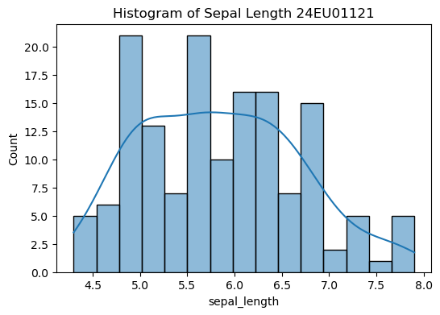
    


    
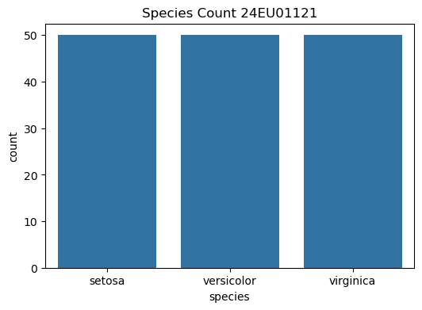
    


    
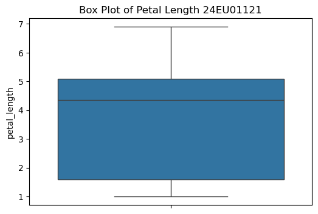
    


    
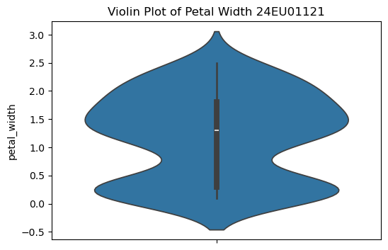
    


    
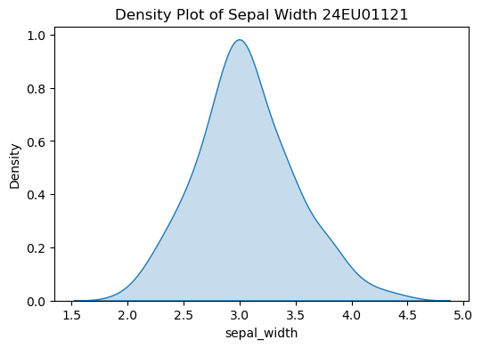
    


```python
# Scatter Plot
plt.figure(figsize=(6,4))
sns.scatterplot(x="sepal_length", y="petal_length",
                hue="species", data=df)
plt.title("Sepal Length vs Petal Length 24EU01121")
plt.show()

# Pair Plot
sns.pairplot(df, hue="species")
plt.show()

# Correlation Heatmap
plt.figure(figsize=(7,5))
sns.heatmap(df.corr(numeric_only=True),
            annot=True,
            cmap="coolwarm")
plt.title("Correlation Heatmap 24EU01121")
plt.show()

# Box Plot by Species
plt.figure(figsize=(6,4))
sns.boxplot(x="species", y="petal_length", data=df)
plt.title("Petal Length by Species 24EU01121")
plt.show()

# Violin Plot by Species
plt.figure(figsize=(6,4))
sns.violinplot(x="species", y="sepal_width", data=df)
plt.title("Sepal Width by Species 24EU01121")
plt.show()

# Bar Plot
plt.figure(figsize=(6,4))
sns.barplot(x="species", y="petal_width", data=df)
plt.title("Average Petal Width by Species 24EU01121")
plt.show()
```


    
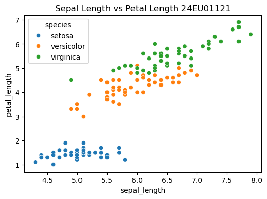
    


    
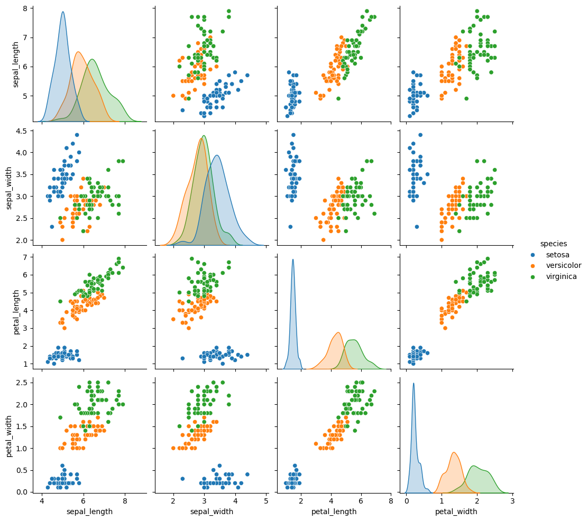
    


    
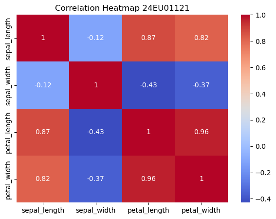
    


    
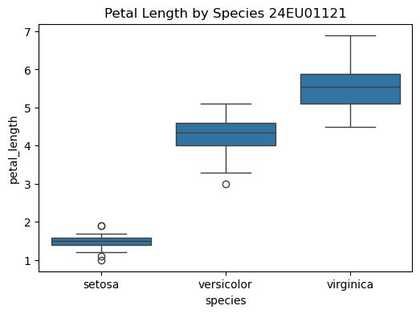
    


    
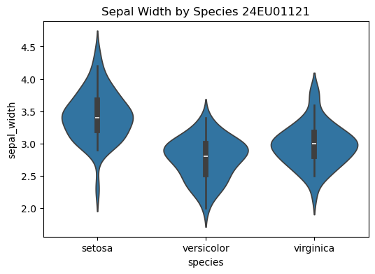
    


    
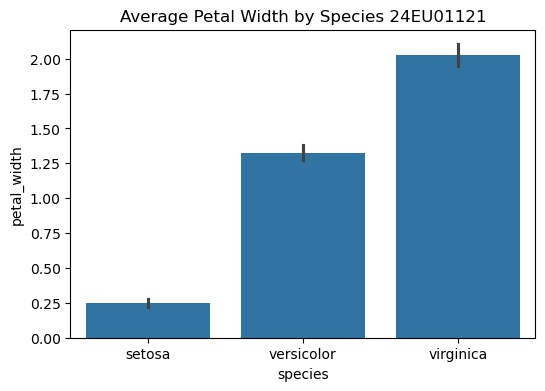
    


### Task 4: Interpret statistical insights and identify significant features influencing predictive analysis (Suggested Dataset: Sonar Dataset).


```python
import pandas as pd

# Load Sonar Dataset from GitHub
url = "https://raw.githubusercontent.com/jbrownlee/Datasets/master/sonar.csv"

df = pd.read_csv(url, header=None)

# Rename the last column as Target
df.rename(columns={60: "Target"}, inplace=True)

print(df.head())
```

            0       1       2       3       4       5       6       7       8  \
    0  0.0200  0.0371  0.0428  0.0207  0.0954  0.0986  0.1539  0.1601  0.3109   
    1  0.0453  0.0523  0.0843  0.0689  0.1183  0.2583  0.2156  0.3481  0.3337   
    2  0.0262  0.0582  0.1099  0.1083  0.0974  0.2280  0.2431  0.3771  0.5598   
    3  0.0100  0.0171  0.0623  0.0205  0.0205  0.0368  0.1098  0.1276  0.0598   
    4  0.0762  0.0666  0.0481  0.0394  0.0590  0.0649  0.1209  0.2467  0.3564   
    
            9  ...      51      52      53      54      55      56      57  \
    0  0.2111  ...  0.0027  0.0065  0.0159  0.0072  0.0167  0.0180  0.0084   
    1  0.2872  ...  0.0084  0.0089  0.0048  0.0094  0.0191  0.0140  0.0049   
    2  0.6194  ...  0.0232  0.0166  0.0095  0.0180  0.0244  0.0316  0.0164   
    3  0.1264  ...  0.0121  0.0036  0.0150  0.0085  0.0073  0.0050  0.0044   
    4  0.4459  ...  0.0031  0.0054  0.0105  0.0110  0.0015  0.0072  0.0048   
    
           58      59  Target  
    0  0.0090  0.0032       R  
    1  0.0052  0.0044       R  
    2  0.0095  0.0078       R  
    3  0.0040  0.0117       R  
    4  0.0107  0.0094       R  
    
    [5 rows x 61 columns]
    


```python
## Statistical Insights

# Shape of dataset
print("Shape:", df.shape)

# Data types
print("\nData Types:")
print(df.dtypes)

# Summary statistics
print("\nStatistical Summary:")
print(df.describe())

# Missing values
print("\nMissing Values:")
print(df.isnull().sum())

# Duplicate rows
print("\nDuplicate Rows:")
print(df.duplicated().sum())

# Class distribution
print("\nClass Distribution:")
print(df["Target"].value_counts())

```

    Shape: (208, 61)
    
    Data Types:
    0         float64
    1         float64
    2         float64
    3         float64
    4         float64
               ...   
    56        float64
    57        float64
    58        float64
    59        float64
    Target     object
    Length: 61, dtype: object
    
    Statistical Summary:
                   0           1           2           3           4           5   \
    count  208.000000  208.000000  208.000000  208.000000  208.000000  208.000000   
    mean     0.029164    0.038437    0.043832    0.053892    0.075202    0.104570   
    std      0.022991    0.032960    0.038428    0.046528    0.055552    0.059105   
    min      0.001500    0.000600    0.001500    0.005800    0.006700    0.010200   
    25%      0.013350    0.016450    0.018950    0.024375    0.038050    0.067025   
    50%      0.022800    0.030800    0.034300    0.044050    0.062500    0.092150   
    75%      0.035550    0.047950    0.057950    0.064500    0.100275    0.134125   
    max      0.137100    0.233900    0.305900    0.426400    0.401000    0.382300   
    
                   6           7           8           9   ...          50  \
    count  208.000000  208.000000  208.000000  208.000000  ...  208.000000   
    mean     0.121747    0.134799    0.178003    0.208259  ...    0.016069   
    std      0.061788    0.085152    0.118387    0.134416  ...    0.012008   
    min      0.003300    0.005500    0.007500    0.011300  ...    0.000000   
    25%      0.080900    0.080425    0.097025    0.111275  ...    0.008425   
    50%      0.106950    0.112100    0.152250    0.182400  ...    0.013900   
    75%      0.154000    0.169600    0.233425    0.268700  ...    0.020825   
    max      0.372900    0.459000    0.682800    0.710600  ...    0.100400   
    
                   51          52          53          54          55          56  \
    count  208.000000  208.000000  208.000000  208.000000  208.000000  208.000000   
    mean     0.013420    0.010709    0.010941    0.009290    0.008222    0.007820   
    std      0.009634    0.007060    0.007301    0.007088    0.005736    0.005785   
    min      0.000800    0.000500    0.001000    0.000600    0.000400    0.000300   
    25%      0.007275    0.005075    0.005375    0.004150    0.004400    0.003700   
    50%      0.011400    0.009550    0.009300    0.007500    0.006850    0.005950   
    75%      0.016725    0.014900    0.014500    0.012100    0.010575    0.010425   
    max      0.070900    0.039000    0.035200    0.044700    0.039400    0.035500   
    
                   57          58          59  
    count  208.000000  208.000000  208.000000  
    mean     0.007949    0.007941    0.006507  
    std      0.006470    0.006181    0.005031  
    min      0.000300    0.000100    0.000600  
    25%      0.003600    0.003675    0.003100  
    50%      0.005800    0.006400    0.005300  
    75%      0.010350    0.010325    0.008525  
    max      0.044000    0.036400    0.043900  
    
    [8 rows x 60 columns]
    
    Missing Values:
    0         0
    1         0
    2         0
    3         0
    4         0
             ..
    56        0
    57        0
    58        0
    59        0
    Target    0
    Length: 61, dtype: int64
    
    Duplicate Rows:
    0
    
    Class Distribution:
    Target
    M    111
    R     97
    Name: count, dtype: int64
    


```python
## Correlation AnalysiS

import matplotlib.pyplot as plt
import seaborn as sns

# Correlation matrix
corr = df.iloc[:, :-1].corr()

plt.figure(figsize=(12,10))
sns.heatmap(corr, cmap="coolwarm")
plt.title("Correlation Matrix 24EU01121")
plt.show()
```


    
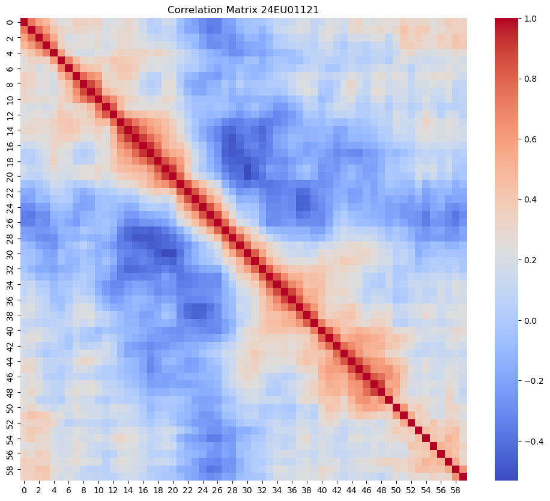
    


```python
# identify significant Features

print(df.corr(numeric_only=True)[0].sort_values(ascending=False))
```

    0     1.000000
    1     0.735896
    2     0.571537
    3     0.491438
    57    0.368132
    58    0.357116
    7     0.355523
    51    0.355299
    8     0.353420
    59    0.347078
    4     0.344797
    10    0.344058
    53    0.322299
    45    0.319354
    9     0.318276
    56    0.313725
    54    0.312067
    52    0.311729
    14    0.304878
    44    0.279968
    49    0.269287
    6     0.260815
    13    0.256278
    50    0.254450
    48    0.247560
    15    0.239079
    5     0.238921
    46    0.230343
    55    0.220642
    41    0.213592
    11    0.210861
    12    0.210722
    37    0.209873
    38    0.208371
    42    0.206057
    47    0.203234
    43    0.157949
    19    0.156760
    16    0.137845
    40    0.127313
    36    0.119565
    20    0.117663
    39    0.099993
    34    0.098118
    35    0.080722
    18    0.055227
    17    0.041817
    33    0.031319
    31   -0.030444
    32   -0.031939
    30   -0.048370
    21   -0.056973
    29   -0.077430
    22   -0.163426
    28   -0.199099
    23   -0.218093
    27   -0.224340
    24   -0.295683
    26   -0.341703
    25   -0.342865
    Name: 0, dtype: float64
    


```python
import sys
print (sys.executable)
import numpy
print(numpy.__version__)
```

    C:\machine learning\python.exe
    2.3.5
    


```python
# ==========================================
# Iris Dataset - Basic Exploration
# ==========================================

import pandas as pd
from sklearn.datasets import load_iris

# Load Iris dataset
iris = load_iris()

# Convert to DataFrame
df = pd.DataFrame(iris.data, columns=iris.feature_names)

# Add target column
df['Species'] = iris.target

# Convert numeric labels to species names
df['Species'] = df['Species'].map({
    0: 'Setosa',
    1: 'Versicolor',
    2: 'Virginica'
})

# Display first 5 rows
print("\n===== First 5 Rows =====")
print(df.head())

# Display last 5 rows
print("\n===== Last 5 Rows =====")
print(df.tail())

# Dataset shape
print("\n===== Dataset Shape =====")
print(df.shape)

# Number of rows and columns
print("\nRows :", df.shape[0])
print("Columns :", df.shape[1])

# Column names
print("\n===== Column Names =====")
print(df.columns.tolist())

# Data types
print("\n===== Data Types =====")
print(df.dtypes)

# Dataset information
print("\n===== Dataset Information =====")
df.info()

# Statistical summary
print("\n===== Statistical Description =====")
print(df.describe())

# Missing values
print("\n===== Missing Values =====")
print(df.isnull().sum())

# Duplicate records
print("\n===== Duplicate Records =====")
print(df.duplicated().sum())

# Random 5 samples
print("\n===== Random 5 Samples =====")
print(df.sample(5))

# Unique values
print("\n===== Unique Values =====")
print(df.nunique())

# Target class distribution
print("\n===== Species Distribution =====")
print(df['Species'].value_counts())
```

    
    ===== First 5 Rows =====
       sepal length (cm)  sepal width (cm)  petal length (cm)  petal width (cm)  \
    0                5.1               3.5                1.4               0.2   
    1                4.9               3.0                1.4               0.2   
    2                4.7               3.2                1.3               0.2   
    3                4.6               3.1                1.5               0.2   
    4                5.0               3.6                1.4               0.2   
    
      Species  
    0  Setosa  
    1  Setosa  
    2  Setosa  
    3  Setosa  
    4  Setosa  
    
    ===== Last 5 Rows =====
         sepal length (cm)  sepal width (cm)  petal length (cm)  petal width (cm)  \
    145                6.7               3.0                5.2               2.3   
    146                6.3               2.5                5.0               1.9   
    147                6.5               3.0                5.2               2.0   
    148                6.2               3.4                5.4               2.3   
    149                5.9               3.0                5.1               1.8   
    
           Species  
    145  Virginica  
    146  Virginica  
    147  Virginica  
    148  Virginica  
    149  Virginica  
    
    ===== Dataset Shape =====
    (150, 5)
    
    Rows : 150
    Columns : 5
    
    ===== Column Names =====
    ['sepal length (cm)', 'sepal width (cm)', 'petal length (cm)', 'petal width (cm)', 'Species']
    
    ===== Data Types =====
    sepal length (cm)    float64
    sepal width (cm)     float64
    petal length (cm)    float64
    petal width (cm)     float64
    Species               object
    dtype: object
    
    ===== Dataset Information =====
    <class 'pandas.core.frame.DataFrame'>
    RangeIndex: 150 entries, 0 to 149
    Data columns (total 5 columns):
     #   Column             Non-Null Count  Dtype  
    ---  ------             --------------  -----  
     0   sepal length (cm)  150 non-null    float64
     1   sepal width (cm)   150 non-null    float64
     2   petal length (cm)  150 non-null    float64
     3   petal width (cm)   150 non-null    float64
     4   Species            150 non-null    object 
    dtypes: float64(4), object(1)
    memory usage: 6.0+ KB
    
    ===== Statistical Description =====
           sepal length (cm)  sepal width (cm)  petal length (cm)  \
    count         150.000000        150.000000         150.000000   
    mean            5.843333          3.057333           3.758000   
    std             0.828066          0.435866           1.765298   
    min             4.300000          2.000000           1.000000   
    25%             5.100000          2.800000           1.600000   
    50%             5.800000          3.000000           4.350000   
    75%             6.400000          3.300000           5.100000   
    max             7.900000          4.400000           6.900000   
    
           petal width (cm)  
    count        150.000000  
    mean           1.199333  
    std            0.762238  
    min            0.100000  
    25%            0.300000  
    50%            1.300000  
    75%            1.800000  
    max            2.500000  
    
    ===== Missing Values =====
    sepal length (cm)    0
    sepal width (cm)     0
    petal length (cm)    0
    petal width (cm)     0
    Species              0
    dtype: int64
    
    ===== Duplicate Records =====
    1
    
    ===== Random 5 Samples =====
         sepal length (cm)  sepal width (cm)  petal length (cm)  petal width (cm)  \
    48                 5.3               3.7                1.5               0.2   
    105                7.6               3.0                6.6               2.1   
    121                5.6               2.8                4.9               2.0   
    104                6.5               3.0                5.8               2.2   
    26                 5.0               3.4                1.6               0.4   
    
           Species  
    48      Setosa  
    105  Virginica  
    121  Virginica  
    104  Virginica  
    26      Setosa  
    
    ===== Unique Values =====
    sepal length (cm)    35
    sepal width (cm)     23
    petal length (cm)    43
    petal width (cm)     22
    Species               3
    dtype: int64
    
    ===== Species Distribution =====
    Species
    Setosa        50
    Versicolor    50
    Virginica     50
    Name: count, dtype: int64
    

## Post-Lab Task

### Exploratory Data Analysis (EDA) on Titanic Dataset


```python

# Step 1: Import Required Libraries
import numpy as np
import pandas as pd
import matplotlib.pyplot as plt
import seaborn as sns

%matplotlib inline

import warnings
warnings.filterwarnings("ignore")

# ------------------------------------------------------------
# Step 2: Load Titanic Dataset
# ------------------------------------------------------------
df = sns.load_dataset('titanic')

# Display first five rows
print("First Five Rows:")
display(df.head())

# ------------------------------------------------------------
# Step 3: Dataset Information
# ------------------------------------------------------------
print("\nDataset Information:")
df.info()

# ------------------------------------------------------------
# Step 4: Dataset Shape
# ------------------------------------------------------------
print("\nShape of Dataset:")
print(df.shape)

# ------------------------------------------------------------
# Step 5: Column Names
# ------------------------------------------------------------
print("\nColumn Names:")
print(df.columns)

# ------------------------------------------------------------
# Step 6: Statistical Summary
# ------------------------------------------------------------
print("\nStatistical Summary:")
display(df.describe())

# ------------------------------------------------------------
# Step 7: Check Missing Values
# ------------------------------------------------------------
print("\nMissing Values:")
print(df.isnull().sum())

# ------------------------------------------------------------
# Step 8: Missing Value Percentage
# ------------------------------------------------------------
print("\nPercentage of Missing Values:")
print((df.isnull().sum()/len(df))*100)

# ------------------------------------------------------------
# Step 9: Check Duplicate Rows
# ------------------------------------------------------------
print("\nDuplicate Rows:")
print(df.duplicated().sum())

# ------------------------------------------------------------
# Step 10: Data Types
# ------------------------------------------------------------
print("\nData Types:")
print(df.dtypes)


```

    First Five Rows:
    


<div>
<style scoped>
    .dataframe tbody tr th:only-of-type {
        vertical-align: middle;
    }

    .dataframe tbody tr th {
        vertical-align: top;
    }

    .dataframe thead th {
        text-align: right;
    }
</style>
<table border="1" class="dataframe">
  <thead>
    <tr style="text-align: right;">
      <th></th>
      <th>survived</th>
      <th>pclass</th>
      <th>sex</th>
      <th>age</th>
      <th>sibsp</th>
      <th>parch</th>
      <th>fare</th>
      <th>embarked</th>
      <th>class</th>
      <th>who</th>
      <th>adult_male</th>
      <th>deck</th>
      <th>embark_town</th>
      <th>alive</th>
      <th>alone</th>
    </tr>
  </thead>
  <tbody>
    <tr>
      <th>0</th>
      <td>0</td>
      <td>3</td>
      <td>male</td>
      <td>22.0</td>
      <td>1</td>
      <td>0</td>
      <td>7.2500</td>
      <td>S</td>
      <td>Third</td>
      <td>man</td>
      <td>True</td>
      <td>NaN</td>
      <td>Southampton</td>
      <td>no</td>
      <td>False</td>
    </tr>
    <tr>
      <th>1</th>
      <td>1</td>
      <td>1</td>
      <td>female</td>
      <td>38.0</td>
      <td>1</td>
      <td>0</td>
      <td>71.2833</td>
      <td>C</td>
      <td>First</td>
      <td>woman</td>
      <td>False</td>
      <td>C</td>
      <td>Cherbourg</td>
      <td>yes</td>
      <td>False</td>
    </tr>
    <tr>
      <th>2</th>
      <td>1</td>
      <td>3</td>
      <td>female</td>
      <td>26.0</td>
      <td>0</td>
      <td>0</td>
      <td>7.9250</td>
      <td>S</td>
      <td>Third</td>
      <td>woman</td>
      <td>False</td>
      <td>NaN</td>
      <td>Southampton</td>
      <td>yes</td>
      <td>True</td>
    </tr>
    <tr>
      <th>3</th>
      <td>1</td>
      <td>1</td>
      <td>female</td>
      <td>35.0</td>
      <td>1</td>
      <td>0</td>
      <td>53.1000</td>
      <td>S</td>
      <td>First</td>
      <td>woman</td>
      <td>False</td>
      <td>C</td>
      <td>Southampton</td>
      <td>yes</td>
      <td>False</td>
    </tr>
    <tr>
      <th>4</th>
      <td>0</td>
      <td>3</td>
      <td>male</td>
      <td>35.0</td>
      <td>0</td>
      <td>0</td>
      <td>8.0500</td>
      <td>S</td>
      <td>Third</td>
      <td>man</td>
      <td>True</td>
      <td>NaN</td>
      <td>Southampton</td>
      <td>no</td>
      <td>True</td>
    </tr>
  </tbody>
</table>
</div>


    
    Dataset Information:
    <class 'pandas.core.frame.DataFrame'>
    RangeIndex: 891 entries, 0 to 890
    Data columns (total 15 columns):
     #   Column       Non-Null Count  Dtype   
    ---  ------       --------------  -----   
     0   survived     891 non-null    int64   
     1   pclass       891 non-null    int64   
     2   sex          891 non-null    object  
     3   age          714 non-null    float64 
     4   sibsp        891 non-null    int64   
     5   parch        891 non-null    int64   
     6   fare         891 non-null    float64 
     7   embarked     889 non-null    object  
     8   class        891 non-null    category
     9   who          891 non-null    object  
     10  adult_male   891 non-null    bool    
     11  deck         203 non-null    category
     12  embark_town  889 non-null    object  
     13  alive        891 non-null    object  
     14  alone        891 non-null    bool    
    dtypes: bool(2), category(2), float64(2), int64(4), object(5)
    memory usage: 80.7+ KB
    
    Shape of Dataset:
    (891, 15)
    
    Column Names:
    Index(['survived', 'pclass', 'sex', 'age', 'sibsp', 'parch', 'fare',
           'embarked', 'class', 'who', 'adult_male', 'deck', 'embark_town',
           'alive', 'alone'],
          dtype='object')
    
    Statistical Summary:
    


<div>
<style scoped>
    .dataframe tbody tr th:only-of-type {
        vertical-align: middle;
    }

    .dataframe tbody tr th {
        vertical-align: top;
    }

    .dataframe thead th {
        text-align: right;
    }
</style>
<table border="1" class="dataframe">
  <thead>
    <tr style="text-align: right;">
      <th></th>
      <th>survived</th>
      <th>pclass</th>
      <th>age</th>
      <th>sibsp</th>
      <th>parch</th>
      <th>fare</th>
    </tr>
  </thead>
  <tbody>
    <tr>
      <th>count</th>
      <td>891.000000</td>
      <td>891.000000</td>
      <td>714.000000</td>
      <td>891.000000</td>
      <td>891.000000</td>
      <td>891.000000</td>
    </tr>
    <tr>
      <th>mean</th>
      <td>0.383838</td>
      <td>2.308642</td>
      <td>29.699118</td>
      <td>0.523008</td>
      <td>0.381594</td>
      <td>32.204208</td>
    </tr>
    <tr>
      <th>std</th>
      <td>0.486592</td>
      <td>0.836071</td>
      <td>14.526497</td>
      <td>1.102743</td>
      <td>0.806057</td>
      <td>49.693429</td>
    </tr>
    <tr>
      <th>min</th>
      <td>0.000000</td>
      <td>1.000000</td>
      <td>0.420000</td>
      <td>0.000000</td>
      <td>0.000000</td>
      <td>0.000000</td>
    </tr>
    <tr>
      <th>25%</th>
      <td>0.000000</td>
      <td>2.000000</td>
      <td>20.125000</td>
      <td>0.000000</td>
      <td>0.000000</td>
      <td>7.910400</td>
    </tr>
    <tr>
      <th>50%</th>
      <td>0.000000</td>
      <td>3.000000</td>
      <td>28.000000</td>
      <td>0.000000</td>
      <td>0.000000</td>
      <td>14.454200</td>
    </tr>
    <tr>
      <th>75%</th>
      <td>1.000000</td>
      <td>3.000000</td>
      <td>38.000000</td>
      <td>1.000000</td>
      <td>0.000000</td>
      <td>31.000000</td>
    </tr>
    <tr>
      <th>max</th>
      <td>1.000000</td>
      <td>3.000000</td>
      <td>80.000000</td>
      <td>8.000000</td>
      <td>6.000000</td>
      <td>512.329200</td>
    </tr>
  </tbody>
</table>
</div>


    
    Missing Values:
    survived         0
    pclass           0
    sex              0
    age            177
    sibsp            0
    parch            0
    fare             0
    embarked         2
    class            0
    who              0
    adult_male       0
    deck           688
    embark_town      2
    alive            0
    alone            0
    dtype: int64
    
    Percentage of Missing Values:
    survived        0.000000
    pclass          0.000000
    sex             0.000000
    age            19.865320
    sibsp           0.000000
    parch           0.000000
    fare            0.000000
    embarked        0.224467
    class           0.000000
    who             0.000000
    adult_male      0.000000
    deck           77.216611
    embark_town     0.224467
    alive           0.000000
    alone           0.000000
    dtype: float64
    
    Duplicate Rows:
    107
    
    Data Types:
    survived          int64
    pclass            int64
    sex              object
    age             float64
    sibsp             int64
    parch             int64
    fare            float64
    embarked         object
    class          category
    who              object
    adult_male         bool
    deck           category
    embark_town      object
    alive            object
    alone              bool
    dtype: object
    


```python
# ============================================================
# Univariate Analysis
# ============================================================

# Survival Count
plt.figure(figsize=(6,4))
sns.countplot(x='survived', data=df)
plt.title("Survival Count 24EU01121")
plt.show()

# Passenger Class Distribution
plt.figure(figsize=(6,4))
sns.countplot(x='pclass', data=df)
plt.title("Passenger Class Distribution 24EU01121")
plt.show()

# Gender Distribution
plt.figure(figsize=(6,4))
sns.countplot(x='sex', data=df)
plt.title("Gender Distribution 24EU01121")
plt.show()

# Age Distribution
plt.figure(figsize=(8,5))
sns.histplot(df['age'], bins=30, kde=True)
plt.title("Age Distribution 24EU01121")
plt.show()

# Fare Distribution
plt.figure(figsize=(8,5))
sns.histplot(df['fare'], bins=40, kde=True)
plt.title("Fare Distribution 24EU01121")
plt.show()

# Age Boxplot
plt.figure(figsize=(6,5))
sns.boxplot(y=df['age'])
plt.title("Age Boxplot 24EU01121")
plt.show()

# Fare Boxplot
plt.figure(figsize=(6,5))
sns.boxplot(y=df['fare'])
plt.title("Fare Boxplot 24EU01121")
plt.show()
```


    

    


    

    


    
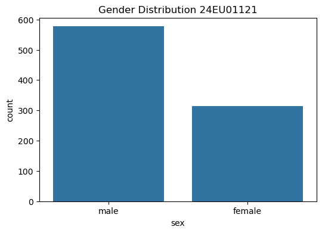
    


    

    


    

    


    

    


    

    


```python
# ============================================================
# Bivariate Analysis
# ============================================================

# Survival by Gender
plt.figure(figsize=(6,4))
sns.countplot(x='sex', hue='survived', data=df)
plt.title("Survival by Gender 24EU01121")
plt.show()

# Survival by Passenger Class
plt.figure(figsize=(6,4))
sns.countplot(x='pclass', hue='survived', data=df)
plt.title("Survival by Passenger Class 24EU01121")
plt.show()

# Age vs Fare
plt.figure(figsize=(8,5))
sns.scatterplot(x='age', y='fare', hue='survived', data=df)
plt.title("Age vs Fare 24EU01121")
plt.show()

```


    
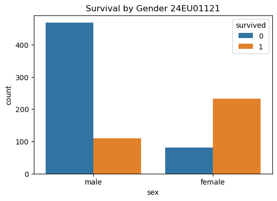
    


    
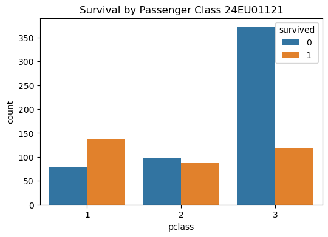
    


    
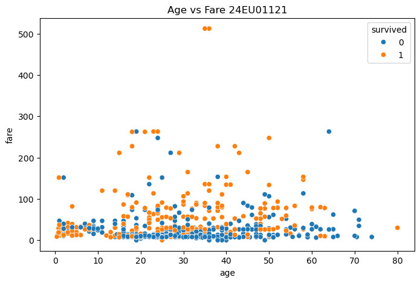
    


```python
# ============================================================
# Correlation Analysis
# ============================================================

numeric_df = df.select_dtypes(include=['number'])

print("\nCorrelation Matrix:")
display(numeric_df.corr())

plt.figure(figsize=(10,8))
sns.heatmap(numeric_df.corr(), annot=True, cmap='coolwarm', linewidths=0.5)
plt.title("Correlation Heatmap 24EU01121")
plt.show()

# Pairplot
sns.pairplot(df[['survived','age','fare','pclass']])
plt.show()
```

    
    Correlation Matrix:
    


<div>
<style scoped>
    .dataframe tbody tr th:only-of-type {
        vertical-align: middle;
    }

    .dataframe tbody tr th {
        vertical-align: top;
    }

    .dataframe thead th {
        text-align: right;
    }
</style>
<table border="1" class="dataframe">
  <thead>
    <tr style="text-align: right;">
      <th></th>
      <th>survived</th>
      <th>pclass</th>
      <th>age</th>
      <th>sibsp</th>
      <th>parch</th>
      <th>fare</th>
    </tr>
  </thead>
  <tbody>
    <tr>
      <th>survived</th>
      <td>1.000000</td>
      <td>-0.338481</td>
      <td>-0.077221</td>
      <td>-0.035322</td>
      <td>0.081629</td>
      <td>0.257307</td>
    </tr>
    <tr>
      <th>pclass</th>
      <td>-0.338481</td>
      <td>1.000000</td>
      <td>-0.369226</td>
      <td>0.083081</td>
      <td>0.018443</td>
      <td>-0.549500</td>
    </tr>
    <tr>
      <th>age</th>
      <td>-0.077221</td>
      <td>-0.369226</td>
      <td>1.000000</td>
      <td>-0.308247</td>
      <td>-0.189119</td>
      <td>0.096067</td>
    </tr>
    <tr>
      <th>sibsp</th>
      <td>-0.035322</td>
      <td>0.083081</td>
      <td>-0.308247</td>
      <td>1.000000</td>
      <td>0.414838</td>
      <td>0.159651</td>
    </tr>
    <tr>
      <th>parch</th>
      <td>0.081629</td>
      <td>0.018443</td>
      <td>-0.189119</td>
      <td>0.414838</td>
      <td>1.000000</td>
      <td>0.216225</td>
    </tr>
    <tr>
      <th>fare</th>
      <td>0.257307</td>
      <td>-0.549500</td>
      <td>0.096067</td>
      <td>0.159651</td>
      <td>0.216225</td>
      <td>1.000000</td>
    </tr>
  </tbody>
</table>
</div>


    
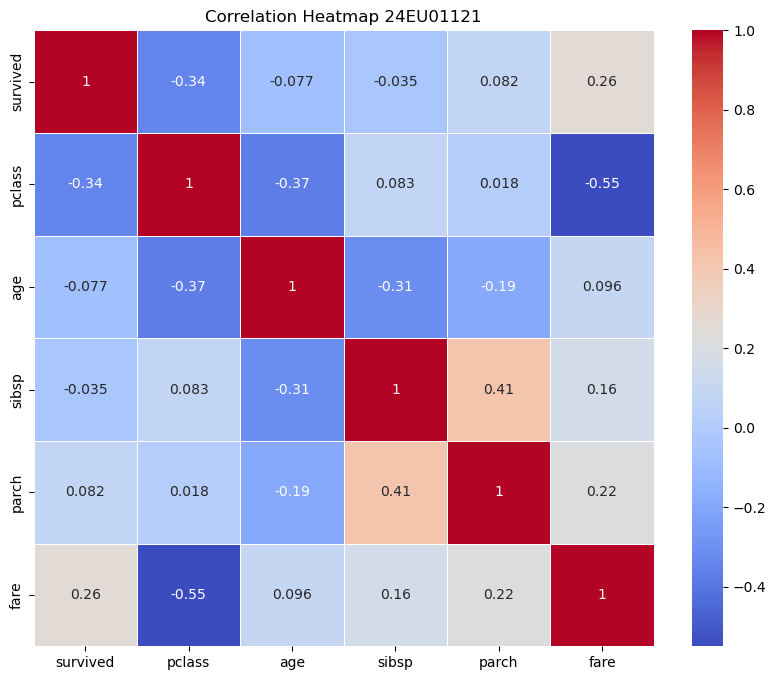
    


    
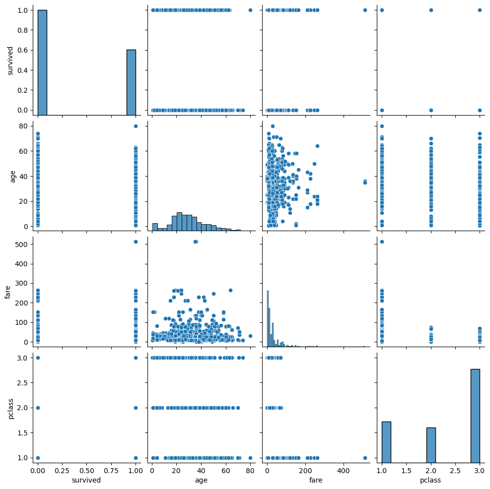
    


```python
# ============================================================
# Value Counts
# ============================================================

print("\nGender Count:")
print(df['sex'].value_counts())

print("\nPassenger Class Count:")
print(df['pclass'].value_counts())

print("\nSurvival Count:")
print(df['survived'].value_counts())


```

    
    Gender Count:
    sex
    male      577
    female    314
    Name: count, dtype: int64
    
    Passenger Class Count:
    pclass
    3    491
    1    216
    2    184
    Name: count, dtype: int64
    
    Survival Count:
    survived
    0    549
    1    342
    Name: count, dtype: int64
    


```python
import pandas as pd
import seaborn as sns

# Load Titanic dataset
df = sns.load_dataset("titanic")

# ============================================================
# Handling Missing Values
# ============================================================

df['age'] = df['age'].fillna(df['age'].median())
df['embarked'] = df['embarked'].fillna(df['embarked'].mode()[0])
df['embark_town'] = df['embark_town'].fillna(df['embark_town'].mode()[0])

# Drop Deck column because it has many missing values
df = df.drop(columns=['deck'])

# ------------------------------------------------------------
# Verify Missing Values
# ------------------------------------------------------------
print("\nMissing Values After Cleaning:")
print(df.isnull().sum())

# ------------------------------------------------------------
# Final Dataset
# ------------------------------------------------------------
print("\nFirst Five Rows After Cleaning:")
print(df.head())        # or display(df.head()) in Jupyter Notebook

# ------------------------------------------------------------
# Final Shape
# ------------------------------------------------------------
print("\nFinal Shape:")
print(df.shape)
```

    
    Missing Values After Cleaning:
    survived       0
    pclass         0
    sex            0
    age            0
    sibsp          0
    parch          0
    fare           0
    embarked       0
    class          0
    who            0
    adult_male     0
    embark_town    0
    alive          0
    alone          0
    dtype: int64
    
    First Five Rows After Cleaning:
       survived  pclass     sex   age  sibsp  parch     fare embarked  class  \
    0         0       3    male  22.0      1      0   7.2500        S  Third   
    1         1       1  female  38.0      1      0  71.2833        C  First   
    2         1       3  female  26.0      0      0   7.9250        S  Third   
    3         1       1  female  35.0      1      0  53.1000        S  First   
    4         0       3    male  35.0      0      0   8.0500        S  Third   
    
         who  adult_male  embark_town alive  alone  
    0    man        True  Southampton    no  False  
    1  woman       False    Cherbourg   yes  False  
    2  woman       False  Southampton   yes   True  
    3  woman       False  Southampton   yes  False  
    4    man        True  Southampton    no   True  
    
    Final Shape:
    (891, 14)
    


```python
# ============================================================
# Conclusion
# ============================================================

print("\n========== EDA SUMMARY ==========")
print("1. Dataset contains 891 rows and 15 columns.")
print("2. Missing values were found in Age, Embarked, Embark Town, and Deck.")
print("3. Missing values were handled using median and mode.")
print("4. Deck column was removed because it contained too many missing values.")
print("5. Most passengers belonged to Third Class.")
print("6. Male passengers were more than female passengers.")
print("7. Female passengers had a higher survival rate.")
print("8. First Class passengers had better survival chances.")
print("9. Fare contains several outliers.")
print("10. Most passengers were between 20 and 40 years old.")
print("11. Correlation analysis shows Fare is positively related to survival, while Passenger Class is negatively related to survival.")

print("\nEDA Completed Successfully.")
```

    
    ========== EDA SUMMARY ==========
    1. Dataset contains 891 rows and 15 columns.
    2. Missing values were found in Age, Embarked, Embark Town, and Deck.
    3. Missing values were handled using median and mode.
    4. Deck column was removed because it contained too many missing values.
    5. Most passengers belonged to Third Class.
    6. Male passengers were more than female passengers.
    7. Female passengers had a higher survival rate.
    8. First Class passengers had better survival chances.
    9. Fare contains several outliers.
    10. Most passengers were between 20 and 40 years old.
    11. Correlation analysis shows Fare is positively related to survival, while Passenger Class is negatively related to survival.
    
    EDA Completed Successfully.
    


```python

```
