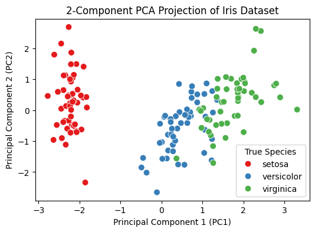
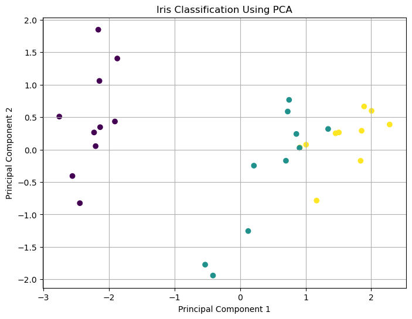
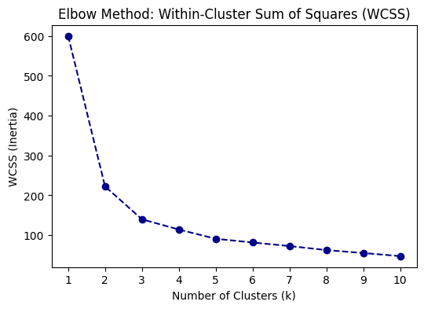
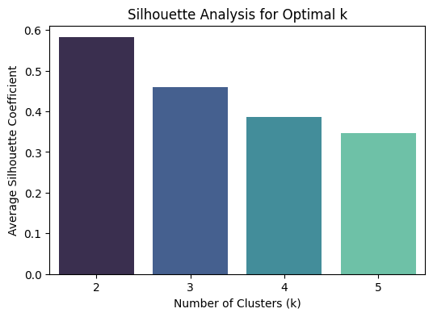
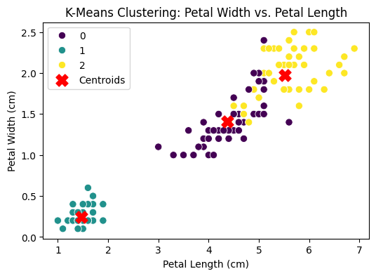
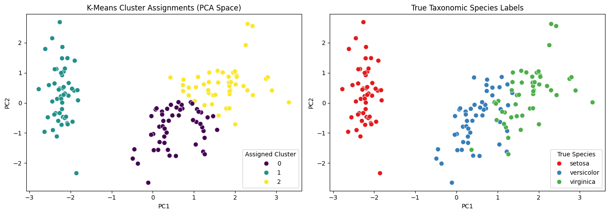

# Experiment 6: PCA and Clustering Models


# Introduction to PCA and Clustering

## 1. Introduction

Machine learning datasets often contain a large number of features. Working with many features can make data analysis, visualization, and interpretation difficult. Two important unsupervised learning techniques that help address these challenges are **Dimensionality Reduction** and **Clustering**.

**Principal Component Analysis (PCA)** is used to reduce the dimensionality of data while preserving the most important information. **Clustering** is used to discover natural groups or patterns within data without using predefined class labels.

---

## 2. Dimensionality Reduction

**Dimensionality reduction** is the process of reducing the number of features in a dataset while retaining the important characteristics of the original data.

For example, a dataset may contain:

**10 features → 2 important dimensions**

Dimensionality reduction is useful because it can:

- Reduce computational complexity
- Remove redundant information
- Reduce the effect of correlated features
- Improve data visualization
- Make datasets easier to interpret
- Improve the efficiency of machine learning algorithms

There are two general approaches:

- **Feature Selection:** Selects a subset of the original features.
- **Feature Extraction:** Creates new features from the original features.

PCA is a **feature extraction** technique.

---

# 3. Principal Component Analysis (PCA)

**Principal Component Analysis (PCA)** is an unsupervised dimensionality reduction technique that transforms the original features into a new set of variables called **Principal Components**.

The principal components are ordered according to the amount of variance they capture from the original dataset.

The first principal component captures the maximum possible variance. The second principal component captures the maximum remaining variance while being independent of the first component, and so on.

### Example

Suppose a dataset contains four original features:

**X₁, X₂, X₃, X₄**

PCA transforms them into:

**PC₁, PC₂, PC₃, PC₄**

If most of the information is contained in the first two components, the dataset can be represented using:

**PC₁ and PC₂**

Thus:

**4 original features → 2 principal components**

This makes the data easier to visualize and analyze.

---

# 4. Principal Components

A **principal component** is a new variable formed as a linear combination of the original features.

The principal components have two important properties:

1. They capture the major sources of variation in the dataset.
2. They are mutually uncorrelated.

The components are arranged in decreasing order of the amount of variance they explain:

**PC₁ → maximum variance**

**PC₂ → next highest variance**

**PC₃ → next highest variance**

and so on.

Therefore, the first few principal components generally contain most of the useful information in the dataset.

---

# 5. Variance and Explained Variance

**Variance** represents how much the data values vary from their mean.

PCA searches for directions in which the data has maximum variance.

**Explained variance** indicates how much of the total variation in the original dataset is captured by a particular principal component.

For example:

| Principal Component | Explained Variance |
|---|---:|
| PC₁ | 70% |
| PC₂ | 20% |
| PC₃ | 7% |
| PC₄ | 3% |

PC₁ and PC₂ together explain:

**70% + 20% = 90%**

of the total variance.

Therefore, the first two components may provide a good lower-dimensional representation of the original dataset.

---

# 6. Covariance in PCA

PCA analyzes the relationships between features using **covariance**.

Covariance indicates how two variables change with respect to each other.

- **Positive covariance:** Both variables tend to increase or decrease together.
- **Negative covariance:** One variable tends to increase while the other decreases.
- **Near-zero covariance:** There is little linear relationship between the variables.

The covariance structure of the data helps PCA identify the directions of maximum variation.

---

# 7. Eigenvalues and Eigenvectors

PCA uses **eigenvalues and eigenvectors** to determine the principal components.

### Eigenvectors

Eigenvectors represent the **directions or orientations** of the principal components.

### Eigenvalues

Eigenvalues represent the **amount of variance** captured in those directions.

A larger eigenvalue means that the corresponding principal component captures more variance.

Therefore:

**Largest eigenvalue → PC₁**

**Second largest eigenvalue → PC₂**

**Third largest eigenvalue → PC₃**

and so on.

---

# 8. Feature Scaling and PCA

Feature scaling is important when features are measured on different scales.

For example:

- Age → 0–100
- Income → 10,000–1,00,000
- Height → 100–200

A feature with a much larger numerical scale may dominate the variance.

Therefore, data is commonly standardized before PCA so that features contribute more comparably to the analysis.

---

# 9. Applications of PCA

PCA is commonly used for:

- Data visualization
- Feature extraction
- Noise reduction
- Image processing
- Pattern recognition
- Exploratory data analysis
- Data compression
- Removing redundant information
- Preparing high-dimensional data for machine learning

---


# 10. Clustering

**Clustering** is an unsupervised machine learning technique used to divide data into groups based on similarity.

A group of similar observations is called a **cluster**.

Unlike supervised learning, clustering does not require predefined class labels.

### Example

Suppose customer data contains information about:

- Age
- Income
- Spending behavior

A clustering algorithm may automatically discover groups such as:

**Cluster 1 → Low spending customers**

**Cluster 2 → Medium spending customers**

**Cluster 3 → High spending customers**

The groups are discovered from the data rather than provided beforehand.

---

# 11. Objectives of Clustering

The main objectives of clustering are:

- Group similar observations together
- Separate dissimilar observations
- Discover hidden patterns
- Identify natural groups
- Support exploratory data analysis
- Simplify complex datasets

A good clustering result generally has:

**High similarity within a cluster**

and

**Low similarity between different clusters**

---

# 12. K-Means Clustering

**K-Means** is one of the most widely used clustering algorithms.

It divides the dataset into a predefined number of clusters, represented by **K**.

For example:

**K = 3**

means that the algorithm attempts to divide the observations into three clusters.

The center of each cluster is called a **centroid**.

---

# 13. Basic Idea of K-Means

K-Means works by repeatedly performing two main operations:

### Assignment

Each data point is assigned to the nearest cluster centroid.

### Update

The centroid of each cluster is recalculated based on the points assigned to that cluster.

These steps are repeated until the cluster assignments or centroids become stable.

Conceptually:

**Choose K → Initialize Centroids → Assign Points → Update Centroids → Repeat**

---

# 14. Distance in K-Means

K-Means commonly uses **Euclidean distance** to measure the distance between data points and cluster centroids.

The basic idea is:

**Smaller distance → More similar**

**Larger distance → Less similar**

Therefore, each observation is assigned to the cluster whose centroid is closest to it.

---

# 15. Within-Cluster Sum of Squares (WCSS)

**Within-Cluster Sum of Squares (WCSS)** measures how close the observations are to the centroid of their assigned cluster.

A smaller WCSS indicates that observations are more compact around their cluster centers.

However, WCSS generally decreases as the number of clusters increases.

Therefore, the smallest WCSS alone should not be used to select the number of clusters.

---

# 16. Elbow Method

The **Elbow Method** is commonly used to determine a suitable value of K.

The WCSS is calculated for different values of K and plotted against the number of clusters.

The point where the decrease in WCSS starts to become less significant is called the **elbow point**.

The corresponding K value can be considered a suitable choice for clustering.

The basic idea is:

**Small K → High WCSS**

**Increasing K → Lower WCSS**

**Elbow point → Suitable candidate for K**

---

# 17. Silhouette Score

The **Silhouette Score** is used to evaluate the quality of clustering.

It considers:

- How close a data point is to points in its own cluster.
- How far the data point is from points in other clusters.

The Silhouette Score ranges from:

**−1 to +1**

### Interpretation

- **Close to +1:** Strong and well-separated clustering
- **Around 0:** Overlapping clusters
- **Negative values:** Possible incorrect cluster assignment

A higher Silhouette Score generally indicates better-defined clusters.

---

# 18. PCA and Clustering Together

PCA and clustering perform different but complementary tasks.

### PCA

**Reduces dimensions and extracts important features.**

### K-Means

**Discovers groups within the data.**

They can therefore be used together:

**Original Dataset**

↓

**Feature Scaling**

↓

**PCA**

↓

**Reduced Feature Space**

↓

**K-Means Clustering**

↓

**Cluster Analysis**

PCA is particularly useful when the dataset contains many features because it can transform the data into a smaller number of informative dimensions.

The reduced data can also be visualized using two principal components, making cluster patterns easier to interpret.

---

# 19. Original Feature Space vs PCA Feature Space

Clustering can be performed using the original feature space or a PCA-transformed feature space.

### Original Feature Space

Contains all selected original features.

### PCA Feature Space

Contains a smaller number of principal components that capture important variance.

Comparing the two spaces can help determine whether dimensionality reduction provides a useful representation for clustering.

The comparison can consider:

- Cluster separation
- Cluster compactness
- Silhouette Score
- Visualization
- Interpretability

PCA does not automatically guarantee better clustering. Its effectiveness should be evaluated using appropriate clustering measures.

---

# 20. PCA vs K-Means

| Aspect | PCA | K-Means |
|---|---|---|
| Purpose | Dimensionality reduction | Clustering |
| Type | Unsupervised | Unsupervised |
| Main Output | Principal Components | Clusters |
| Main Concept | Variance | Similarity |
| Important Terms | Eigenvalues, Eigenvectors | Centroids, WCSS |
| Main Use | Feature extraction and visualization | Pattern discovery and grouping |
| Evaluation | Explained Variance | WCSS and Silhouette Score |

---

# 21. Real-World Applications

### PCA Applications

- Image compression
- Face recognition
- Medical data analysis
- Visualization of high-dimensional data
- Feature extraction
- Signal processing

### Clustering Applications

- Customer segmentation
- Document grouping
- Image segmentation
- Market analysis
- Anomaly detection
- Pattern discovery
- Biological data analysis

---


## Task 1: Apply Principal Component Analysis (PCA) for feature extraction and dimensionality reduction
*Suggested Dataset: Iris Dataset*


### Subtask 1.1: Data Acquisition and Feature Standardization
**Concept:** Import warnings suppression and libraries, load the taxonomic Iris dataset, and standardize the feature space using StandardScaler.


```python
import warnings
warnings.filterwarnings("ignore")

import pandas as pd
import numpy as np
from sklearn.datasets import load_iris
from sklearn.preprocessing import StandardScaler

# Load raw Iris dataset
raw_iris = load_iris()
features = raw_iris.feature_names
X_raw = raw_iris.data
y_true = raw_iris.target

# Standardize the features
scaler = StandardScaler()
X_scaled = scaler.fit_transform(X_raw)

# Store in a DataFrame for visualization
iris_df = pd.DataFrame(data=X_scaled, columns=features)
iris_df['species_id'] = y_true
species_map = {i: name for i, name in enumerate(raw_iris.target_names)}
iris_df['species_name'] = iris_df['species_id'].map(species_map)

print("Standardized dataset dimensions:", X_scaled.shape)
print("\nFirst 3 rows of standardized dataset:")
print(iris_df.head(3))

```

    Standardized dataset dimensions: (150, 4)
    
    First 3 rows of standardized dataset:
       sepal length (cm)  sepal width (cm)  petal length (cm)  petal width (cm)  \
    0          -0.900681          1.019004          -1.340227         -1.315444   
    1          -1.143017         -0.131979          -1.340227         -1.315444   
    2          -1.385353          0.328414          -1.397064         -1.315444   
    
       species_id species_name  
    0           0       setosa  
    1           0       setosa  
    2           0       setosa  
    

### Subtask 1.2: Covariance Matrix and Eigenvalue Decomposition
**Concept:** Compute the covariance matrix of the standardized features, then calculate its eigenvalues and eigenvectors to understand PCA's mathematical foundation.


```python
# Calculate the covariance matrix
cov_matrix = np.cov(X_scaled.T)
print("Covariance Matrix:\n", cov_matrix)

# Perform eigenvalue decomposition
eigenvalues, eigenvectors = np.linalg.eig(cov_matrix)
print("\nEigenvalues (Variance components):\n", eigenvalues)
print("\nEigenvectors (Principal Axes):\n", eigenvectors)

```

    Covariance Matrix:
     [[ 1.00671141 -0.11835884  0.87760447  0.82343066]
     [-0.11835884  1.00671141 -0.43131554 -0.36858315]
     [ 0.87760447 -0.43131554  1.00671141  0.96932762]
     [ 0.82343066 -0.36858315  0.96932762  1.00671141]]
    
    Eigenvalues (Variance components):
     [2.93808505 0.9201649  0.14774182 0.02085386]
    
    Eigenvectors (Principal Axes):
     [[ 0.52106591 -0.37741762 -0.71956635  0.26128628]
     [-0.26934744 -0.92329566  0.24438178 -0.12350962]
     [ 0.5804131  -0.02449161  0.14212637 -0.80144925]
     [ 0.56485654 -0.06694199  0.63427274  0.52359713]]
    

### Subtask 1.3: Implementing Dimensionality Reduction via PCA
**Concept:** Apply Scikit-Learn's PCA model to project the 4D standardized feature space into 2 principal components.


```python
from sklearn.decomposition import PCA

# Initialize PCA to extract 2 orthogonal components
pca_model = PCA(n_components=2, random_state=42)
X_pca = pca_model.fit_transform(X_scaled)

# Convert to a DataFrame
pca_df = pd.DataFrame(data=X_pca, columns=['PC_1', 'PC2'])
pca_df['species_name'] = iris_df['species_name']

print("Transformed PCA space dimensions:", X_pca.shape)
print("\nFirst 3 projected coordinates:")
print(pca_df.head(3))

```

    Transformed PCA space dimensions: (150, 2)
    
    First 3 projected coordinates:
           PC_1       PC2 species_name
    0 -2.264703  0.480027       setosa
    1 -2.080961 -0.674134       setosa
    2 -2.364229 -0.341908       setosa
    

### Subtask 1.4: Visualizing the 2D PCA Feature Space
**Concept:** Plot the projected 2D coordinates on a scatter plot, coloring points by their true species labels to check class separation.


```python
import matplotlib.pyplot as plt
import seaborn as sns

plt.figure(figsize=(6, 4))
sns.scatterplot(data=pca_df, x='PC_1', y='PC2', hue='species_name', palette='Set1', s=60)
plt.title("2-Component PCA Projection of Iris Dataset")
plt.xlabel("Principal Component 1 (PC1)")
plt.ylabel("Principal Component 2 (PC2)")
plt.legend(title='True Species')
plt.show()

```


    

    


### Subtask 1.5: Analyzing Explained Variance Ratio
**Concept:** Extract and print the explained variance ratio of each principal component to quantify how much information is retained in the 2D projection.


```python
explained_variance = pca_model.explained_variance_ratio_
cumulative_variance = np.sum(explained_variance)

print("Explained Variance per Component:")
for i, var in enumerate(explained_variance):
    print(f"  PC{i+1}: {var*100:.2f}%")

print(f"\nTotal Cumulative Variance Retained by 2 Components: {cumulative_variance*100:.2f}%")

```

    Explained Variance per Component:
      PC1: 72.96%
      PC2: 22.85%
    
    Total Cumulative Variance Retained by 2 Components: 95.81%
    


```python
# ============================================================
# Classification with and without PCA
# Dataset: Iris Dataset
# Classifier: Logistic Regression
# ============================================================

# Step 1: Import required libraries
import numpy as np
import pandas as pd
import matplotlib.pyplot as plt

from sklearn.datasets import load_iris
from sklearn.model_selection import train_test_split
from sklearn.preprocessing import StandardScaler
from sklearn.decomposition import PCA
from sklearn.linear_model import LogisticRegression
from sklearn.metrics import accuracy_score, classification_report, confusion_matrix


# ============================================================
# Step 2: Load the Dataset
# ============================================================

iris = load_iris()

X = iris.data                 # Input features
y = iris.target               # Target labels
feature_names = iris.feature_names
target_names = iris.target_names

print("Dataset Shape:", X.shape)
print("Features:", feature_names)
print("Classes:", target_names)


# ============================================================
# Step 3: Split the Dataset
# ============================================================

X_train, X_test, y_train, y_test = train_test_split(
    X,
    y,
    test_size=0.20,
    random_state=42,
    stratify=y
)


# ============================================================
# Step 4: Feature Scaling
# ============================================================

scaler = StandardScaler()

X_train_scaled = scaler.fit_transform(X_train)
X_test_scaled = scaler.transform(X_test)


# ============================================================
# PART A: CLASSIFICATION WITHOUT PCA
# ============================================================

print("\n========================================")
print("CLASSIFICATION WITHOUT PCA")
print("========================================")

# Create Logistic Regression model
model_without_pca = LogisticRegression(
    random_state=42,
    max_iter=1000
)

# Train the model
model_without_pca.fit(
    X_train_scaled,
    y_train
)

# Predict test data
y_pred_without_pca = model_without_pca.predict(
    X_test_scaled
)

# Calculate accuracy
accuracy_without_pca = accuracy_score(
    y_test,
    y_pred_without_pca
)

print("Accuracy without PCA:",
      accuracy_without_pca)

print("\nClassification Report:")
print(
    classification_report(
        y_test,
        y_pred_without_pca,
        target_names=target_names
    )
)


# ============================================================
# PART B: CLASSIFICATION WITH PCA
# ============================================================

print("\n========================================")
print("CLASSIFICATION WITH PCA")
print("========================================")

# Apply PCA
pca = PCA(
    n_components=2
)

# Fit PCA only on training data
X_train_pca = pca.fit_transform(
    X_train_scaled
)

# Transform test data using the same PCA
X_test_pca = pca.transform(
    X_test_scaled
)

# Display explained variance
print("Explained Variance Ratio:",
      pca.explained_variance_ratio_)

print("Total Explained Variance:",
      pca.explained_variance_ratio_.sum())


# Create Logistic Regression model
model_with_pca = LogisticRegression(
    random_state=42,
    max_iter=1000
)

# Train the model using PCA features
model_with_pca.fit(
    X_train_pca,
    y_train
)

# Predict test data
y_pred_with_pca = model_with_pca.predict(
    X_test_pca
)

# Calculate accuracy
accuracy_with_pca = accuracy_score(
    y_test,
    y_pred_with_pca
)

print("Accuracy with PCA:",
      accuracy_with_pca)

print("\nClassification Report:")
print(
    classification_report(
        y_test,
        y_pred_with_pca,
        target_names=target_names
    )
)


# ============================================================
# PART C: COMPARE BOTH MODELS
# ============================================================

print("\n========================================")
print("COMPARISON")
print("========================================")

comparison = pd.DataFrame({
    "Method": [
        "Without PCA",
        "With PCA"
    ],
    "Number of Features": [
        X_train_scaled.shape[1],
        X_train_pca.shape[1]
    ],
    "Accuracy": [
        accuracy_without_pca,
        accuracy_with_pca
    ]
})

print(comparison)


# ============================================================
# PART D: VISUALIZE PCA FEATURES
# ============================================================

plt.figure(figsize=(8, 6))

plt.scatter(
    X_test_pca[:, 0],
    X_test_pca[:, 1],
    c=y_test
)

plt.xlabel("Principal Component 1")
plt.ylabel("Principal Component 2")
plt.title("Iris Classification Using PCA")
plt.grid()

plt.show()
```

    Dataset Shape: (150, 4)
    Features: ['sepal length (cm)', 'sepal width (cm)', 'petal length (cm)', 'petal width (cm)']
    Classes: ['setosa' 'versicolor' 'virginica']
    
    ========================================
    CLASSIFICATION WITHOUT PCA
    ========================================
    Accuracy without PCA: 0.9333333333333333
    
    Classification Report:
                  precision    recall  f1-score   support
    
          setosa       1.00      1.00      1.00        10
      versicolor       0.90      0.90      0.90        10
       virginica       0.90      0.90      0.90        10
    
        accuracy                           0.93        30
       macro avg       0.93      0.93      0.93        30
    weighted avg       0.93      0.93      0.93        30
    
    
    ========================================
    CLASSIFICATION WITH PCA
    ========================================
    Explained Variance Ratio: [0.72677234 0.23066667]
    Total Explained Variance: 0.9574390106545367
    Accuracy with PCA: 0.9
    
    Classification Report:
                  precision    recall  f1-score   support
    
          setosa       1.00      1.00      1.00        10
      versicolor       0.82      0.90      0.86        10
       virginica       0.89      0.80      0.84        10
    
        accuracy                           0.90        30
       macro avg       0.90      0.90      0.90        30
    weighted avg       0.90      0.90      0.90        30
    
    
    ========================================
    COMPARISON
    ========================================
            Method  Number of Features  Accuracy
    0  Without PCA                   4  0.933333
    1     With PCA                   2  0.900000
    


    

    


## Task 2: Design clustering models using K-Means clustering for pattern discovery and data grouping
*Suggested Dataset: Iris Dataset*


### Subtask 2.1: Determining Clusters via the Elbow Method (WCSS)
**Concept:** Implement K-Means over cluster sizes ($k$) from 1 to 10 and plot the Within-Cluster Sum of Squares (WCSS) curve to find the optimal elbow point.


```python
import warnings
warnings.filterwarnings("ignore")

from sklearn.cluster import KMeans
import matplotlib.pyplot as plt

wcss = []
k_range = range(1, 11)

# Fit K-Means iteratively
for k in k_range:
    kmeans = KMeans(n_clusters=k, init='k-means++', random_state=42, n_init=10)
    kmeans.fit(X_scaled)
    wcss.append(kmeans.inertia_)

# Plot the Elbow Curve
plt.figure(figsize=(6, 4))
plt.plot(k_range, wcss, marker='o', linestyle='--', color='darkblue')
plt.title("Elbow Method: Within-Cluster Sum of Squares (WCSS)")
plt.xlabel("Number of Clusters (k)")
plt.ylabel("WCSS (Inertia)")
plt.xticks(k_range)
plt.show()

```


    

    


### Subtask 2.2: Validating Optimal Clusters with Silhouette Analysis
**Concept:** Calculate and plot average silhouette scores across cluster counts ($k=2, 3, 4, 5$) to mathematically confirm the optimal number of groups.


```python
from sklearn.metrics import silhouette_score

silhouette_scores = []
k_eval = range(2, 6)

# Calculate silhouette scores for different cluster counts
for k in k_eval:
    kmeans_temp = KMeans(n_clusters=k, init='k-means++', random_state=42, n_init=10)
    labels_temp = kmeans_temp.fit_predict(X_scaled)
    score = silhouette_score(X_scaled, labels_temp)
    silhouette_scores.append(score)

# Plot Silhouette scores
plt.figure(figsize=(6, 4))
sns.barplot(x=list(k_eval), y=silhouette_scores, palette='mako')
plt.title("Silhouette Analysis for Optimal k")
plt.xlabel("Number of Clusters (k)")
plt.ylabel("Average Silhouette Coefficient")
plt.show()

# Find and print the best k
best_k = k_eval[np.argmax(silhouette_scores)]
print(f"k = {best_k} yielded the highest silhouette coefficient ({max(silhouette_scores):.4f}).")

```


    

    


    k = 2 yielded the highest silhouette coefficient (0.5818).
    

### Subtask 2.3: Implementing K-Means Clustering on the Raw Feature Space
**Concept:** Fit a K-Means model with $k=3$ on the raw standardized features, and assign cluster labels to each sample.


```python
# Train K-Means on the standardized raw 4D feature space
kmeans_raw = KMeans(n_clusters=3, init='k-means++', random_state=42, n_init=10)
kmeans_raw_labels = kmeans_raw.fit_predict(X_scaled)

# Append cluster labels to main DataFrame
iris_df['cluster_raw'] = kmeans_raw_labels
print("K-Means clustering complete. First 5 sample allocations:")
print(iris_df[['species_name', 'cluster_raw']].head(5))

```

    K-Means clustering complete. First 5 sample allocations:
      species_name  cluster_raw
    0       setosa            1
    1       setosa            1
    2       setosa            1
    3       setosa            1
    4       setosa            1
    

### Subtask 2.4: Extracting and Inspecting Cluster Centroids
**Concept:** Extract coordinates of the calculated centroids and inverse-scale them back to the original units (cm) for standard physical interpretation.


```python
# Extract raw centroid coordinates in standardized space
raw_centroids_scaled = kmeans_raw.cluster_centers_

# Inverse transform centroids back to original physical measurements (cm)
raw_centroids_physical = scaler.inverse_transform(raw_centroids_scaled)

# Store in a summary table
centroids_df = pd.DataFrame(data=raw_centroids_physical, columns=features)
centroids_df.index = [f"Cluster_{i}" for i in range(3)]

print("--- Estimated Cluster Centroids (Original Physical Units - cm) ---")
print(centroids_df)

```

    --- Estimated Cluster Centroids (Original Physical Units - cm) ---
               sepal length (cm)  sepal width (cm)  petal length (cm)  \
    Cluster_0           5.801887          2.673585           4.369811   
    Cluster_1           5.006000          3.428000           1.462000   
    Cluster_2           6.780851          3.095745           5.510638   
    
               petal width (cm)  
    Cluster_0          1.413208  
    Cluster_1          0.246000  
    Cluster_2          1.972340  
    

### Subtask 2.5: Visualizing Raw Clusters and Centroids
**Concept:** Create a scatter plot comparing Petal Length vs. Petal Width, coloring points by cluster assignment and plotting the centroids.


```python
plt.figure(figsize=(6, 4))

# Convert standardized centroids to original units for plotting
raw_data = scaler.inverse_transform(X_scaled)

# Plot the continuous data points colored by cluster assignment
sns.scatterplot(x=raw_data[:, 2], y=raw_data[:, 3], hue=kmeans_raw_labels, palette='viridis', s=55, legend='full')

# Plot the calculated centroids on the same canvas
plt.scatter(
    raw_centroids_physical[:, 2], 
    raw_centroids_physical[:, 3], 
    color='red', 
    marker='X', 
    s=150, 
    label='Centroids'
)

plt.title("K-Means Clustering: Petal Width vs. Petal Length")
plt.xlabel("Petal Length (cm)")
plt.ylabel("Petal Width (cm)")
plt.legend()
plt.show()

```


    

    


## Task 3: Analyze clustering performance and compare transformed feature spaces for improved data interpretation
*Continuous Comparisons on Iris Dataset (comparing Raw 4D vs 2D PCA spaces)*


### Subtask 3.1: K-Means Clustering in the PCA-Reduced Space
**Concept:** Import warnings suppression, and fit a K-Means model on the 2D PCA coordinates generated in Task 1.


```python
import warnings
warnings.filterwarnings("ignore")

from sklearn.cluster import KMeans

# Train a separate K-Means model on the 2-Component PCA space
kmeans_pca = KMeans(n_clusters=3, init='k-means++', random_state=42, n_init=10)
kmeans_pca_labels = kmeans_pca.fit_predict(X_pca)

# Append to main DataFrame
iris_df['cluster_pca'] = kmeans_pca_labels
print("PCA space K-Means clustering completed successfully.")

```

    PCA space K-Means clustering completed successfully.
    

### Subtask 3.2: Internal Validation Metrics (Silhouette and Calinski-Harabasz Scores)
**Concept:** Calculate Silhouette and Calinski-Harabasz scores to evaluate the separation and cohesion of clusters in both spaces without true labels.


```python
from sklearn.metrics import silhouette_score, calinski_harabasz_score

# Compute internal metrics for raw space clusters
sil_raw = silhouette_score(X_scaled, kmeans_raw_labels)
ch_raw = calinski_harabasz_score(X_scaled, kmeans_raw_labels)

# Compute internal metrics for PCA-reduced space clusters
sil_pca = silhouette_score(X_pca, kmeans_pca_labels)
ch_pca = calinski_harabasz_score(X_pca, kmeans_pca_labels)

print("--- Internal Validation (Unsupervised Quality Metrics) ---")
print(f"Raw 4D Feature Space  -> Silhouette Score: {sil_raw:.4f} | Calinski-Harabasz: {ch_raw:.2f}")
print(f"PCA 2D Reduced Space -> Silhouette Score: {sil_pca:.4f} | Calinski-Harabasz: {ch_pca:.2f}")

```

    --- Internal Validation (Unsupervised Quality Metrics) ---
    Raw 4D Feature Space  -> Silhouette Score: 0.4599 | Calinski-Harabasz: 241.90
    PCA 2D Reduced Space -> Silhouette Score: 0.5092 | Calinski-Harabasz: 293.86
    

### Subtask 3.3: Faceted Visual Comparison: K-Means Clusters vs. True Species
**Concept:** Plot a side-by-side comparison of K-Means cluster assignments in the 2D PCA space against actual species labels to check for overlaps.


```python
import matplotlib.pyplot as plt
import seaborn as sns

fig, axes = plt.subplots(1, 2, figsize=(14, 5))

# Plot 1: PCA Coordinates colored by K-Means cluster allocations
sns.scatterplot(
    data=pca_df, x='PC_1', y='PC2', hue=kmeans_pca_labels, 
    palette='viridis', s=60, ax=axes[0]
)
axes[0].set_title("K-Means Cluster Assignments (PCA Space)")
axes[0].set_xlabel("PC1")
axes[0].set_ylabel("PC2")
axes[0].legend(title='Assigned Cluster')

# Plot 2: PCA Coordinates colored by true species labels
sns.scatterplot(
    data=pca_df, x='PC_1', y='PC2', hue='species_name', 
    palette='Set1', s=60, ax=axes[1]
)
axes[1].set_title("True Taxonomic Species Labels")
axes[1].set_xlabel("PC1")
axes[1].set_ylabel("PC2")
axes[1].legend(title='True Species')

plt.tight_layout()
plt.show()

```


    

    


### Subtask 3.4: Compiling the Performance Comparison Table
**Concept:** Organize and print your clustering performance metrics in a structured comparison table.


```python
# Compile metrics into a comparison DataFrame
comparison_metrics = pd.DataFrame(
    data=[
        [sil_raw, ch_raw, ari_raw, nmi_raw],
        [sil_pca, ch_pca, ari_pca, nmi_pca]
    ],
    columns=['Silhouette_Score', 'Calinski_Harabasz', 'Adjusted_Rand_Index', 'Normalized_Mutual_Info'],
    index=['Standardized Raw Space (4D)', 'PCA Reduced Space (2D)']
)

print("--- Clustering Performance Summary: Raw vs. PCA ---")
print(comparison_metrics.round(4))

```

    --- Clustering Performance Summary: Raw vs. PCA ---
                                 Silhouette_Score  Calinski_Harabasz  \
    Standardized Raw Space (4D)            0.4599           241.9044   
    PCA Reduced Space (2D)                 0.5092           293.8565   
    
                                 Adjusted_Rand_Index  Normalized_Mutual_Info  
    Standardized Raw Space (4D)               0.6201                  0.6595  
    PCA Reduced Space (2D)                    0.6201                  0.6595  
    
