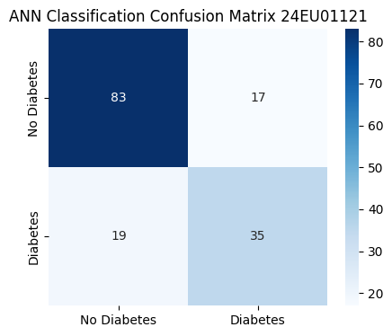
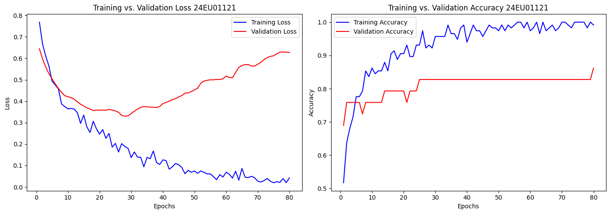
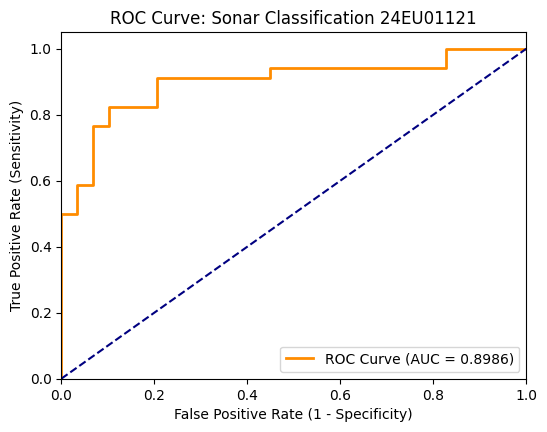
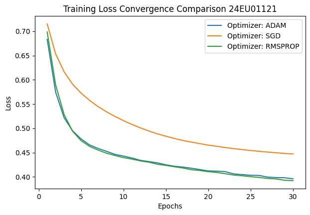

# Experiment 8: Artificial Neural Networks using Keras


## Task 1: Design and implement Artificial Neural Network architectures using Keras for classification tasks
*Suggested Dataset: Pima Indians Diabetes Dataset*


### Subtask 1.1: Data Acquisition, Imputation, and Feature Scaling
**Concept:** Import warnings suppression, load the raw Pima Indians dataset, handle missing value zeros using median imputation, standardize the features, and perform a stratified train-test split.


```python
import warnings
```


```python
warnings.filterwarnings("ignore")
```


```python
import numpy as np
```


```python
import pandas as pd
```


```python
from sklearn.model_selection import train_test_split
```


```python
from sklearn.preprocessing import StandardScaler
```


```python
from sklearn.impute import SimpleImputer
```


```python
# Load Pima Indians Diabetes dataset
pima_url = "https://raw.githubusercontent.com/jbrownlee/Datasets/master/pima-indians-diabetes.data.csv"

```


```python
pima_cols = ['Pregnancies', 'Glucose', 'BloodPressure', 'SkinThickness', 'Insulin', 'BMI', 'DiabetesPedigreeFunction', 'Age', 'Outcome']
```


```python
pima_df = pd.read_csv(pima_url, header=None, names=pima_cols)
```


```python
# Prevent copy warnings using an explicit copy
X_pima = pima_df[pima_cols[:-1]].copy()

```


```python
y_pima = pima_df['Outcome']
```


```python
# Mark invalid zeros as NaN placeholders for imputation
cols_to_impute = ['Glucose', 'BloodPressure', 'SkinThickness', 'Insulin', 'BMI']
```


```python
X_pima[cols_to_impute] = X_pima[cols_to_impute].replace(0, np.nan)
```


```python
# Impute and standardize
imputer = SimpleImputer(strategy='median')
```


```python
X_imputed = imputer.fit_transform(X_pima)
```


```python
scaler = StandardScaler()
```


```python
X_pima_scaled = scaler.fit_transform(X_imputed)
```


```python
# Stratified train-test split
X_train_p, X_test_p, y_train_p, y_test_p = train_test_split(
    X_pima_scaled, y_pima, test_size=0.20, stratify=y_pima, random_state=42
)
```


```python
print("Preprocessed Pima dataset shapes:")
print(f"  Training set features: {X_train_p.shape} | Test set features: {X_test_p.shape}")

```

    Preprocessed Pima dataset shapes:
      Training set features: (614, 8) | Test set features: (154, 8)
    

### Subtask 1.2: Designing Feedforward Neural Network Architectures
**Concept:** Design a baseline feedforward Artificial Neural Network (ANN) using Keras Sequential API, configuring hidden Dense layers with ReLU activations and a binary Sigmoid output node.


```python
import tensorflow as tf
```


```python
from tensorflow.keras.models import Sequential
```


```python
from tensorflow.keras.layers import Dense
```


```python
# Design baseline sequential model
ann_pima = Sequential([
    # Input layer + Hidden layer 1: 16 neurons with ReLU activation
    Dense(16, activation='relu', input_shape=(8,)),
    # Hidden layer 2: 8 neurons with ReLU activation
    Dense(8, activation='relu'),
    # Output layer: 1 neuron with Sigmoid activation for binary classification
    Dense(1, activation='sigmoid')
])
```


```python
print("Sequential ANN Architecture established:")
ann_pima.summary()
```

    Sequential ANN Architecture established:
    


<pre style="white-space:pre;overflow-x:auto;line-height:normal;font-family:Menlo,'DejaVu Sans Mono',consolas,'Courier New',monospace"><span style="font-weight: bold">Model: "sequential"</span>
</pre>


<pre style="white-space:pre;overflow-x:auto;line-height:normal;font-family:Menlo,'DejaVu Sans Mono',consolas,'Courier New',monospace">┏━━━━━━━━━━━━━━━━━━━━━━━━━━━━━━━━━┳━━━━━━━━━━━━━━━━━━━━━━━━┳━━━━━━━━━━━━━━━┓
┃<span style="font-weight: bold"> Layer (type)                    </span>┃<span style="font-weight: bold"> Output Shape           </span>┃<span style="font-weight: bold">       Param # </span>┃
┡━━━━━━━━━━━━━━━━━━━━━━━━━━━━━━━━━╇━━━━━━━━━━━━━━━━━━━━━━━━╇━━━━━━━━━━━━━━━┩
│ dense (<span style="color: #0087ff; text-decoration-color: #0087ff">Dense</span>)                   │ (<span style="color: #00d7ff; text-decoration-color: #00d7ff">None</span>, <span style="color: #00af00; text-decoration-color: #00af00">16</span>)             │           <span style="color: #00af00; text-decoration-color: #00af00">144</span> │
├─────────────────────────────────┼────────────────────────┼───────────────┤
│ dense_1 (<span style="color: #0087ff; text-decoration-color: #0087ff">Dense</span>)                 │ (<span style="color: #00d7ff; text-decoration-color: #00d7ff">None</span>, <span style="color: #00af00; text-decoration-color: #00af00">8</span>)              │           <span style="color: #00af00; text-decoration-color: #00af00">136</span> │
├─────────────────────────────────┼────────────────────────┼───────────────┤
│ dense_2 (<span style="color: #0087ff; text-decoration-color: #0087ff">Dense</span>)                 │ (<span style="color: #00d7ff; text-decoration-color: #00d7ff">None</span>, <span style="color: #00af00; text-decoration-color: #00af00">1</span>)              │             <span style="color: #00af00; text-decoration-color: #00af00">9</span> │
└─────────────────────────────────┴────────────────────────┴───────────────┘
</pre>


<pre style="white-space:pre;overflow-x:auto;line-height:normal;font-family:Menlo,'DejaVu Sans Mono',consolas,'Courier New',monospace"><span style="font-weight: bold"> Total params: </span><span style="color: #00af00; text-decoration-color: #00af00">289</span> (1.13 KB)
</pre>


<pre style="white-space:pre;overflow-x:auto;line-height:normal;font-family:Menlo,'DejaVu Sans Mono',consolas,'Courier New',monospace"><span style="font-weight: bold"> Trainable params: </span><span style="color: #00af00; text-decoration-color: #00af00">289</span> (1.13 KB)
</pre>


<pre style="white-space:pre;overflow-x:auto;line-height:normal;font-family:Menlo,'DejaVu Sans Mono',consolas,'Courier New',monospace"><span style="font-weight: bold"> Non-trainable params: </span><span style="color: #00af00; text-decoration-color: #00af00">0</span> (0.00 B)
</pre>


### Subtask 1.3: Compiling the Neural Network Model
**Concept:** Compile the sequential model by defining binary_crossentropy as the loss function, Adam as the optimizer, and accuracy as the primary evaluation metric.


```python
# Compile the neural network model
ann_pima.compile(
    optimizer='adam',
    loss='binary_crossentropy',
    metrics=['accuracy']
)
```


```python
print("Neural network model compiled successfully.")
```

    Neural network model compiled successfully.
    

### Subtask 1.4: Fitting the Network with Validation Splits
**Concept:** Train the compiled network on the training set for 50 epochs using a batch size of 16 and a 20% validation split.


```python
# Fit model and collect training metrics
history_pima = ann_pima.fit(
    X_train_p,
    y_train_p,
    epochs=50,
    batch_size=16,
    validation_split=0.2,
    verbose=1
)
```

    Epoch 1/50
    31/31 ━━━━━━━━━━━━━━━━━━━━ 5s 32ms/step - accuracy: 0.6680 - loss: 0.6524 - val_accuracy: 0.6585 - val_loss: 0.6952
    Epoch 2/50
    31/31 ━━━━━━━━━━━━━━━━━━━━ 2s 18ms/step - accuracy: 0.6864 - loss: 0.5909 - val_accuracy: 0.7073 - val_loss: 0.6173
    Epoch 3/50
    31/31 ━━━━━━━━━━━━━━━━━━━━ 0s 11ms/step - accuracy: 0.7088 - loss: 0.5494 - val_accuracy: 0.7317 - val_loss: 0.5626
    Epoch 4/50
    31/31 ━━━━━━━━━━━━━━━━━━━━ 1s 21ms/step - accuracy: 0.7352 - loss: 0.5208 - val_accuracy: 0.7480 - val_loss: 0.5240
    Epoch 5/50
    31/31 ━━━━━━━━━━━━━━━━━━━━ 1s 20ms/step - accuracy: 0.7597 - loss: 0.5011 - val_accuracy: 0.7561 - val_loss: 0.4996
    Epoch 6/50
    31/31 ━━━━━━━━━━━━━━━━━━━━ 1s 10ms/step - accuracy: 0.7699 - loss: 0.4866 - val_accuracy: 0.7805 - val_loss: 0.4792
    Epoch 7/50
    31/31 ━━━━━━━━━━━━━━━━━━━━ 1s 15ms/step - accuracy: 0.7739 - loss: 0.4760 - val_accuracy: 0.7724 - val_loss: 0.4646
    Epoch 8/50
    31/31 ━━━━━━━━━━━━━━━━━━━━ 0s 13ms/step - accuracy: 0.7780 - loss: 0.4670 - val_accuracy: 0.7886 - val_loss: 0.4526
    Epoch 9/50
    31/31 ━━━━━━━━━━━━━━━━━━━━ 0s 10ms/step - accuracy: 0.7821 - loss: 0.4600 - val_accuracy: 0.7967 - val_loss: 0.4427
    Epoch 10/50
    31/31 ━━━━━━━━━━━━━━━━━━━━ 1s 14ms/step - accuracy: 0.7821 - loss: 0.4545 - val_accuracy: 0.8049 - val_loss: 0.4381
    Epoch 11/50
    31/31 ━━━━━━━━━━━━━━━━━━━━ 0s 4ms/step - accuracy: 0.7943 - loss: 0.4496 - val_accuracy: 0.8049 - val_loss: 0.4339
    Epoch 12/50
    31/31 ━━━━━━━━━━━━━━━━━━━━ 0s 4ms/step - accuracy: 0.7841 - loss: 0.4462 - val_accuracy: 0.8293 - val_loss: 0.4253
    Epoch 13/50
    31/31 ━━━━━━━━━━━━━━━━━━━━ 0s 4ms/step - accuracy: 0.7902 - loss: 0.4413 - val_accuracy: 0.8130 - val_loss: 0.4257
    Epoch 14/50
    31/31 ━━━━━━━━━━━━━━━━━━━━ 0s 4ms/step - accuracy: 0.7943 - loss: 0.4396 - val_accuracy: 0.8130 - val_loss: 0.4257
    Epoch 15/50
    31/31 ━━━━━━━━━━━━━━━━━━━━ 0s 4ms/step - accuracy: 0.7902 - loss: 0.4362 - val_accuracy: 0.8293 - val_loss: 0.4202
    Epoch 16/50
    31/31 ━━━━━━━━━━━━━━━━━━━━ 0s 5ms/step - accuracy: 0.7943 - loss: 0.4343 - val_accuracy: 0.8293 - val_loss: 0.4189
    Epoch 17/50
    31/31 ━━━━━━━━━━━━━━━━━━━━ 0s 4ms/step - accuracy: 0.7963 - loss: 0.4312 - val_accuracy: 0.8293 - val_loss: 0.4195
    Epoch 18/50
    31/31 ━━━━━━━━━━━━━━━━━━━━ 0s 4ms/step - accuracy: 0.8024 - loss: 0.4295 - val_accuracy: 0.8211 - val_loss: 0.4182
    Epoch 19/50
    31/31 ━━━━━━━━━━━━━━━━━━━━ 0s 4ms/step - accuracy: 0.7984 - loss: 0.4280 - val_accuracy: 0.8293 - val_loss: 0.4168
    Epoch 20/50
    31/31 ━━━━━━━━━━━━━━━━━━━━ 0s 4ms/step - accuracy: 0.8004 - loss: 0.4257 - val_accuracy: 0.8049 - val_loss: 0.4205
    Epoch 21/50
    31/31 ━━━━━━━━━━━━━━━━━━━━ 0s 4ms/step - accuracy: 0.7984 - loss: 0.4241 - val_accuracy: 0.8211 - val_loss: 0.4160
    Epoch 22/50
    31/31 ━━━━━━━━━━━━━━━━━━━━ 0s 5ms/step - accuracy: 0.8065 - loss: 0.4227 - val_accuracy: 0.8293 - val_loss: 0.4150
    Epoch 23/50
    31/31 ━━━━━━━━━━━━━━━━━━━━ 0s 4ms/step - accuracy: 0.8004 - loss: 0.4212 - val_accuracy: 0.8293 - val_loss: 0.4159
    Epoch 24/50
    31/31 ━━━━━━━━━━━━━━━━━━━━ 0s 4ms/step - accuracy: 0.7963 - loss: 0.4193 - val_accuracy: 0.8130 - val_loss: 0.4172
    Epoch 25/50
    31/31 ━━━━━━━━━━━━━━━━━━━━ 0s 4ms/step - accuracy: 0.8004 - loss: 0.4183 - val_accuracy: 0.8130 - val_loss: 0.4184
    Epoch 26/50
    31/31 ━━━━━━━━━━━━━━━━━━━━ 0s 6ms/step - accuracy: 0.8045 - loss: 0.4184 - val_accuracy: 0.8293 - val_loss: 0.4139
    Epoch 27/50
    31/31 ━━━━━━━━━━━━━━━━━━━━ 0s 6ms/step - accuracy: 0.8024 - loss: 0.4163 - val_accuracy: 0.8130 - val_loss: 0.4187
    Epoch 28/50
    31/31 ━━━━━━━━━━━━━━━━━━━━ 0s 8ms/step - accuracy: 0.8024 - loss: 0.4152 - val_accuracy: 0.8293 - val_loss: 0.4156
    Epoch 29/50
    31/31 ━━━━━━━━━━━━━━━━━━━━ 0s 7ms/step - accuracy: 0.7984 - loss: 0.4142 - val_accuracy: 0.8293 - val_loss: 0.4158
    Epoch 30/50
    31/31 ━━━━━━━━━━━━━━━━━━━━ 0s 7ms/step - accuracy: 0.8024 - loss: 0.4130 - val_accuracy: 0.8293 - val_loss: 0.4171
    Epoch 31/50
    31/31 ━━━━━━━━━━━━━━━━━━━━ 0s 7ms/step - accuracy: 0.8086 - loss: 0.4111 - val_accuracy: 0.8293 - val_loss: 0.4172
    Epoch 32/50
    31/31 ━━━━━━━━━━━━━━━━━━━━ 0s 7ms/step - accuracy: 0.8045 - loss: 0.4107 - val_accuracy: 0.8293 - val_loss: 0.4204
    Epoch 33/50
    31/31 ━━━━━━━━━━━━━━━━━━━━ 0s 7ms/step - accuracy: 0.8065 - loss: 0.4093 - val_accuracy: 0.8293 - val_loss: 0.4138
    Epoch 34/50
    31/31 ━━━━━━━━━━━━━━━━━━━━ 0s 6ms/step - accuracy: 0.8106 - loss: 0.4079 - val_accuracy: 0.8293 - val_loss: 0.4194
    Epoch 35/50
    31/31 ━━━━━━━━━━━━━━━━━━━━ 0s 6ms/step - accuracy: 0.8106 - loss: 0.4077 - val_accuracy: 0.8293 - val_loss: 0.4156
    Epoch 36/50
    31/31 ━━━━━━━━━━━━━━━━━━━━ 0s 8ms/step - accuracy: 0.8045 - loss: 0.4062 - val_accuracy: 0.8293 - val_loss: 0.4209
    Epoch 37/50
    31/31 ━━━━━━━━━━━━━━━━━━━━ 0s 7ms/step - accuracy: 0.8106 - loss: 0.4049 - val_accuracy: 0.8293 - val_loss: 0.4176
    Epoch 38/50
    31/31 ━━━━━━━━━━━━━━━━━━━━ 0s 5ms/step - accuracy: 0.8167 - loss: 0.4044 - val_accuracy: 0.8293 - val_loss: 0.4175
    Epoch 39/50
    31/31 ━━━━━━━━━━━━━━━━━━━━ 0s 5ms/step - accuracy: 0.8126 - loss: 0.4036 - val_accuracy: 0.8293 - val_loss: 0.4181
    Epoch 40/50
    31/31 ━━━━━━━━━━━━━━━━━━━━ 0s 5ms/step - accuracy: 0.8147 - loss: 0.4031 - val_accuracy: 0.8293 - val_loss: 0.4187
    Epoch 41/50
    31/31 ━━━━━━━━━━━━━━━━━━━━ 0s 4ms/step - accuracy: 0.8147 - loss: 0.4019 - val_accuracy: 0.8293 - val_loss: 0.4189
    Epoch 42/50
    31/31 ━━━━━━━━━━━━━━━━━━━━ 0s 5ms/step - accuracy: 0.8126 - loss: 0.4023 - val_accuracy: 0.8293 - val_loss: 0.4144
    Epoch 43/50
    31/31 ━━━━━━━━━━━━━━━━━━━━ 0s 5ms/step - accuracy: 0.8208 - loss: 0.4000 - val_accuracy: 0.8293 - val_loss: 0.4190
    Epoch 44/50
    31/31 ━━━━━━━━━━━━━━━━━━━━ 0s 4ms/step - accuracy: 0.8167 - loss: 0.4000 - val_accuracy: 0.8293 - val_loss: 0.4166
    Epoch 45/50
    31/31 ━━━━━━━━━━━━━━━━━━━━ 0s 4ms/step - accuracy: 0.8187 - loss: 0.3987 - val_accuracy: 0.8293 - val_loss: 0.4177
    Epoch 46/50
    31/31 ━━━━━━━━━━━━━━━━━━━━ 0s 5ms/step - accuracy: 0.8126 - loss: 0.3985 - val_accuracy: 0.8293 - val_loss: 0.4202
    Epoch 47/50
    31/31 ━━━━━━━━━━━━━━━━━━━━ 0s 5ms/step - accuracy: 0.8187 - loss: 0.3968 - val_accuracy: 0.8211 - val_loss: 0.4192
    Epoch 48/50
    31/31 ━━━━━━━━━━━━━━━━━━━━ 0s 5ms/step - accuracy: 0.8228 - loss: 0.3959 - val_accuracy: 0.8211 - val_loss: 0.4188
    Epoch 49/50
    31/31 ━━━━━━━━━━━━━━━━━━━━ 0s 4ms/step - accuracy: 0.8167 - loss: 0.3956 - val_accuracy: 0.8130 - val_loss: 0.4201
    Epoch 50/50
    31/31 ━━━━━━━━━━━━━━━━━━━━ 0s 4ms/step - accuracy: 0.8167 - loss: 0.3947 - val_accuracy: 0.8211 - val_loss: 0.4178
    


```python
print("\nModel training complete.")
```

    
    Model training complete.
    

### Subtask 1.5: Evaluating Classifications on Held-out Test Data
**Concept:** Predict output probabilities on held-out test data, threshold them at 0.5, and evaluate predictions using accuracy, a confusion matrix, and a classification report.


```python
from sklearn.metrics import classification_report, confusion_matrix, accuracy_score
```


```python
import seaborn as sns
```


```python
import matplotlib.pyplot as plt
```


```python
# Predict target probabilities
y_pred_probs = ann_pima.predict(X_test_p)
```

    5/5 ━━━━━━━━━━━━━━━━━━━━ 0s 13ms/step
    


```python
# Threshold probabilities to binary classes (0 or 1)
y_pred_classes = (y_pred_probs >= 0.5).astype(int)
```


```python
test_acc = accuracy_score(y_test_p, y_pred_classes)
```


```python
print(f"ANN Holdout Test Accuracy: {test_acc * 100:.2f}%\n")

print("--- Classification Report ---")
print(classification_report(y_test_p, y_pred_classes, target_names=['No Diabetes', 'Diabetes']))
```

    ANN Holdout Test Accuracy: 76.62%
    
    --- Classification Report ---
                  precision    recall  f1-score   support
    
     No Diabetes       0.81      0.83      0.82       100
        Diabetes       0.67      0.65      0.66        54
    
        accuracy                           0.77       154
       macro avg       0.74      0.74      0.74       154
    weighted avg       0.76      0.77      0.77       154
    
    


```python
# Plot confusion matrix
cm_pima = confusion_matrix(y_test_p, y_pred_classes)
plt.figure(figsize=(5, 4))
sns.heatmap(cm_pima, annot=True, fmt='d', cmap='Blues', xticklabels=['No Diabetes', 'Diabetes'], yticklabels=['No Diabetes', 'Diabetes'])
plt.title("ANN Classification Confusion Matrix 24EU01121")
plt.show()
```


    

    


## Task 2: Train neural network models and analyze learning behavior using suitable evaluation measures
*Suggested Dataset: Sonar Dataset*


### Subtask 2.1: Standard Scaling and High-Dimensional Data Splitting
**Concept:** Import warnings suppression, load the Sonar dataset, map nominal class labels, standardize features, and perform a stratified split.


```python
import warnings
```


```python
warnings.filterwarnings("ignore")
```


```python
import pandas as pd
```


```python
from sklearn.model_selection import train_test_split
```


```python
from sklearn.preprocessing import StandardScaler
```


```python
# Load Sonar dataset
sonar_url = "https://raw.githubusercontent.com/jbrownlee/Datasets/master/sonar.csv"
```


```python
sonar_features = [f"F_{i}" for i in range(1, 61)]
```


```python
sonar_columns = sonar_features + ['Class']
```


```python
sonar_df = pd.read_csv(sonar_url, header=None, names=sonar_columns)
```


```python
# Encode class: M -> 1, R -> 0
sonar_df['Class_numeric'] = sonar_df['Class'].map({'M': 1, 'R': 0})
```


```python
X_sonar = sonar_df[sonar_features]
y_sonar = sonar_df['Class_numeric']

```


```python
# Scale features
scaler_sonar = StandardScaler()
X_sonar_scaled = scaler_sonar.fit_transform(X_sonar)
```


```python
# Split into train/test sets
X_train_s, X_test_s, y_train_s, y_test_s = train_test_split(
    X_sonar_scaled, y_sonar, test_size=0.30, stratify=y_sonar, random_state=42
)
```


```python

print("Sonar Training Set Shape:", X_train_s.shape)
print("Sonar Test Set Shape:", X_test_s.shape)
```

    Sonar Training Set Shape: (145, 60)
    Sonar Test Set Shape: (63, 60)
    

### Subtask 2.2: Designing Deep Neural Networks with Dropout Regularization
**Concept:** Construct a deep multi-layer neural network using Keras and incorporate Dropout layers to prevent overfitting on high-dimensional continuous features.


```python
from tensorflow.keras.models import Sequential
```


```python
from tensorflow.keras.layers import Dense, Dropout
```


```python
# Design regularized sequential network
ann_sonar = Sequential([
    # Input layer + Dense hidden layer 1
    Dense(64, activation='relu', input_shape=(60,)),
    Dropout(0.3), # Apply 30% dropout rate to mitigate co-adaptation
    # Dense hidden layer 2
    Dense(32, activation='relu'),
    Dropout(0.3), # Apply 30% dropout rate
    # Binary sigmoid output node
    Dense(1, activation='sigmoid')
])


```


```python
print("Regularized Sonar ANN Architecture established:")
ann_sonar.summary()
```

    Regularized Sonar ANN Architecture established:
    


<pre style="white-space:pre;overflow-x:auto;line-height:normal;font-family:Menlo,'DejaVu Sans Mono',consolas,'Courier New',monospace"><span style="font-weight: bold">Model: "sequential_1"</span>
</pre>


<pre style="white-space:pre;overflow-x:auto;line-height:normal;font-family:Menlo,'DejaVu Sans Mono',consolas,'Courier New',monospace">┏━━━━━━━━━━━━━━━━━━━━━━━━━━━━━━━━━┳━━━━━━━━━━━━━━━━━━━━━━━━┳━━━━━━━━━━━━━━━┓
┃<span style="font-weight: bold"> Layer (type)                    </span>┃<span style="font-weight: bold"> Output Shape           </span>┃<span style="font-weight: bold">       Param # </span>┃
┡━━━━━━━━━━━━━━━━━━━━━━━━━━━━━━━━━╇━━━━━━━━━━━━━━━━━━━━━━━━╇━━━━━━━━━━━━━━━┩
│ dense_3 (<span style="color: #0087ff; text-decoration-color: #0087ff">Dense</span>)                 │ (<span style="color: #00d7ff; text-decoration-color: #00d7ff">None</span>, <span style="color: #00af00; text-decoration-color: #00af00">64</span>)             │         <span style="color: #00af00; text-decoration-color: #00af00">3,904</span> │
├─────────────────────────────────┼────────────────────────┼───────────────┤
│ dropout (<span style="color: #0087ff; text-decoration-color: #0087ff">Dropout</span>)               │ (<span style="color: #00d7ff; text-decoration-color: #00d7ff">None</span>, <span style="color: #00af00; text-decoration-color: #00af00">64</span>)             │             <span style="color: #00af00; text-decoration-color: #00af00">0</span> │
├─────────────────────────────────┼────────────────────────┼───────────────┤
│ dense_4 (<span style="color: #0087ff; text-decoration-color: #0087ff">Dense</span>)                 │ (<span style="color: #00d7ff; text-decoration-color: #00d7ff">None</span>, <span style="color: #00af00; text-decoration-color: #00af00">32</span>)             │         <span style="color: #00af00; text-decoration-color: #00af00">2,080</span> │
├─────────────────────────────────┼────────────────────────┼───────────────┤
│ dropout_1 (<span style="color: #0087ff; text-decoration-color: #0087ff">Dropout</span>)             │ (<span style="color: #00d7ff; text-decoration-color: #00d7ff">None</span>, <span style="color: #00af00; text-decoration-color: #00af00">32</span>)             │             <span style="color: #00af00; text-decoration-color: #00af00">0</span> │
├─────────────────────────────────┼────────────────────────┼───────────────┤
│ dense_5 (<span style="color: #0087ff; text-decoration-color: #0087ff">Dense</span>)                 │ (<span style="color: #00d7ff; text-decoration-color: #00d7ff">None</span>, <span style="color: #00af00; text-decoration-color: #00af00">1</span>)              │            <span style="color: #00af00; text-decoration-color: #00af00">33</span> │
└─────────────────────────────────┴────────────────────────┴───────────────┘
</pre>


<pre style="white-space:pre;overflow-x:auto;line-height:normal;font-family:Menlo,'DejaVu Sans Mono',consolas,'Courier New',monospace"><span style="font-weight: bold"> Total params: </span><span style="color: #00af00; text-decoration-color: #00af00">6,017</span> (23.50 KB)
</pre>


<pre style="white-space:pre;overflow-x:auto;line-height:normal;font-family:Menlo,'DejaVu Sans Mono',consolas,'Courier New',monospace"><span style="font-weight: bold"> Trainable params: </span><span style="color: #00af00; text-decoration-color: #00af00">6,017</span> (23.50 KB)
</pre>


<pre style="white-space:pre;overflow-x:auto;line-height:normal;font-family:Menlo,'DejaVu Sans Mono',consolas,'Courier New',monospace"><span style="font-weight: bold"> Non-trainable params: </span><span style="color: #00af00; text-decoration-color: #00af00">0</span> (0.00 B)
</pre>


### Subtask 2.3: Compiling and Training the Sonar Network
**Concept:** Compile your model with the Adam optimizer, fit it on the Sonar training set for 80 epochs, and collect the training metrics.


```python
# Compile the model
ann_sonar.compile(
    optimizer='adam',
    loss='binary_crossentropy',
    metrics=['accuracy']
)
```


```python
# Fit model and collect training metrics
history_sonar = ann_sonar.fit(
    X_train_s,
    y_train_s,
    epochs=80,
    batch_size=16,
    validation_split=0.2,
    verbose=1
)

```

    Epoch 1/80
    8/8 ━━━━━━━━━━━━━━━━━━━━ 1s 37ms/step - accuracy: 0.5172 - loss: 0.7685 - val_accuracy: 0.6897 - val_loss: 0.6447
    Epoch 2/80
    8/8 ━━━━━━━━━━━━━━━━━━━━ 0s 11ms/step - accuracy: 0.6379 - loss: 0.6656 - val_accuracy: 0.7586 - val_loss: 0.5964
    Epoch 3/80
    8/8 ━━━━━━━━━━━━━━━━━━━━ 0s 11ms/step - accuracy: 0.6810 - loss: 0.6100 - val_accuracy: 0.7586 - val_loss: 0.5592
    Epoch 4/80
    8/8 ━━━━━━━━━━━━━━━━━━━━ 0s 12ms/step - accuracy: 0.7155 - loss: 0.5641 - val_accuracy: 0.7586 - val_loss: 0.5283
    Epoch 5/80
    8/8 ━━━━━━━━━━━━━━━━━━━━ 0s 12ms/step - accuracy: 0.7759 - loss: 0.4931 - val_accuracy: 0.7586 - val_loss: 0.5042
    Epoch 6/80
    8/8 ━━━━━━━━━━━━━━━━━━━━ 0s 12ms/step - accuracy: 0.7759 - loss: 0.4757 - val_accuracy: 0.7586 - val_loss: 0.4806
    Epoch 7/80
    8/8 ━━━━━━━━━━━━━━━━━━━━ 0s 12ms/step - accuracy: 0.7931 - loss: 0.4573 - val_accuracy: 0.7241 - val_loss: 0.4595
    Epoch 8/80
    8/8 ━━━━━━━━━━━━━━━━━━━━ 0s 12ms/step - accuracy: 0.8534 - loss: 0.3869 - val_accuracy: 0.7586 - val_loss: 0.4406
    Epoch 9/80
    8/8 ━━━━━━━━━━━━━━━━━━━━ 0s 14ms/step - accuracy: 0.8362 - loss: 0.3749 - val_accuracy: 0.7586 - val_loss: 0.4258
    Epoch 10/80
    8/8 ━━━━━━━━━━━━━━━━━━━━ 0s 12ms/step - accuracy: 0.8621 - loss: 0.3641 - val_accuracy: 0.7586 - val_loss: 0.4205
    Epoch 11/80
    8/8 ━━━━━━━━━━━━━━━━━━━━ 0s 11ms/step - accuracy: 0.8448 - loss: 0.3660 - val_accuracy: 0.7586 - val_loss: 0.4170
    Epoch 12/80
    8/8 ━━━━━━━━━━━━━━━━━━━━ 0s 11ms/step - accuracy: 0.8534 - loss: 0.3630 - val_accuracy: 0.7586 - val_loss: 0.4086
    Epoch 13/80
    8/8 ━━━━━━━━━━━━━━━━━━━━ 0s 12ms/step - accuracy: 0.8534 - loss: 0.3463 - val_accuracy: 0.7586 - val_loss: 0.3971
    Epoch 14/80
    8/8 ━━━━━━━━━━━━━━━━━━━━ 0s 11ms/step - accuracy: 0.8793 - loss: 0.2964 - val_accuracy: 0.7931 - val_loss: 0.3857
    Epoch 15/80
    8/8 ━━━━━━━━━━━━━━━━━━━━ 0s 11ms/step - accuracy: 0.8534 - loss: 0.3352 - val_accuracy: 0.7931 - val_loss: 0.3778
    Epoch 16/80
    8/8 ━━━━━━━━━━━━━━━━━━━━ 0s 11ms/step - accuracy: 0.9052 - loss: 0.2797 - val_accuracy: 0.7931 - val_loss: 0.3691
    Epoch 17/80
    8/8 ━━━━━━━━━━━━━━━━━━━━ 0s 12ms/step - accuracy: 0.9138 - loss: 0.2543 - val_accuracy: 0.7931 - val_loss: 0.3632
    Epoch 18/80
    8/8 ━━━━━━━━━━━━━━━━━━━━ 0s 15ms/step - accuracy: 0.8879 - loss: 0.3065 - val_accuracy: 0.7931 - val_loss: 0.3567
    Epoch 19/80
    8/8 ━━━━━━━━━━━━━━━━━━━━ 0s 11ms/step - accuracy: 0.9052 - loss: 0.2719 - val_accuracy: 0.7931 - val_loss: 0.3581
    Epoch 20/80
    8/8 ━━━━━━━━━━━━━━━━━━━━ 0s 12ms/step - accuracy: 0.9052 - loss: 0.2463 - val_accuracy: 0.7931 - val_loss: 0.3585
    Epoch 21/80
    8/8 ━━━━━━━━━━━━━━━━━━━━ 0s 12ms/step - accuracy: 0.9310 - loss: 0.2677 - val_accuracy: 0.7586 - val_loss: 0.3582
    Epoch 22/80
    8/8 ━━━━━━━━━━━━━━━━━━━━ 0s 12ms/step - accuracy: 0.8966 - loss: 0.2269 - val_accuracy: 0.7931 - val_loss: 0.3581
    Epoch 23/80
    8/8 ━━━━━━━━━━━━━━━━━━━━ 0s 12ms/step - accuracy: 0.8966 - loss: 0.2497 - val_accuracy: 0.7931 - val_loss: 0.3618
    Epoch 24/80
    8/8 ━━━━━━━━━━━━━━━━━━━━ 0s 12ms/step - accuracy: 0.9310 - loss: 0.1858 - val_accuracy: 0.7931 - val_loss: 0.3586
    Epoch 25/80
    8/8 ━━━━━━━━━━━━━━━━━━━━ 0s 12ms/step - accuracy: 0.9310 - loss: 0.2032 - val_accuracy: 0.8276 - val_loss: 0.3548
    Epoch 26/80
    8/8 ━━━━━━━━━━━━━━━━━━━━ 0s 11ms/step - accuracy: 0.9741 - loss: 0.1629 - val_accuracy: 0.8276 - val_loss: 0.3479
    Epoch 27/80
    8/8 ━━━━━━━━━━━━━━━━━━━━ 0s 14ms/step - accuracy: 0.9224 - loss: 0.2021 - val_accuracy: 0.8276 - val_loss: 0.3339
    Epoch 28/80
    8/8 ━━━━━━━━━━━━━━━━━━━━ 0s 11ms/step - accuracy: 0.9310 - loss: 0.1887 - val_accuracy: 0.8276 - val_loss: 0.3299
    Epoch 29/80
    8/8 ━━━━━━━━━━━━━━━━━━━━ 0s 11ms/step - accuracy: 0.9224 - loss: 0.1802 - val_accuracy: 0.8276 - val_loss: 0.3319
    Epoch 30/80
    8/8 ━━━━━━━━━━━━━━━━━━━━ 0s 12ms/step - accuracy: 0.9569 - loss: 0.1371 - val_accuracy: 0.8276 - val_loss: 0.3423
    Epoch 31/80
    8/8 ━━━━━━━━━━━━━━━━━━━━ 0s 11ms/step - accuracy: 0.9569 - loss: 0.1632 - val_accuracy: 0.8276 - val_loss: 0.3528
    Epoch 32/80
    8/8 ━━━━━━━━━━━━━━━━━━━━ 0s 12ms/step - accuracy: 0.9569 - loss: 0.1393 - val_accuracy: 0.8276 - val_loss: 0.3632
    Epoch 33/80
    8/8 ━━━━━━━━━━━━━━━━━━━━ 0s 11ms/step - accuracy: 0.9569 - loss: 0.1381 - val_accuracy: 0.8276 - val_loss: 0.3713
    Epoch 34/80
    8/8 ━━━━━━━━━━━━━━━━━━━━ 0s 12ms/step - accuracy: 0.9914 - loss: 0.0937 - val_accuracy: 0.8276 - val_loss: 0.3748
    Epoch 35/80
    8/8 ━━━━━━━━━━━━━━━━━━━━ 0s 11ms/step - accuracy: 0.9655 - loss: 0.1379 - val_accuracy: 0.8276 - val_loss: 0.3741
    Epoch 36/80
    8/8 ━━━━━━━━━━━━━━━━━━━━ 0s 13ms/step - accuracy: 0.9655 - loss: 0.1320 - val_accuracy: 0.8276 - val_loss: 0.3722
    Epoch 37/80
    8/8 ━━━━━━━━━━━━━━━━━━━━ 0s 12ms/step - accuracy: 0.9483 - loss: 0.1680 - val_accuracy: 0.8276 - val_loss: 0.3719
    Epoch 38/80
    8/8 ━━━━━━━━━━━━━━━━━━━━ 0s 11ms/step - accuracy: 0.9828 - loss: 0.1139 - val_accuracy: 0.8276 - val_loss: 0.3703
    Epoch 39/80
    8/8 ━━━━━━━━━━━━━━━━━━━━ 0s 12ms/step - accuracy: 0.9914 - loss: 0.1048 - val_accuracy: 0.8276 - val_loss: 0.3751
    Epoch 40/80
    8/8 ━━━━━━━━━━━━━━━━━━━━ 0s 11ms/step - accuracy: 0.9397 - loss: 0.1262 - val_accuracy: 0.8276 - val_loss: 0.3884
    Epoch 41/80
    8/8 ━━━━━━━━━━━━━━━━━━━━ 0s 11ms/step - accuracy: 0.9655 - loss: 0.1235 - val_accuracy: 0.8276 - val_loss: 0.3939
    Epoch 42/80
    8/8 ━━━━━━━━━━━━━━━━━━━━ 0s 12ms/step - accuracy: 0.9914 - loss: 0.0829 - val_accuracy: 0.8276 - val_loss: 0.4001
    Epoch 43/80
    8/8 ━━━━━━━━━━━━━━━━━━━━ 0s 12ms/step - accuracy: 0.9741 - loss: 0.0936 - val_accuracy: 0.8276 - val_loss: 0.4074
    Epoch 44/80
    8/8 ━━━━━━━━━━━━━━━━━━━━ 0s 17ms/step - accuracy: 0.9741 - loss: 0.1094 - val_accuracy: 0.8276 - val_loss: 0.4117
    Epoch 45/80
    8/8 ━━━━━━━━━━━━━━━━━━━━ 0s 26ms/step - accuracy: 0.9569 - loss: 0.1036 - val_accuracy: 0.8276 - val_loss: 0.4199
    Epoch 46/80
    8/8 ━━━━━━━━━━━━━━━━━━━━ 0s 21ms/step - accuracy: 0.9741 - loss: 0.0906 - val_accuracy: 0.8276 - val_loss: 0.4263
    Epoch 47/80
    8/8 ━━━━━━━━━━━━━━━━━━━━ 0s 17ms/step - accuracy: 0.9914 - loss: 0.0618 - val_accuracy: 0.8276 - val_loss: 0.4379
    Epoch 48/80
    8/8 ━━━━━━━━━━━━━━━━━━━━ 0s 16ms/step - accuracy: 0.9828 - loss: 0.0771 - val_accuracy: 0.8276 - val_loss: 0.4384
    Epoch 49/80
    8/8 ━━━━━━━━━━━━━━━━━━━━ 0s 21ms/step - accuracy: 0.9828 - loss: 0.0689 - val_accuracy: 0.8276 - val_loss: 0.4452
    Epoch 50/80
    8/8 ━━━━━━━━━━━━━━━━━━━━ 0s 21ms/step - accuracy: 0.9741 - loss: 0.0743 - val_accuracy: 0.8276 - val_loss: 0.4523
    Epoch 51/80
    8/8 ━━━━━━━━━━━━━━━━━━━━ 0s 20ms/step - accuracy: 0.9914 - loss: 0.0637 - val_accuracy: 0.8276 - val_loss: 0.4610
    Epoch 52/80
    8/8 ━━━━━━━━━━━━━━━━━━━━ 0s 17ms/step - accuracy: 0.9741 - loss: 0.0745 - val_accuracy: 0.8276 - val_loss: 0.4836
    Epoch 53/80
    8/8 ━━━━━━━━━━━━━━━━━━━━ 0s 18ms/step - accuracy: 0.9914 - loss: 0.0684 - val_accuracy: 0.8276 - val_loss: 0.4938
    Epoch 54/80
    8/8 ━━━━━━━━━━━━━━━━━━━━ 0s 18ms/step - accuracy: 0.9828 - loss: 0.0607 - val_accuracy: 0.8276 - val_loss: 0.4974
    Epoch 55/80
    8/8 ━━━━━━━━━━━━━━━━━━━━ 0s 21ms/step - accuracy: 0.9914 - loss: 0.0610 - val_accuracy: 0.8276 - val_loss: 0.4997
    Epoch 56/80
    8/8 ━━━━━━━━━━━━━━━━━━━━ 0s 11ms/step - accuracy: 1.0000 - loss: 0.0478 - val_accuracy: 0.8276 - val_loss: 0.4999
    Epoch 57/80
    8/8 ━━━━━━━━━━━━━━━━━━━━ 0s 12ms/step - accuracy: 1.0000 - loss: 0.0341 - val_accuracy: 0.8276 - val_loss: 0.5012
    Epoch 58/80
    8/8 ━━━━━━━━━━━━━━━━━━━━ 0s 12ms/step - accuracy: 0.9828 - loss: 0.0578 - val_accuracy: 0.8276 - val_loss: 0.5012
    Epoch 59/80
    8/8 ━━━━━━━━━━━━━━━━━━━━ 0s 12ms/step - accuracy: 1.0000 - loss: 0.0461 - val_accuracy: 0.8276 - val_loss: 0.5044
    Epoch 60/80
    8/8 ━━━━━━━━━━━━━━━━━━━━ 0s 12ms/step - accuracy: 0.9741 - loss: 0.0689 - val_accuracy: 0.8276 - val_loss: 0.5170
    Epoch 61/80
    8/8 ━━━━━━━━━━━━━━━━━━━━ 0s 12ms/step - accuracy: 0.9828 - loss: 0.0592 - val_accuracy: 0.8276 - val_loss: 0.5101
    Epoch 62/80
    8/8 ━━━━━━━━━━━━━━━━━━━━ 0s 12ms/step - accuracy: 1.0000 - loss: 0.0415 - val_accuracy: 0.8276 - val_loss: 0.5096
    Epoch 63/80
    8/8 ━━━━━━━━━━━━━━━━━━━━ 0s 11ms/step - accuracy: 0.9655 - loss: 0.0734 - val_accuracy: 0.8276 - val_loss: 0.5340
    Epoch 64/80
    8/8 ━━━━━━━━━━━━━━━━━━━━ 0s 11ms/step - accuracy: 1.0000 - loss: 0.0317 - val_accuracy: 0.8276 - val_loss: 0.5574
    Epoch 65/80
    8/8 ━━━━━━━━━━━━━━━━━━━━ 0s 12ms/step - accuracy: 0.9741 - loss: 0.0865 - val_accuracy: 0.8276 - val_loss: 0.5665
    Epoch 66/80
    8/8 ━━━━━━━━━━━━━━━━━━━━ 0s 11ms/step - accuracy: 0.9828 - loss: 0.0452 - val_accuracy: 0.8276 - val_loss: 0.5705
    Epoch 67/80
    8/8 ━━━━━━━━━━━━━━━━━━━━ 0s 12ms/step - accuracy: 0.9914 - loss: 0.0439 - val_accuracy: 0.8276 - val_loss: 0.5704
    Epoch 68/80
    8/8 ━━━━━━━━━━━━━━━━━━━━ 0s 11ms/step - accuracy: 0.9741 - loss: 0.0497 - val_accuracy: 0.8276 - val_loss: 0.5643
    Epoch 69/80
    8/8 ━━━━━━━━━━━━━━━━━━━━ 0s 12ms/step - accuracy: 0.9828 - loss: 0.0431 - val_accuracy: 0.8276 - val_loss: 0.5636
    Epoch 70/80
    8/8 ━━━━━━━━━━━━━━━━━━━━ 0s 11ms/step - accuracy: 1.0000 - loss: 0.0267 - val_accuracy: 0.8276 - val_loss: 0.5723
    Epoch 71/80
    8/8 ━━━━━━━━━━━━━━━━━━━━ 0s 11ms/step - accuracy: 1.0000 - loss: 0.0230 - val_accuracy: 0.8276 - val_loss: 0.5810
    Epoch 72/80
    8/8 ━━━━━━━━━━━━━━━━━━━━ 0s 13ms/step - accuracy: 0.9914 - loss: 0.0299 - val_accuracy: 0.8276 - val_loss: 0.5943
    Epoch 73/80
    8/8 ━━━━━━━━━━━━━━━━━━━━ 0s 11ms/step - accuracy: 0.9828 - loss: 0.0396 - val_accuracy: 0.8276 - val_loss: 0.6033
    Epoch 74/80
    8/8 ━━━━━━━━━━━━━━━━━━━━ 0s 11ms/step - accuracy: 1.0000 - loss: 0.0264 - val_accuracy: 0.8276 - val_loss: 0.6090
    Epoch 75/80
    8/8 ━━━━━━━━━━━━━━━━━━━━ 0s 12ms/step - accuracy: 1.0000 - loss: 0.0199 - val_accuracy: 0.8276 - val_loss: 0.6116
    Epoch 76/80
    8/8 ━━━━━━━━━━━━━━━━━━━━ 0s 12ms/step - accuracy: 1.0000 - loss: 0.0244 - val_accuracy: 0.8276 - val_loss: 0.6202
    Epoch 77/80
    8/8 ━━━━━━━━━━━━━━━━━━━━ 0s 12ms/step - accuracy: 1.0000 - loss: 0.0214 - val_accuracy: 0.8276 - val_loss: 0.6289
    Epoch 78/80
    8/8 ━━━━━━━━━━━━━━━━━━━━ 0s 13ms/step - accuracy: 0.9828 - loss: 0.0393 - val_accuracy: 0.8276 - val_loss: 0.6290
    Epoch 79/80
    8/8 ━━━━━━━━━━━━━━━━━━━━ 0s 11ms/step - accuracy: 1.0000 - loss: 0.0203 - val_accuracy: 0.8276 - val_loss: 0.6288
    Epoch 80/80
    8/8 ━━━━━━━━━━━━━━━━━━━━ 0s 12ms/step - accuracy: 0.9914 - loss: 0.0428 - val_accuracy: 0.8621 - val_loss: 0.6269
    


```python
print("\nModel training complete.")
```

    
    Model training complete.
    

### Subtask 2.4: Plotting Loss and Accuracy Learning Curves
**Concept:** Plot the training versus validation loss and training versus validation accuracy curves across epochs to analyze model convergence and detect overfitting.


```python
import matplotlib.pyplot as plt
```


```python
# Extract metrics from training history
train_loss = history_sonar.history['loss']
val_loss = history_sonar.history['val_loss']
train_acc = history_sonar.history['accuracy']
val_acc = history_sonar.history['val_accuracy']
epochs_range = range(1, len(train_loss) + 1)

# Plot loss curves
fig, axes = plt.subplots(1, 2, figsize=(14, 5))

axes[0].plot(epochs_range, train_loss, 'b-', label='Training Loss')
axes[0].plot(epochs_range, val_loss, 'r-', label='Validation Loss')
axes[0].set_title("Training vs. Validation Loss 24EU01121")
axes[0].set_xlabel("Epochs")
axes[0].set_ylabel("Loss")
axes[0].legend()

# Plot accuracy curves
axes[1].plot(epochs_range, train_acc, 'b-', label='Training Accuracy')
axes[1].plot(epochs_range, val_acc, 'r-', label='Validation Accuracy')
axes[1].set_title("Training vs. Validation Accuracy 24EU01121")
axes[1].set_xlabel("Epochs")
axes[1].set_ylabel("Accuracy")
axes[1].legend()

plt.tight_layout()
plt.show()

```


    

    


### Subtask 2.5: Evaluating Classification Metrics and ROC-AUC Curves
**Concept:** Evaluate predictions on the test set and plot the Receiver Operating Characteristic (ROC) curve to calculate the Area Under the Curve (AUC).


```python
from sklearn.metrics import classification_report, roc_curve, auc
```


```python
import matplotlib.pyplot as plt
```


```python
# Predict probabilities on test set
sonar_probs = ann_sonar.predict(X_test_s)[:, 0]
```

    2/2 ━━━━━━━━━━━━━━━━━━━━ 0s 54ms/step
    


```python
sonar_preds = (sonar_probs >= 0.5).astype(int)
```


```python
# Print classification report
print("--- Classification Report (Sonar Test Set) ---")
print(classification_report(y_test_s, sonar_preds, target_names=['Rock (0)', 'Mine (1)']))
```

    --- Classification Report (Sonar Test Set) ---
                  precision    recall  f1-score   support
    
        Rock (0)       0.76      0.90      0.83        29
        Mine (1)       0.90      0.76      0.83        34
    
        accuracy                           0.83        63
       macro avg       0.83      0.83      0.83        63
    weighted avg       0.84      0.83      0.83        63
    
    


```python
# Compute ROC curve coordinates and AUC score
fpr, tpr, _ = roc_curve(y_test_s, sonar_probs)
roc_auc = auc(fpr, tpr)
```


```python
# Plot the ROC curve
plt.figure(figsize=(6, 4.5))
plt.plot(fpr, tpr, color='darkorange', lw=2, label=f'ROC Curve (AUC = {roc_auc:.4f})')
plt.plot([0, 1], [0, 1], color='navy', lw=1.5, linestyle='--')
plt.xlim([0.0, 1.0])
plt.ylim([0.0, 1.05])
plt.title("ROC Curve: Sonar Classification 24EU01121")
plt.xlabel("False Positive Rate (1 - Specificity)")
plt.ylabel("True Positive Rate (Sensitivity)")
plt.legend(loc="lower right")
plt.show()
```


    

    


## Task 3: Perform hyperparameter optimization to improve neural network performance and generalization
*Continuous Optimization and Regularization on Pima Indians Dataset*


### Subtask 3.1: Building a Parameterized Network Builder Function
**Concept:** Construct a flexible, parameter-driven builder function that lets you compile an ANN model with different optimizer choices.


```python
import tensorflow as tf
```


```python
from tensorflow.keras.models import Sequential
```


```python
from tensorflow.keras.layers import Dense
```


```python
# Define parameterized builder function
def build_ann_model(optimizer_name='adam'):
    model = Sequential([
        Dense(32, activation='relu', input_shape=(8,)),
        Dense(16, activation='relu'),
        Dense(1, activation='sigmoid')
    ])
    model.compile(
        optimizer=optimizer_name,
        loss='binary_crossentropy',
        metrics=['accuracy']
    )
    return model

```


```python
print("Modular ANN model builder function established.")

```

    Modular ANN model builder function established.
    

### Subtask 3.2: Tuning Convergence Speeds manually
**Concept:** Run a manual search loop across different optimizers (Adam, SGD, RMSprop) to compare training loss convergence.


```python
optimizers = ['adam', 'sgd', 'rmsprop']
history_records = {}
```


```python
print("--- Running Optimizer Search ---")
for opt in optimizers:
    print(f"Training network using: {opt}...")
    temp_model = build_ann_model(optimizer_name=opt)

    # Fit for 30 epochs
    hist = temp_model.fit(
        X_train_p,
        y_train_p,
        validation_split=0.2,
        epochs=30,
        batch_size=16,
        verbose=0
    )
    history_records[opt] = hist.history['loss']
```

    --- Running Optimizer Search ---
    Training network using: adam...
    Training network using: sgd...
    Training network using: rmsprop...
    


```python
print("Tuning loop complete.")
```

    Tuning loop complete.
    

### Subtask 3.3: Comparing Optimizer Loss Trajectories
**Concept:** Plot the training loss trajectories across your selected optimizers to evaluate and select the fastest converging solver.


```python
import matplotlib.pyplot as plt
```


```python
# Plot optimizer training loss profiles
plt.figure(figsize=(7, 4.5))
for opt in optimizers:
    plt.plot(range(1, 31), history_records[opt], label=f"Optimizer: {opt.upper()}")

plt.title("Training Loss Convergence Comparison 24EU01121")
plt.xlabel("Epochs")
plt.ylabel("Loss")
plt.legend()
plt.show()

```


    

    


### Subtask 3.4: Implementing Early Stopping Regularization
**Concept:** Set up an EarlyStopping callback to automatically halt training and restore the best weights when the validation loss stops improving.


```python
from tensorflow.keras.callbacks import EarlyStopping
```


```python
# Configure EarlyStopping callback
early_stop = EarlyStopping(
    monitor='val_loss',
    patience=10,
    restore_best_weights=True,
    verbose=1
)
```


```python

# Build model with the optimal optimizer found
tuned_model = build_ann_model(optimizer_name='adam')
```


```python
print("Training model with Early Stopping...")
```

    Training model with Early Stopping...
    


```python
# Fit model for up to 100 epochs
history_tuned = tuned_model.fit(
    X_train_p,
    y_train_p,
    validation_split=0.2,
    epochs=100,
    batch_size=16,
    callbacks=[early_stop],
    verbose=1
)
```

    Epoch 1/100
    31/31 ━━━━━━━━━━━━━━━━━━━━ 2s 15ms/step - accuracy: 0.4053 - loss: 0.8543 - val_accuracy: 0.4472 - val_loss: 0.7255
    Epoch 2/100
    31/31 ━━━━━━━━━━━━━━━━━━━━ 0s 7ms/step - accuracy: 0.5927 - loss: 0.6853 - val_accuracy: 0.6911 - val_loss: 0.6151
    Epoch 3/100
    31/31 ━━━━━━━━━━━━━━━━━━━━ 0s 7ms/step - accuracy: 0.7230 - loss: 0.6038 - val_accuracy: 0.7317 - val_loss: 0.5597
    Epoch 4/100
    31/31 ━━━━━━━━━━━━━━━━━━━━ 0s 7ms/step - accuracy: 0.7699 - loss: 0.5572 - val_accuracy: 0.7724 - val_loss: 0.5174
    Epoch 5/100
    31/31 ━━━━━━━━━━━━━━━━━━━━ 0s 7ms/step - accuracy: 0.7760 - loss: 0.5234 - val_accuracy: 0.7967 - val_loss: 0.4871
    Epoch 6/100
    31/31 ━━━━━━━━━━━━━━━━━━━━ 0s 6ms/step - accuracy: 0.7882 - loss: 0.4982 - val_accuracy: 0.7886 - val_loss: 0.4644
    Epoch 7/100
    31/31 ━━━━━━━━━━━━━━━━━━━━ 0s 8ms/step - accuracy: 0.7902 - loss: 0.4800 - val_accuracy: 0.7967 - val_loss: 0.4518
    Epoch 8/100
    31/31 ━━━━━━━━━━━━━━━━━━━━ 0s 7ms/step - accuracy: 0.7902 - loss: 0.4667 - val_accuracy: 0.7886 - val_loss: 0.4423
    Epoch 9/100
    31/31 ━━━━━━━━━━━━━━━━━━━━ 0s 5ms/step - accuracy: 0.7882 - loss: 0.4580 - val_accuracy: 0.7967 - val_loss: 0.4345
    Epoch 10/100
    31/31 ━━━━━━━━━━━━━━━━━━━━ 0s 4ms/step - accuracy: 0.7882 - loss: 0.4522 - val_accuracy: 0.7967 - val_loss: 0.4284
    Epoch 11/100
    31/31 ━━━━━━━━━━━━━━━━━━━━ 0s 4ms/step - accuracy: 0.7923 - loss: 0.4451 - val_accuracy: 0.7967 - val_loss: 0.4293
    Epoch 12/100
    31/31 ━━━━━━━━━━━━━━━━━━━━ 0s 5ms/step - accuracy: 0.7923 - loss: 0.4404 - val_accuracy: 0.8049 - val_loss: 0.4276
    Epoch 13/100
    31/31 ━━━━━━━━━━━━━━━━━━━━ 0s 5ms/step - accuracy: 0.7984 - loss: 0.4356 - val_accuracy: 0.7967 - val_loss: 0.4232
    Epoch 14/100
    31/31 ━━━━━━━━━━━━━━━━━━━━ 0s 5ms/step - accuracy: 0.8024 - loss: 0.4325 - val_accuracy: 0.7967 - val_loss: 0.4230
    Epoch 15/100
    31/31 ━━━━━━━━━━━━━━━━━━━━ 0s 4ms/step - accuracy: 0.7923 - loss: 0.4298 - val_accuracy: 0.7967 - val_loss: 0.4208
    Epoch 16/100
    31/31 ━━━━━━━━━━━━━━━━━━━━ 0s 4ms/step - accuracy: 0.7943 - loss: 0.4260 - val_accuracy: 0.8049 - val_loss: 0.4191
    Epoch 17/100
    31/31 ━━━━━━━━━━━━━━━━━━━━ 0s 5ms/step - accuracy: 0.7984 - loss: 0.4240 - val_accuracy: 0.7967 - val_loss: 0.4212
    Epoch 18/100
    31/31 ━━━━━━━━━━━━━━━━━━━━ 0s 5ms/step - accuracy: 0.7963 - loss: 0.4227 - val_accuracy: 0.7967 - val_loss: 0.4170
    Epoch 19/100
    31/31 ━━━━━━━━━━━━━━━━━━━━ 0s 4ms/step - accuracy: 0.7943 - loss: 0.4187 - val_accuracy: 0.7967 - val_loss: 0.4205
    Epoch 20/100
    31/31 ━━━━━━━━━━━━━━━━━━━━ 0s 4ms/step - accuracy: 0.7963 - loss: 0.4169 - val_accuracy: 0.7967 - val_loss: 0.4185
    Epoch 21/100
    31/31 ━━━━━━━━━━━━━━━━━━━━ 0s 4ms/step - accuracy: 0.8004 - loss: 0.4137 - val_accuracy: 0.7886 - val_loss: 0.4182
    Epoch 22/100
    31/31 ━━━━━━━━━━━━━━━━━━━━ 0s 4ms/step - accuracy: 0.8065 - loss: 0.4114 - val_accuracy: 0.7967 - val_loss: 0.4166
    Epoch 23/100
    31/31 ━━━━━━━━━━━━━━━━━━━━ 0s 4ms/step - accuracy: 0.8045 - loss: 0.4091 - val_accuracy: 0.8049 - val_loss: 0.4164
    Epoch 24/100
    31/31 ━━━━━━━━━━━━━━━━━━━━ 0s 5ms/step - accuracy: 0.8045 - loss: 0.4071 - val_accuracy: 0.8049 - val_loss: 0.4168
    Epoch 25/100
    31/31 ━━━━━━━━━━━━━━━━━━━━ 0s 4ms/step - accuracy: 0.8065 - loss: 0.4058 - val_accuracy: 0.8049 - val_loss: 0.4188
    Epoch 26/100
    31/31 ━━━━━━━━━━━━━━━━━━━━ 0s 4ms/step - accuracy: 0.8126 - loss: 0.4036 - val_accuracy: 0.8049 - val_loss: 0.4172
    Epoch 27/100
    31/31 ━━━━━━━━━━━━━━━━━━━━ 0s 4ms/step - accuracy: 0.8106 - loss: 0.4008 - val_accuracy: 0.7967 - val_loss: 0.4186
    Epoch 28/100
    31/31 ━━━━━━━━━━━━━━━━━━━━ 0s 4ms/step - accuracy: 0.8126 - loss: 0.3998 - val_accuracy: 0.7967 - val_loss: 0.4177
    Epoch 29/100
    31/31 ━━━━━━━━━━━━━━━━━━━━ 0s 5ms/step - accuracy: 0.8126 - loss: 0.3976 - val_accuracy: 0.7886 - val_loss: 0.4187
    Epoch 30/100
    31/31 ━━━━━━━━━━━━━━━━━━━━ 0s 4ms/step - accuracy: 0.8126 - loss: 0.3960 - val_accuracy: 0.8049 - val_loss: 0.4184
    Epoch 31/100
    31/31 ━━━━━━━━━━━━━━━━━━━━ 0s 4ms/step - accuracy: 0.8167 - loss: 0.3935 - val_accuracy: 0.7967 - val_loss: 0.4217
    Epoch 32/100
    31/31 ━━━━━━━━━━━━━━━━━━━━ 0s 4ms/step - accuracy: 0.8187 - loss: 0.3914 - val_accuracy: 0.7967 - val_loss: 0.4216
    Epoch 33/100
    31/31 ━━━━━━━━━━━━━━━━━━━━ 0s 4ms/step - accuracy: 0.8208 - loss: 0.3899 - val_accuracy: 0.7967 - val_loss: 0.4215
    Epoch 33: early stopping
    Restoring model weights from the end of the best epoch: 23.
    

### Subtask 3.5: Evaluating the Tuned, Regularized Model
**Concept:** Compare the final test accuracy of the tuned, early-stopped model against the baseline model trained with fixed epochs in Task 1.


```python
from sklearn.metrics import accuracy_score
```


```python
# Evaluate baseline model from Task 1
baseline_accuracy = ann_pima.evaluate(X_test_p, y_test_p, verbose=0)[1]
```


```python
# Evaluate the tuned, early-stopped model
tuned_accuracy = tuned_model.evaluate(X_test_p, y_test_p, verbose=0)[1]
```


```python
comparison_df = pd.DataFrame({
    'Model Configuration': ['Baseline ANN (Fixed 50 Epochs)', 'Tuned ANN (with Early Stopping)'],
    'Test Accuracy (%)': [baseline_accuracy * 100, tuned_accuracy * 100],
    'Epochs Trained': [50, len(history_tuned.history['loss'])]
})
```


```python
print("--- Final Performance Comparison ---")
print(comparison_df.to_string(index=False))

```

    --- Final Performance Comparison ---
                Model Configuration  Test Accuracy (%)  Epochs Trained
     Baseline ANN (Fixed 50 Epochs)          76.623374              50
    Tuned ANN (with Early Stopping)          70.779222              33
    


```python

```
