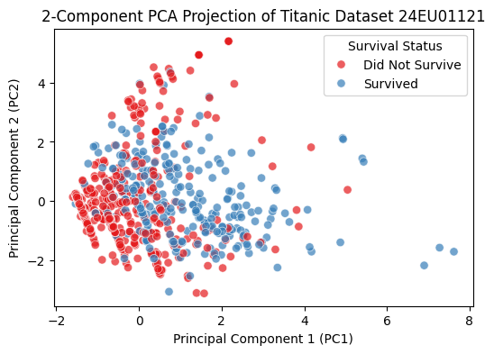
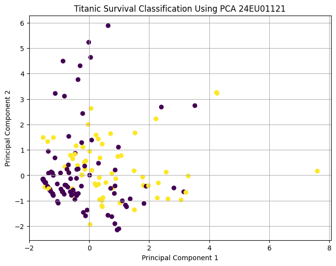
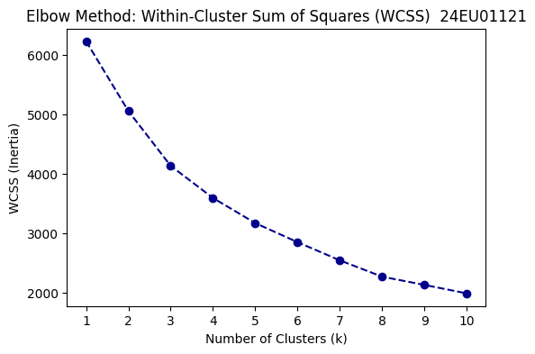
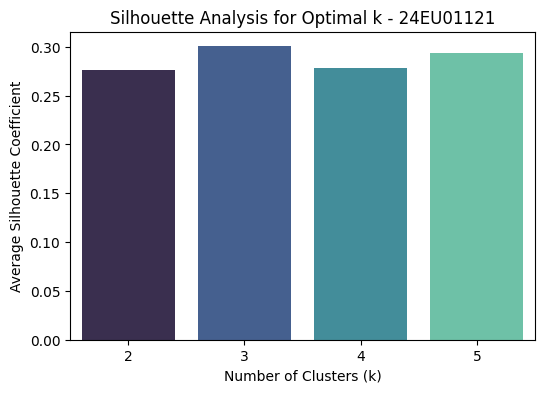
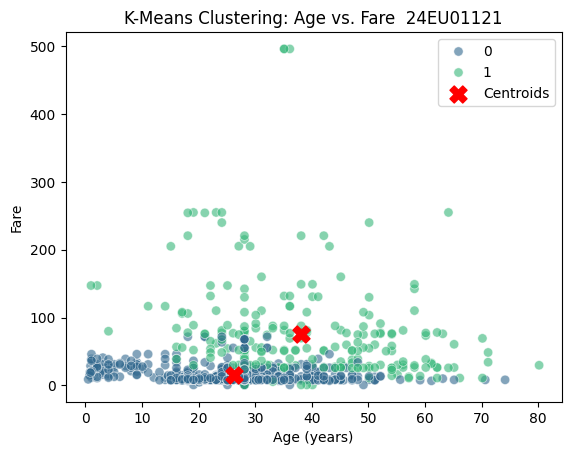
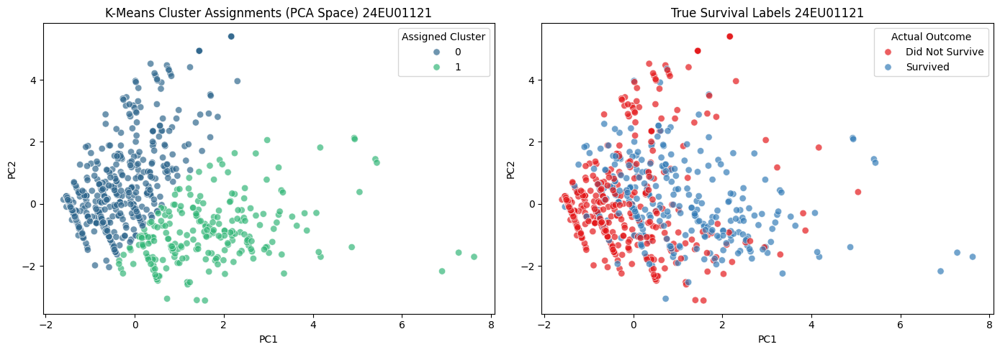

 # Experiment 6: PCA and Clustering Models
 ## Task 1: Apply Principal Component Analysis (PCA) for feature extraction and dimensionality reduction*Dataset: Titanic Dataset*

### Subtask 1.1: Data Acquisition and Feature Standardization


```python
import warnings
```


```python
warnings.filterwarnings("ignore")
```


```python
import pandas as pd
```


```python
import numpy as np
```


```python
import seaborn as sns
```


```python
from sklearn.preprocessing import StandardScaler, LabelEncoder
```


```python
# Load raw Titanic dataset
raw_titanic = sns.load_dataset('titanic')
```


```python
print("Raw dataset dimensions:", raw_titanic.shape)
```

    Raw dataset dimensions: (891, 15)
    


```python
print("\nMissing values per column:")
print(raw_titanic.isnull().sum())
```

    
    Missing values per column:
    survived         0
    pclass           0
    sex              0
    age            177
    sibsp            0
    parch            0
    fare             0
    embarked         2
    class            0
    who              0
    adult_male       0
    deck           688
    embark_town      2
    alive            0
    alone            0
    dtype: int64
    


```python
# Select the analytical feature set and target
titanic_df = raw_titanic[['survived', 'pclass', 'sex', 'age', 'sibsp', 'parch', 'fare', 'embarked']].copy()
```


```python
# Impute missing Age with the median, missing Embarked with the mode
titanic_df['age'] = titanic_df['age'].fillna(titanic_df['age'].median())
```


```python
titanic_df['embarked'] = titanic_df['embarked'].fillna(titanic_df['embarked'].mode()[0])
```


```python
# Encode categorical features to numeric form
sex_encoder = LabelEncoder()
titanic_df['sex_encoded'] = sex_encoder.fit_transform(titanic_df['sex'])
```


```python
embarked_encoder = LabelEncoder()
titanic_df['embarked_encoded'] = embarked_encoder.fit_transform(titanic_df['embarked'])
```


```python
features = ['pclass', 'sex_encoded', 'age', 'sibsp', 'parch', 'fare', 'embarked_encoded']
```


```python
X_raw = titanic_df[features].values
```


```python
y_true = titanic_df['survived'].values
```


```python
# Standardize the features
scaler = StandardScaler()
```


```python
X_scaled = scaler.fit_transform(X_raw)
```


```python
# Store in a DataFrame for visualization
titanic_scaled_df = pd.DataFrame(data=X_scaled, columns=features)
```


```python
titanic_scaled_df['survived'] = y_true
```


```python
survival_map = {0: 'Did Not Survive', 1: 'Survived'}
```


```python
titanic_scaled_df['survival_label'] = titanic_scaled_df['survived'].map(survival_map)
```


```python
print("Standardized dataset dimensions:", X_scaled.shape)
```

    Standardized dataset dimensions: (891, 7)
    


```python
print("\nFirst 3 rows of standardized dataset:")
print(titanic_scaled_df.head(3))
```

    
    First 3 rows of standardized dataset:
         pclass  sex_encoded       age     sibsp     parch      fare  \
    0  0.827377     0.737695 -0.565736  0.432793 -0.473674 -0.502445   
    1 -1.566107    -1.355574  0.663861  0.432793 -0.473674  0.786845   
    2  0.827377    -1.355574 -0.258337 -0.474545 -0.473674 -0.488854   
    
       embarked_encoded  survived   survival_label  
    0          0.585954         0  Did Not Survive  
    1         -1.942303         1         Survived  
    2          0.585954         1         Survived  
    

### Subtask 1.2: Covariance Matrix and Eigenvalue Decomposition


```python
# Calculate the covariance matrix
cov_matrix = np.cov(X_scaled.T)
```


```python
print("Covariance Matrix:\n", cov_matrix)
```

    Covariance Matrix:
     [[ 1.0011236   0.13204869 -0.34028024  0.08317471  0.01846339 -0.55011704
       0.16227994]
     [ 0.13204869  1.0011236   0.08125373 -0.11475961 -0.24576479 -0.1825377
       0.10838385]
     [-0.34028024  0.08125373  1.0011236  -0.23355846 -0.17267575  0.09679706
      -0.01877539]
     [ 0.08317471 -0.11475961 -0.23355846  1.0011236   0.41530381  0.15983043
       0.06830695]
     [ 0.01846339 -0.24576479 -0.17267575  0.41530381  1.0011236   0.21646789
       0.03984311]
     [-0.55011704 -0.1825377   0.09679706  0.15983043  0.21646789  1.0011236
      -0.22497186]
     [ 0.16227994  0.10838385 -0.01877539  0.06830695  0.03984311 -0.22497186
       1.0011236 ]]
    


```python
# Perform eigenvalue decomposition
eigenvalues, eigenvectors = np.linalg.eig(cov_matrix)
```


```python
print("\nEigenvalues (Variance components):\n", eigenvalues)
```

    
    Eigenvalues (Variance components):
     [1.85796677 1.71653366 0.36689739 0.99749852 0.66716428 0.55771075
     0.84409379]
    


```python
print("\nEigenvectors (Principal Axes):\n", eigenvectors)
```

    
    Eigenvectors (Principal Axes):
     [[ 0.53352353  0.34389883  0.68835705  0.2003863   0.28673039 -0.02942797
       0.00397617]
     [ 0.34356535 -0.22158262 -0.07602253 -0.31123395  0.01243361 -0.24758768
      -0.81777977]
     [-0.14488859 -0.49989395  0.20010723 -0.40852423  0.68599662  0.1386299
       0.17991326]
     [-0.18812291  0.5412223  -0.10314171 -0.24011808  0.19048691  0.67828452
      -0.32716684]
     [-0.29120493  0.51409535 -0.15871747 -0.19220909  0.37130869 -0.67058141
       0.03493604]
     [-0.61439189 -0.04708266  0.65950535 -0.09066006 -0.3263448  -0.09307198
      -0.24894968]
     [ 0.28045472  0.15267088  0.09780328 -0.77023791 -0.40790121 -0.01429632
       0.35863219]]
    

### Subtask 1.3: Implementing Dimensionality Reduction via PCA


```python
from sklearn.decomposition import PCA
```


```python
# Initialize PCA to extract 2 orthogonal components
pca_model = PCA(n_components=2, random_state=42)
```


```python
X_pca = pca_model.fit_transform(X_scaled)
```


```python
# Convert to a DataFrame
pca_df = pd.DataFrame(data=X_pca, columns=['PC_1', 'PC2'])
```


```python
pca_df['survival_label'] = titanic_scaled_df['survival_label']
```


```python
print("Transformed PCA space dimensions:", X_pca.shape)
```

    Transformed PCA space dimensions: (891, 2)
    


```python
print("\nFirst 3 projected coordinates:")
print(pca_df.head(3))
```

    
    First 3 projected coordinates:
           PC_1       PC2   survival_label
    0 -1.306390  0.507720  Did Not Survive
    1  2.369111 -0.912927         Survived
    2 -0.705018  0.326174         Survived
    

### Subtask 1.4: Visualizing the 2D PCA Feature Space


```python
import matplotlib.pyplot as plt
```


```python
plt.figure(figsize=(6,4))
sns.scatterplot(data=pca_df, x='PC_1', y='PC2', hue='survival_label', palette='Set1', s=45, alpha=0.7)
plt.title("2-Component PCA Projection of Titanic Dataset 24EU01121")
plt.xlabel("Principal Component 1 (PC1)")
plt.ylabel("Principal Component 2 (PC2)")
plt.legend(title='Survival Status')
plt.show()
```


    

    


### Subtask 1.5: Analyzing Explained Variance Ratio


```python
explained_variance = pca_model.explained_variance_ratio_
```


```python
cumulative_variance = np.sum(explained_variance)
```


```python
print("Explained Variance per Component:")
for i, var in enumerate(explained_variance):
    print(f"  PC{i+1}: {var*100:.2f}%")
```

    Explained Variance per Component:
      PC1: 26.51%
      PC2: 24.49%
    


```python
print(f"\nTotal Cumulative Variance Retained by 2 Components: {cumulative_variance*100:.2f}%")
```

    
    Total Cumulative Variance Retained by 2 Components: 51.01%
    

 **Classification with and without PCA -** **Dataset: Titanic Dataset -** **Classifier: Logistic Regression**


```python
# Step 1: Import required libraries
import numpy as np
```


```python
import pandas as pd
```


```python
import matplotlib.pyplot as plt
```


```python
from sklearn.model_selection import train_test_split
```


```python
from sklearn.preprocessing import StandardScaler
```


```python
from sklearn.decomposition import PCA
```


```python
from sklearn.linear_model import LogisticRegression
```


```python
from sklearn.metrics import accuracy_score, classification_report, confusion_matrix
```


```python
# Step 2: Prepare the Dataset
X = titanic_df[features].values
```


```python
y = titanic_df['survived'].values
```


```python
feature_names = features
```


```python
target_names = ['Did Not Survive', 'Survived']
```


```python
print("Dataset Shape:", X.shape)
```

    Dataset Shape: (891, 7)
    


```python
print("Features:", feature_names)
```

    Features: ['pclass', 'sex_encoded', 'age', 'sibsp', 'parch', 'fare', 'embarked_encoded']
    


```python
print("Classes:", target_names)
```

    Classes: ['Did Not Survive', 'Survived']
    


```python
# Step 3: Split the Dataset
X_train, X_test, y_train, y_test = train_test_split(
    X,
    y,
    test_size=0.20,
    random_state=42,
    stratify=y
)
```


```python
# Step 4: Feature Scaling
scaler = StandardScaler()
```


```python
X_train_scaled = scaler.fit_transform(X_train)
```


```python
X_test_scaled = scaler.transform(X_test)
```


```python
# ============================================================
# PART A: CLASSIFICATION WITHOUT PCA
# ============================================================
# Create Logistic Regression model
model_without_pca = LogisticRegression(
    random_state=42,
    max_iter=1000
)
```


```python
# Train the model
model_without_pca.fit(
    X_train_scaled,
    y_train
)
```


<style>#sk-container-id-1 {
  /* Definition of color scheme common for light and dark mode */
  --sklearn-color-text: #000;
  --sklearn-color-text-muted: #666;
  --sklearn-color-line: gray;
  /* Definition of color scheme for unfitted estimators */
  --sklearn-color-unfitted-level-0: #fff5e6;
  --sklearn-color-unfitted-level-1: #f6e4d2;
  --sklearn-color-unfitted-level-2: #ffe0b3;
  --sklearn-color-unfitted-level-3: chocolate;
  /* Definition of color scheme for fitted estimators */
  --sklearn-color-fitted-level-0: #f0f8ff;
  --sklearn-color-fitted-level-1: #d4ebff;
  --sklearn-color-fitted-level-2: #b3dbfd;
  --sklearn-color-fitted-level-3: cornflowerblue;
}

#sk-container-id-1.light {
  /* Specific color for light theme */
  --sklearn-color-text-on-default-background: black;
  --sklearn-color-background: white;
  --sklearn-color-border-box: black;
  --sklearn-color-icon: #696969;
}

#sk-container-id-1.dark {
  --sklearn-color-text-on-default-background: white;
  --sklearn-color-background: #111;
  --sklearn-color-border-box: white;
  --sklearn-color-icon: #878787;
}

#sk-container-id-1 {
  color: var(--sklearn-color-text);
}

#sk-container-id-1 pre {
  padding: 0;
}

#sk-container-id-1 input.sk-hidden--visually {
  border: 0;
  clip: rect(1px 1px 1px 1px);
  clip: rect(1px, 1px, 1px, 1px);
  height: 1px;
  margin: -1px;
  overflow: hidden;
  padding: 0;
  position: absolute;
  width: 1px;
}

#sk-container-id-1 div.sk-dashed-wrapped {
  border: 1px dashed var(--sklearn-color-line);
  margin: 0 0.4em 0.5em 0.4em;
  box-sizing: border-box;
  padding-bottom: 0.4em;
  background-color: var(--sklearn-color-background);
}

#sk-container-id-1 div.sk-container {
  /* jupyter's `normalize.less` sets `[hidden] { display: none; }`
     but bootstrap.min.css set `[hidden] { display: none !important; }`
     so we also need the `!important` here to be able to override the
     default hidden behavior on the sphinx rendered scikit-learn.org.
     See: https://github.com/scikit-learn/scikit-learn/issues/21755 */
  display: inline-block !important;
  position: relative;
}

#sk-container-id-1 div.sk-text-repr-fallback {
  display: none;
}

div.sk-parallel-item,
div.sk-serial,
div.sk-item {
  /* draw centered vertical line to link estimators */
  background-image: linear-gradient(var(--sklearn-color-text-on-default-background), var(--sklearn-color-text-on-default-background));
  background-size: 2px 100%;
  background-repeat: no-repeat;
  background-position: center center;
}

/* Parallel-specific style estimator block */

#sk-container-id-1 div.sk-parallel-item::after {
  content: "";
  width: 100%;
  border-bottom: 2px solid var(--sklearn-color-text-on-default-background);
  flex-grow: 1;
}

#sk-container-id-1 div.sk-parallel {
  display: flex;
  align-items: stretch;
  justify-content: center;
  background-color: var(--sklearn-color-background);
  position: relative;
}

#sk-container-id-1 div.sk-parallel-item {
  display: flex;
  flex-direction: column;
}

#sk-container-id-1 div.sk-parallel-item:first-child::after {
  align-self: flex-end;
  width: 50%;
}

#sk-container-id-1 div.sk-parallel-item:last-child::after {
  align-self: flex-start;
  width: 50%;
}

#sk-container-id-1 div.sk-parallel-item:only-child::after {
  width: 0;
}

/* Serial-specific style estimator block */

#sk-container-id-1 div.sk-serial {
  display: flex;
  flex-direction: column;
  align-items: center;
  background-color: var(--sklearn-color-background);
  padding-right: 1em;
  padding-left: 1em;
}


/* Toggleable style: style used for estimator/Pipeline/ColumnTransformer box that is
clickable and can be expanded/collapsed.
- Pipeline and ColumnTransformer use this feature and define the default style
- Estimators will overwrite some part of the style using the `sk-estimator` class
*/

/* Pipeline and ColumnTransformer style (default) */

#sk-container-id-1 div.sk-toggleable {
  /* Default theme specific background. It is overwritten whether we have a
  specific estimator or a Pipeline/ColumnTransformer */
  background-color: var(--sklearn-color-background);
}

/* Toggleable label */
#sk-container-id-1 label.sk-toggleable__label {
  cursor: pointer;
  display: flex;
  width: 100%;
  margin-bottom: 0;
  padding: 0.5em;
  box-sizing: border-box;
  text-align: center;
  align-items: center;
  justify-content: center;
  gap: 0.5em;
}

#sk-container-id-1 label.sk-toggleable__label .caption {
  font-size: 0.6rem;
  font-weight: lighter;
  color: var(--sklearn-color-text-muted);
}

#sk-container-id-1 label.sk-toggleable__label-arrow:before {
  /* Arrow on the left of the label */
  content: "▸";
  float: left;
  margin-right: 0.25em;
  color: var(--sklearn-color-icon);
}

#sk-container-id-1 label.sk-toggleable__label-arrow:hover:before {
  color: var(--sklearn-color-text);
}

/* Toggleable content - dropdown */

#sk-container-id-1 div.sk-toggleable__content {
  display: none;
  text-align: left;
  /* unfitted */
  background-color: var(--sklearn-color-unfitted-level-0);
}

#sk-container-id-1 div.sk-toggleable__content.fitted {
  /* fitted */
  background-color: var(--sklearn-color-fitted-level-0);
}

#sk-container-id-1 div.sk-toggleable__content pre {
  margin: 0.2em;
  border-radius: 0.25em;
  color: var(--sklearn-color-text);
  /* unfitted */
  background-color: var(--sklearn-color-unfitted-level-0);
}

#sk-container-id-1 div.sk-toggleable__content.fitted pre {
  /* unfitted */
  background-color: var(--sklearn-color-fitted-level-0);
}

#sk-container-id-1 input.sk-toggleable__control:checked~div.sk-toggleable__content {
  /* Expand drop-down */
  display: block;
  width: 100%;
  overflow: visible;
}

#sk-container-id-1 input.sk-toggleable__control:checked~label.sk-toggleable__label-arrow:before {
  content: "▾";
}

/* Pipeline/ColumnTransformer-specific style */

#sk-container-id-1 div.sk-label input.sk-toggleable__control:checked~label.sk-toggleable__label {
  color: var(--sklearn-color-text);
  background-color: var(--sklearn-color-unfitted-level-2);
}

#sk-container-id-1 div.sk-label.fitted input.sk-toggleable__control:checked~label.sk-toggleable__label {
  background-color: var(--sklearn-color-fitted-level-2);
}

/* Estimator-specific style */

/* Colorize estimator box */
#sk-container-id-1 div.sk-estimator input.sk-toggleable__control:checked~label.sk-toggleable__label {
  /* unfitted */
  background-color: var(--sklearn-color-unfitted-level-2);
}

#sk-container-id-1 div.sk-estimator.fitted input.sk-toggleable__control:checked~label.sk-toggleable__label {
  /* fitted */
  background-color: var(--sklearn-color-fitted-level-2);
}

#sk-container-id-1 div.sk-label label.sk-toggleable__label,
#sk-container-id-1 div.sk-label label {
  /* The background is the default theme color */
  color: var(--sklearn-color-text-on-default-background);
}

/* On hover, darken the color of the background */
#sk-container-id-1 div.sk-label:hover label.sk-toggleable__label {
  color: var(--sklearn-color-text);
  background-color: var(--sklearn-color-unfitted-level-2);
}

/* Label box, darken color on hover, fitted */
#sk-container-id-1 div.sk-label.fitted:hover label.sk-toggleable__label.fitted {
  color: var(--sklearn-color-text);
  background-color: var(--sklearn-color-fitted-level-2);
}

/* Estimator label */

#sk-container-id-1 div.sk-label label {
  font-family: monospace;
  font-weight: bold;
  line-height: 1.2em;
}

#sk-container-id-1 div.sk-label-container {
  text-align: center;
}

/* Estimator-specific */
#sk-container-id-1 div.sk-estimator {
  font-family: monospace;
  border: 1px dotted var(--sklearn-color-border-box);
  border-radius: 0.25em;
  box-sizing: border-box;
  margin-bottom: 0.5em;
  /* unfitted */
  background-color: var(--sklearn-color-unfitted-level-0);
}

#sk-container-id-1 div.sk-estimator.fitted {
  /* fitted */
  background-color: var(--sklearn-color-fitted-level-0);
}

/* on hover */
#sk-container-id-1 div.sk-estimator:hover {
  /* unfitted */
  background-color: var(--sklearn-color-unfitted-level-2);
}

#sk-container-id-1 div.sk-estimator.fitted:hover {
  /* fitted */
  background-color: var(--sklearn-color-fitted-level-2);
}

/* Specification for estimator info (e.g. "i" and "?") */

/* Common style for "i" and "?" */

.sk-estimator-doc-link,
a:link.sk-estimator-doc-link,
a:visited.sk-estimator-doc-link {
  float: right;
  font-size: smaller;
  line-height: 1em;
  font-family: monospace;
  background-color: var(--sklearn-color-unfitted-level-0);
  border-radius: 1em;
  height: 1em;
  width: 1em;
  text-decoration: none !important;
  margin-left: 0.5em;
  text-align: center;
  /* unfitted */
  border: var(--sklearn-color-unfitted-level-3) 1pt solid;
  color: var(--sklearn-color-unfitted-level-3);
}

.sk-estimator-doc-link.fitted,
a:link.sk-estimator-doc-link.fitted,
a:visited.sk-estimator-doc-link.fitted {
  /* fitted */
  background-color: var(--sklearn-color-fitted-level-0);
  border: var(--sklearn-color-fitted-level-3) 1pt solid;
  color: var(--sklearn-color-fitted-level-3);
}

/* On hover */
div.sk-estimator:hover .sk-estimator-doc-link:hover,
.sk-estimator-doc-link:hover,
div.sk-label-container:hover .sk-estimator-doc-link:hover,
.sk-estimator-doc-link:hover {
  /* unfitted */
  background-color: var(--sklearn-color-unfitted-level-3);
  border: var(--sklearn-color-fitted-level-0) 1pt solid;
  color: var(--sklearn-color-unfitted-level-0);
  text-decoration: none;
}

div.sk-estimator.fitted:hover .sk-estimator-doc-link.fitted:hover,
.sk-estimator-doc-link.fitted:hover,
div.sk-label-container:hover .sk-estimator-doc-link.fitted:hover,
.sk-estimator-doc-link.fitted:hover {
  /* fitted */
  background-color: var(--sklearn-color-fitted-level-3);
  border: var(--sklearn-color-fitted-level-0) 1pt solid;
  color: var(--sklearn-color-fitted-level-0);
  text-decoration: none;
}

/* Span, style for the box shown on hovering the info icon */
.sk-estimator-doc-link span {
  display: none;
  z-index: 9999;
  position: relative;
  font-weight: normal;
  right: .2ex;
  padding: .5ex;
  margin: .5ex;
  width: min-content;
  min-width: 20ex;
  max-width: 50ex;
  color: var(--sklearn-color-text);
  box-shadow: 2pt 2pt 4pt #999;
  /* unfitted */
  background: var(--sklearn-color-unfitted-level-0);
  border: .5pt solid var(--sklearn-color-unfitted-level-3);
}

.sk-estimator-doc-link.fitted span {
  /* fitted */
  background: var(--sklearn-color-fitted-level-0);
  border: var(--sklearn-color-fitted-level-3);
}

.sk-estimator-doc-link:hover span {
  display: block;
}

/* "?"-specific style due to the `<a>` HTML tag */

#sk-container-id-1 a.estimator_doc_link {
  float: right;
  font-size: 1rem;
  line-height: 1em;
  font-family: monospace;
  background-color: var(--sklearn-color-unfitted-level-0);
  border-radius: 1rem;
  height: 1rem;
  width: 1rem;
  text-decoration: none;
  /* unfitted */
  color: var(--sklearn-color-unfitted-level-1);
  border: var(--sklearn-color-unfitted-level-1) 1pt solid;
}

#sk-container-id-1 a.estimator_doc_link.fitted {
  /* fitted */
  background-color: var(--sklearn-color-fitted-level-0);
  border: var(--sklearn-color-fitted-level-1) 1pt solid;
  color: var(--sklearn-color-fitted-level-1);
}

/* On hover */
#sk-container-id-1 a.estimator_doc_link:hover {
  /* unfitted */
  background-color: var(--sklearn-color-unfitted-level-3);
  color: var(--sklearn-color-background);
  text-decoration: none;
}

#sk-container-id-1 a.estimator_doc_link.fitted:hover {
  /* fitted */
  background-color: var(--sklearn-color-fitted-level-3);
}

.estimator-table {
    font-family: monospace;
}

.estimator-table summary {
    padding: .5rem;
    cursor: pointer;
}

.estimator-table summary::marker {
    font-size: 0.7rem;
}

.estimator-table details[open] {
    padding-left: 0.1rem;
    padding-right: 0.1rem;
    padding-bottom: 0.3rem;
}

.estimator-table .parameters-table {
    margin-left: auto !important;
    margin-right: auto !important;
    margin-top: 0;
}

.estimator-table .parameters-table tr:nth-child(odd) {
    background-color: #fff;
}

.estimator-table .parameters-table tr:nth-child(even) {
    background-color: #f6f6f6;
}

.estimator-table .parameters-table tr:hover {
    background-color: #e0e0e0;
}

.estimator-table table td {
    border: 1px solid rgba(106, 105, 104, 0.232);
}

/*
    `table td`is set in notebook with right text-align.
    We need to overwrite it.
*/
.estimator-table table td.param {
    text-align: left;
    position: relative;
    padding: 0;
}

.user-set td {
    color:rgb(255, 94, 0);
    text-align: left !important;
}

.user-set td.value {
    color:rgb(255, 94, 0);
    background-color: transparent;
}

.default td {
    color: black;
    text-align: left !important;
}

.user-set td i,
.default td i {
    color: black;
}

/*
    Styles for parameter documentation links
    We need styling for visited so jupyter doesn't overwrite it
*/
a.param-doc-link,
a.param-doc-link:link,
a.param-doc-link:visited {
    text-decoration: underline dashed;
    text-underline-offset: .3em;
    color: inherit;
    display: block;
    padding: .5em;
}

/* "hack" to make the entire area of the cell containing the link clickable */
a.param-doc-link::before {
    position: absolute;
    content: "";
    inset: 0;
}

.param-doc-description {
    display: none;
    position: absolute;
    z-index: 9999;
    left: 0;
    padding: .5ex;
    margin-left: 1.5em;
    color: var(--sklearn-color-text);
    box-shadow: .3em .3em .4em #999;
    width: max-content;
    text-align: left;
    max-height: 10em;
    overflow-y: auto;

    /* unfitted */
    background: var(--sklearn-color-unfitted-level-0);
    border: thin solid var(--sklearn-color-unfitted-level-3);
}

/* Fitted state for parameter tooltips */
.fitted .param-doc-description {
    /* fitted */
    background: var(--sklearn-color-fitted-level-0);
    border: thin solid var(--sklearn-color-fitted-level-3);
}

.param-doc-link:hover .param-doc-description {
    display: block;
}

.copy-paste-icon {
    background-image: url(data:image/svg+xml;base64,PHN2ZyB4bWxucz0iaHR0cDovL3d3dy53My5vcmcvMjAwMC9zdmciIHZpZXdCb3g9IjAgMCA0NDggNTEyIj48IS0tIUZvbnQgQXdlc29tZSBGcmVlIDYuNy4yIGJ5IEBmb250YXdlc29tZSAtIGh0dHBzOi8vZm9udGF3ZXNvbWUuY29tIExpY2Vuc2UgLSBodHRwczovL2ZvbnRhd2Vzb21lLmNvbS9saWNlbnNlL2ZyZWUgQ29weXJpZ2h0IDIwMjUgRm9udGljb25zLCBJbmMuLS0+PHBhdGggZD0iTTIwOCAwTDMzMi4xIDBjMTIuNyAwIDI0LjkgNS4xIDMzLjkgMTQuMWw2Ny45IDY3LjljOSA5IDE0LjEgMjEuMiAxNC4xIDMzLjlMNDQ4IDMzNmMwIDI2LjUtMjEuNSA0OC00OCA0OGwtMTkyIDBjLTI2LjUgMC00OC0yMS41LTQ4LTQ4bDAtMjg4YzAtMjYuNSAyMS41LTQ4IDQ4LTQ4ek00OCAxMjhsODAgMCAwIDY0LTY0IDAgMCAyNTYgMTkyIDAgMC0zMiA2NCAwIDAgNDhjMCAyNi41LTIxLjUgNDgtNDggNDhMNDggNTEyYy0yNi41IDAtNDgtMjEuNS00OC00OEwwIDE3NmMwLTI2LjUgMjEuNS00OCA0OC00OHoiLz48L3N2Zz4=);
    background-repeat: no-repeat;
    background-size: 14px 14px;
    background-position: 0;
    display: inline-block;
    width: 14px;
    height: 14px;
    cursor: pointer;
}
</style><body><div id="sk-container-id-1" class="sk-top-container"><div class="sk-text-repr-fallback"><pre>LogisticRegression(max_iter=1000, random_state=42)</pre><b>In a Jupyter environment, please rerun this cell to show the HTML representation or trust the notebook. <br />On GitHub, the HTML representation is unable to render, please try loading this page with nbviewer.org.</b></div><div class="sk-container" hidden><div class="sk-item"><div class="sk-estimator fitted sk-toggleable"><input class="sk-toggleable__control sk-hidden--visually" id="sk-estimator-id-1" type="checkbox" checked><label for="sk-estimator-id-1" class="sk-toggleable__label fitted sk-toggleable__label-arrow"><div><div>LogisticRegression</div></div><div><a class="sk-estimator-doc-link fitted" rel="noreferrer" target="_blank" href="https://scikit-learn.org/1.8/modules/generated/sklearn.linear_model.LogisticRegression.html">?<span>Documentation for LogisticRegression</span></a><span class="sk-estimator-doc-link fitted">i<span>Fitted</span></span></div></label><div class="sk-toggleable__content fitted" data-param-prefix="">
        <div class="estimator-table">
            <details>
                <summary>Parameters</summary>
                <table class="parameters-table">
                  <tbody>

        <tr class="default">
            <td><i class="copy-paste-icon"
                 onclick="copyToClipboard('penalty',
                          this.parentElement.nextElementSibling)"
            ></i></td>
            <td class="param">
        <a class="param-doc-link"
            rel="noreferrer" target="_blank" href="https://scikit-learn.org/1.8/modules/generated/sklearn.linear_model.LogisticRegression.html#:~:text=penalty,-%7B%27l1%27%2C%20%27l2%27%2C%20%27elasticnet%27%2C%20None%7D%2C%20default%3D%27l2%27">
            penalty
            <span class="param-doc-description">penalty: {'l1', 'l2', 'elasticnet', None}, default='l2'<br><br>Specify the norm of the penalty:<br><br>- `None`: no penalty is added;<br>- `'l2'`: add a L2 penalty term and it is the default choice;<br>- `'l1'`: add a L1 penalty term;<br>- `'elasticnet'`: both L1 and L2 penalty terms are added.<br><br>.. warning::<br>   Some penalties may not work with some solvers. See the parameter<br>   `solver` below, to know the compatibility between the penalty and<br>   solver.<br><br>.. versionadded:: 0.19<br>   l1 penalty with SAGA solver (allowing 'multinomial' + L1)<br><br>.. deprecated:: 1.8<br>   `penalty` was deprecated in version 1.8 and will be removed in 1.10.<br>   Use `l1_ratio` instead. `l1_ratio=0` for `penalty='l2'`, `l1_ratio=1` for<br>   `penalty='l1'` and `l1_ratio` set to any float between 0 and 1 for<br>   `'penalty='elasticnet'`.</span>
        </a>
    </td>
            <td class="value">&#x27;deprecated&#x27;</td>
        </tr>


        <tr class="default">
            <td><i class="copy-paste-icon"
                 onclick="copyToClipboard('C',
                          this.parentElement.nextElementSibling)"
            ></i></td>
            <td class="param">
        <a class="param-doc-link"
            rel="noreferrer" target="_blank" href="https://scikit-learn.org/1.8/modules/generated/sklearn.linear_model.LogisticRegression.html#:~:text=C,-float%2C%20default%3D1.0">
            C
            <span class="param-doc-description">C: float, default=1.0<br><br>Inverse of regularization strength; must be a positive float.<br>Like in support vector machines, smaller values specify stronger<br>regularization. `C=np.inf` results in unpenalized logistic regression.<br>For a visual example on the effect of tuning the `C` parameter<br>with an L1 penalty, see:<br>:ref:`sphx_glr_auto_examples_linear_model_plot_logistic_path.py`.</span>
        </a>
    </td>
            <td class="value">1.0</td>
        </tr>


        <tr class="default">
            <td><i class="copy-paste-icon"
                 onclick="copyToClipboard('l1_ratio',
                          this.parentElement.nextElementSibling)"
            ></i></td>
            <td class="param">
        <a class="param-doc-link"
            rel="noreferrer" target="_blank" href="https://scikit-learn.org/1.8/modules/generated/sklearn.linear_model.LogisticRegression.html#:~:text=l1_ratio,-float%2C%20default%3D0.0">
            l1_ratio
            <span class="param-doc-description">l1_ratio: float, default=0.0<br><br>The Elastic-Net mixing parameter, with `0 <= l1_ratio <= 1`. Setting<br>`l1_ratio=1` gives a pure L1-penalty, setting `l1_ratio=0` a pure L2-penalty.<br>Any value between 0 and 1 gives an Elastic-Net penalty of the form<br>`l1_ratio * L1 + (1 - l1_ratio) * L2`.<br><br>.. warning::<br>   Certain values of `l1_ratio`, i.e. some penalties, may not work with some<br>   solvers. See the parameter `solver` below, to know the compatibility between<br>   the penalty and solver.<br><br>.. versionchanged:: 1.8<br>    Default value changed from None to 0.0.<br><br>.. deprecated:: 1.8<br>    `None` is deprecated and will be removed in version 1.10. Always use<br>    `l1_ratio` to specify the penalty type.</span>
        </a>
    </td>
            <td class="value">0.0</td>
        </tr>


        <tr class="default">
            <td><i class="copy-paste-icon"
                 onclick="copyToClipboard('dual',
                          this.parentElement.nextElementSibling)"
            ></i></td>
            <td class="param">
        <a class="param-doc-link"
            rel="noreferrer" target="_blank" href="https://scikit-learn.org/1.8/modules/generated/sklearn.linear_model.LogisticRegression.html#:~:text=dual,-bool%2C%20default%3DFalse">
            dual
            <span class="param-doc-description">dual: bool, default=False<br><br>Dual (constrained) or primal (regularized, see also<br>:ref:`this equation <regularized-logistic-loss>`) formulation. Dual formulation<br>is only implemented for l2 penalty with liblinear solver. Prefer `dual=False`<br>when n_samples > n_features.</span>
        </a>
    </td>
            <td class="value">False</td>
        </tr>


        <tr class="default">
            <td><i class="copy-paste-icon"
                 onclick="copyToClipboard('tol',
                          this.parentElement.nextElementSibling)"
            ></i></td>
            <td class="param">
        <a class="param-doc-link"
            rel="noreferrer" target="_blank" href="https://scikit-learn.org/1.8/modules/generated/sklearn.linear_model.LogisticRegression.html#:~:text=tol,-float%2C%20default%3D1e-4">
            tol
            <span class="param-doc-description">tol: float, default=1e-4<br><br>Tolerance for stopping criteria.</span>
        </a>
    </td>
            <td class="value">0.0001</td>
        </tr>


        <tr class="default">
            <td><i class="copy-paste-icon"
                 onclick="copyToClipboard('fit_intercept',
                          this.parentElement.nextElementSibling)"
            ></i></td>
            <td class="param">
        <a class="param-doc-link"
            rel="noreferrer" target="_blank" href="https://scikit-learn.org/1.8/modules/generated/sklearn.linear_model.LogisticRegression.html#:~:text=fit_intercept,-bool%2C%20default%3DTrue">
            fit_intercept
            <span class="param-doc-description">fit_intercept: bool, default=True<br><br>Specifies if a constant (a.k.a. bias or intercept) should be<br>added to the decision function.</span>
        </a>
    </td>
            <td class="value">True</td>
        </tr>


        <tr class="default">
            <td><i class="copy-paste-icon"
                 onclick="copyToClipboard('intercept_scaling',
                          this.parentElement.nextElementSibling)"
            ></i></td>
            <td class="param">
        <a class="param-doc-link"
            rel="noreferrer" target="_blank" href="https://scikit-learn.org/1.8/modules/generated/sklearn.linear_model.LogisticRegression.html#:~:text=intercept_scaling,-float%2C%20default%3D1">
            intercept_scaling
            <span class="param-doc-description">intercept_scaling: float, default=1<br><br>Useful only when the solver `liblinear` is used<br>and `self.fit_intercept` is set to `True`. In this case, `x` becomes<br>`[x, self.intercept_scaling]`,<br>i.e. a "synthetic" feature with constant value equal to<br>`intercept_scaling` is appended to the instance vector.<br>The intercept becomes<br>``intercept_scaling * synthetic_feature_weight``.<br><br>.. note::<br>    The synthetic feature weight is subject to L1 or L2<br>    regularization as all other features.<br>    To lessen the effect of regularization on synthetic feature weight<br>    (and therefore on the intercept) `intercept_scaling` has to be increased.</span>
        </a>
    </td>
            <td class="value">1</td>
        </tr>


        <tr class="default">
            <td><i class="copy-paste-icon"
                 onclick="copyToClipboard('class_weight',
                          this.parentElement.nextElementSibling)"
            ></i></td>
            <td class="param">
        <a class="param-doc-link"
            rel="noreferrer" target="_blank" href="https://scikit-learn.org/1.8/modules/generated/sklearn.linear_model.LogisticRegression.html#:~:text=class_weight,-dict%20or%20%27balanced%27%2C%20default%3DNone">
            class_weight
            <span class="param-doc-description">class_weight: dict or 'balanced', default=None<br><br>Weights associated with classes in the form ``{class_label: weight}``.<br>If not given, all classes are supposed to have weight one.<br><br>The "balanced" mode uses the values of y to automatically adjust<br>weights inversely proportional to class frequencies in the input data<br>as ``n_samples / (n_classes * np.bincount(y))``.<br><br>Note that these weights will be multiplied with sample_weight (passed<br>through the fit method) if sample_weight is specified.<br><br>.. versionadded:: 0.17<br>   *class_weight='balanced'*</span>
        </a>
    </td>
            <td class="value">None</td>
        </tr>


        <tr class="user-set">
            <td><i class="copy-paste-icon"
                 onclick="copyToClipboard('random_state',
                          this.parentElement.nextElementSibling)"
            ></i></td>
            <td class="param">
        <a class="param-doc-link"
            rel="noreferrer" target="_blank" href="https://scikit-learn.org/1.8/modules/generated/sklearn.linear_model.LogisticRegression.html#:~:text=random_state,-int%2C%20RandomState%20instance%2C%20default%3DNone">
            random_state
            <span class="param-doc-description">random_state: int, RandomState instance, default=None<br><br>Used when ``solver`` == 'sag', 'saga' or 'liblinear' to shuffle the<br>data. See :term:`Glossary <random_state>` for details.</span>
        </a>
    </td>
            <td class="value">42</td>
        </tr>


        <tr class="default">
            <td><i class="copy-paste-icon"
                 onclick="copyToClipboard('solver',
                          this.parentElement.nextElementSibling)"
            ></i></td>
            <td class="param">
        <a class="param-doc-link"
            rel="noreferrer" target="_blank" href="https://scikit-learn.org/1.8/modules/generated/sklearn.linear_model.LogisticRegression.html#:~:text=solver,-%7B%27lbfgs%27%2C%20%27liblinear%27%2C%20%27newton-cg%27%2C%20%27newton-cholesky%27%2C%20%27sag%27%2C%20%27saga%27%7D%2C%20%20%20%20%20%20%20%20%20%20%20%20%20default%3D%27lbfgs%27">
            solver
            <span class="param-doc-description">solver: {'lbfgs', 'liblinear', 'newton-cg', 'newton-cholesky', 'sag', 'saga'},             default='lbfgs'<br><br>Algorithm to use in the optimization problem. Default is 'lbfgs'.<br>To choose a solver, you might want to consider the following aspects:<br><br>- 'lbfgs' is a good default solver because it works reasonably well for a wide<br>  class of problems.<br>- For :term:`multiclass` problems (`n_classes >= 3`), all solvers except<br>  'liblinear' minimize the full multinomial loss, 'liblinear' will raise an<br>  error.<br>- 'newton-cholesky' is a good choice for<br>  `n_samples` >> `n_features * n_classes`, especially with one-hot encoded<br>  categorical features with rare categories. Be aware that the memory usage<br>  of this solver has a quadratic dependency on `n_features * n_classes`<br>  because it explicitly computes the full Hessian matrix.<br>- For small datasets, 'liblinear' is a good choice, whereas 'sag'<br>  and 'saga' are faster for large ones;<br>- 'liblinear' can only handle binary classification by default. To apply a<br>  one-versus-rest scheme for the multiclass setting one can wrap it with the<br>  :class:`~sklearn.multiclass.OneVsRestClassifier`.<br><br>.. warning::<br>   The choice of the algorithm depends on the penalty chosen (`l1_ratio=0`<br>   for L2-penalty, `l1_ratio=1` for L1-penalty and `0 < l1_ratio < 1` for<br>   Elastic-Net) and on (multinomial) multiclass support:<br><br>   ================= ======================== ======================<br>   solver            l1_ratio                 multinomial multiclass<br>   ================= ======================== ======================<br>   'lbfgs'           l1_ratio=0               yes<br>   'liblinear'       l1_ratio=1 or l1_ratio=0 no<br>   'newton-cg'       l1_ratio=0               yes<br>   'newton-cholesky' l1_ratio=0               yes<br>   'sag'             l1_ratio=0               yes<br>   'saga'            0<=l1_ratio<=1           yes<br>   ================= ======================== ======================<br><br>.. note::<br>   'sag' and 'saga' fast convergence is only guaranteed on features<br>   with approximately the same scale. You can preprocess the data with<br>   a scaler from :mod:`sklearn.preprocessing`.<br><br>.. seealso::<br>   Refer to the :ref:`User Guide <Logistic_regression>` for more<br>   information regarding :class:`LogisticRegression` and more specifically the<br>   :ref:`Table <logistic_regression_solvers>`<br>   summarizing solver/penalty supports.<br><br>.. versionadded:: 0.17<br>   Stochastic Average Gradient (SAG) descent solver. Multinomial support in<br>   version 0.18.<br>.. versionadded:: 0.19<br>   SAGA solver.<br>.. versionchanged:: 0.22<br>   The default solver changed from 'liblinear' to 'lbfgs' in 0.22.<br>.. versionadded:: 1.2<br>   newton-cholesky solver. Multinomial support in version 1.6.</span>
        </a>
    </td>
            <td class="value">&#x27;lbfgs&#x27;</td>
        </tr>


        <tr class="user-set">
            <td><i class="copy-paste-icon"
                 onclick="copyToClipboard('max_iter',
                          this.parentElement.nextElementSibling)"
            ></i></td>
            <td class="param">
        <a class="param-doc-link"
            rel="noreferrer" target="_blank" href="https://scikit-learn.org/1.8/modules/generated/sklearn.linear_model.LogisticRegression.html#:~:text=max_iter,-int%2C%20default%3D100">
            max_iter
            <span class="param-doc-description">max_iter: int, default=100<br><br>Maximum number of iterations taken for the solvers to converge.</span>
        </a>
    </td>
            <td class="value">1000</td>
        </tr>


        <tr class="default">
            <td><i class="copy-paste-icon"
                 onclick="copyToClipboard('verbose',
                          this.parentElement.nextElementSibling)"
            ></i></td>
            <td class="param">
        <a class="param-doc-link"
            rel="noreferrer" target="_blank" href="https://scikit-learn.org/1.8/modules/generated/sklearn.linear_model.LogisticRegression.html#:~:text=verbose,-int%2C%20default%3D0">
            verbose
            <span class="param-doc-description">verbose: int, default=0<br><br>For the liblinear and lbfgs solvers set verbose to any positive<br>number for verbosity.</span>
        </a>
    </td>
            <td class="value">0</td>
        </tr>


        <tr class="default">
            <td><i class="copy-paste-icon"
                 onclick="copyToClipboard('warm_start',
                          this.parentElement.nextElementSibling)"
            ></i></td>
            <td class="param">
        <a class="param-doc-link"
            rel="noreferrer" target="_blank" href="https://scikit-learn.org/1.8/modules/generated/sklearn.linear_model.LogisticRegression.html#:~:text=warm_start,-bool%2C%20default%3DFalse">
            warm_start
            <span class="param-doc-description">warm_start: bool, default=False<br><br>When set to True, reuse the solution of the previous call to fit as<br>initialization, otherwise, just erase the previous solution.<br>Useless for liblinear solver. See :term:`the Glossary <warm_start>`.<br><br>.. versionadded:: 0.17<br>   *warm_start* to support *lbfgs*, *newton-cg*, *sag*, *saga* solvers.</span>
        </a>
    </td>
            <td class="value">False</td>
        </tr>


        <tr class="default">
            <td><i class="copy-paste-icon"
                 onclick="copyToClipboard('n_jobs',
                          this.parentElement.nextElementSibling)"
            ></i></td>
            <td class="param">
        <a class="param-doc-link"
            rel="noreferrer" target="_blank" href="https://scikit-learn.org/1.8/modules/generated/sklearn.linear_model.LogisticRegression.html#:~:text=n_jobs,-int%2C%20default%3DNone">
            n_jobs
            <span class="param-doc-description">n_jobs: int, default=None<br><br>Does not have any effect.<br><br>.. deprecated:: 1.8<br>   `n_jobs` is deprecated in version 1.8 and will be removed in 1.10.</span>
        </a>
    </td>
            <td class="value">None</td>
        </tr>

                  </tbody>
                </table>
            </details>
        </div>
    </div></div></div></div></div><script>function copyToClipboard(text, element) {
    // Get the parameter prefix from the closest toggleable content
    const toggleableContent = element.closest('.sk-toggleable__content');
    const paramPrefix = toggleableContent ? toggleableContent.dataset.paramPrefix : '';
    const fullParamName = paramPrefix ? `${paramPrefix}${text}` : text;

    const originalStyle = element.style;
    const computedStyle = window.getComputedStyle(element);
    const originalWidth = computedStyle.width;
    const originalHTML = element.innerHTML.replace('Copied!', '');

    navigator.clipboard.writeText(fullParamName)
        .then(() => {
            element.style.width = originalWidth;
            element.style.color = 'green';
            element.innerHTML = "Copied!";

            setTimeout(() => {
                element.innerHTML = originalHTML;
                element.style = originalStyle;
            }, 2000);
        })
        .catch(err => {
            console.error('Failed to copy:', err);
            element.style.color = 'red';
            element.innerHTML = "Failed!";
            setTimeout(() => {
                element.innerHTML = originalHTML;
                element.style = originalStyle;
            }, 2000);
        });
    return false;
}

document.querySelectorAll('.copy-paste-icon').forEach(function(element) {
    const toggleableContent = element.closest('.sk-toggleable__content');
    const paramPrefix = toggleableContent ? toggleableContent.dataset.paramPrefix : '';
    const paramName = element.parentElement.nextElementSibling
        .textContent.trim().split(' ')[0];
    const fullParamName = paramPrefix ? `${paramPrefix}${paramName}` : paramName;

    element.setAttribute('title', fullParamName);
});


/**
 * Adapted from Skrub
 * https://github.com/skrub-data/skrub/blob/403466d1d5d4dc76a7ef569b3f8228db59a31dc3/skrub/_reporting/_data/templates/report.js#L789
 * @returns "light" or "dark"
 */
function detectTheme(element) {
    const body = document.querySelector('body');

    // Check VSCode theme
    const themeKindAttr = body.getAttribute('data-vscode-theme-kind');
    const themeNameAttr = body.getAttribute('data-vscode-theme-name');

    if (themeKindAttr && themeNameAttr) {
        const themeKind = themeKindAttr.toLowerCase();
        const themeName = themeNameAttr.toLowerCase();

        if (themeKind.includes("dark") || themeName.includes("dark")) {
            return "dark";
        }
        if (themeKind.includes("light") || themeName.includes("light")) {
            return "light";
        }
    }

    // Check Jupyter theme
    if (body.getAttribute('data-jp-theme-light') === 'false') {
        return 'dark';
    } else if (body.getAttribute('data-jp-theme-light') === 'true') {
        return 'light';
    }

    // Guess based on a parent element's color
    const color = window.getComputedStyle(element.parentNode, null).getPropertyValue('color');
    const match = color.match(/^rgb\s*\(\s*(\d+)\s*,\s*(\d+)\s*,\s*(\d+)\s*\)\s*$/i);
    if (match) {
        const [r, g, b] = [
            parseFloat(match[1]),
            parseFloat(match[2]),
            parseFloat(match[3])
        ];

        // https://en.wikipedia.org/wiki/HSL_and_HSV#Lightness
        const luma = 0.299 * r + 0.587 * g + 0.114 * b;

        if (luma > 180) {
            // If the text is very bright we have a dark theme
            return 'dark';
        }
        if (luma < 75) {
            // If the text is very dark we have a light theme
            return 'light';
        }
        // Otherwise fall back to the next heuristic.
    }

    // Fallback to system preference
    return window.matchMedia('(prefers-color-scheme: dark)').matches ? 'dark' : 'light';
}


function forceTheme(elementId) {
    const estimatorElement = document.querySelector(`#${elementId}`);
    if (estimatorElement === null) {
        console.error(`Element with id ${elementId} not found.`);
    } else {
        const theme = detectTheme(estimatorElement);
        estimatorElement.classList.add(theme);
    }
}

forceTheme('sk-container-id-1');</script></body>


```python
# Predict test data
y_pred_without_pca = model_without_pca.predict(
    X_test_scaled
)
```


```python
# Calculate accuracy
accuracy_without_pca = accuracy_score(
    y_test,
    y_pred_without_pca
)
```


```python
print("\n========================================")
print("CLASSIFICATION WITHOUT PCA")
print("========================================")
print("Accuracy without PCA:", accuracy_without_pca)
```

    
    ========================================
    CLASSIFICATION WITHOUT PCA
    ========================================
    Accuracy without PCA: 0.7988826815642458
    


```python
print("\nClassification Report:")
print(
    classification_report(
        y_test,
        y_pred_without_pca,
        target_names=target_names
    )
)
```

    
    Classification Report:
                     precision    recall  f1-score   support
    
    Did Not Survive       0.81      0.88      0.84       110
           Survived       0.78      0.67      0.72        69
    
           accuracy                           0.80       179
          macro avg       0.79      0.77      0.78       179
       weighted avg       0.80      0.80      0.80       179
    
    


```python
# PART B: CLASSIFICATION WITH PCA
# Apply PCA
pca = PCA(
    n_components=2
)
```


```python
# Fit PCA only on training data
X_train_pca = pca.fit_transform(
    X_train_scaled
)
```


```python
# Transform test data using the same PCA
X_test_pca = pca.transform(
    X_test_scaled
)
```


```python
print("\n========================================")
print("CLASSIFICATION WITH PCA")
print("========================================")
# Display explained variance
print("Explained Variance Ratio:",
      pca.explained_variance_ratio_)
```

    
    ========================================
    CLASSIFICATION WITH PCA
    ========================================
    Explained Variance Ratio: [0.26945897 0.24260044]
    


```python
print("Total Explained Variance:",
      pca.explained_variance_ratio_.sum())
```

    Total Explained Variance: 0.5120594027011035
    


```python
# Create Logistic Regression model
model_with_pca = LogisticRegression(
    random_state=42,
    max_iter=1000
)
```


```python
# Train the model using PCA features
model_with_pca.fit(
    X_train_pca,
    y_train
)
```


<style>#sk-container-id-2 {
  /* Definition of color scheme common for light and dark mode */
  --sklearn-color-text: #000;
  --sklearn-color-text-muted: #666;
  --sklearn-color-line: gray;
  /* Definition of color scheme for unfitted estimators */
  --sklearn-color-unfitted-level-0: #fff5e6;
  --sklearn-color-unfitted-level-1: #f6e4d2;
  --sklearn-color-unfitted-level-2: #ffe0b3;
  --sklearn-color-unfitted-level-3: chocolate;
  /* Definition of color scheme for fitted estimators */
  --sklearn-color-fitted-level-0: #f0f8ff;
  --sklearn-color-fitted-level-1: #d4ebff;
  --sklearn-color-fitted-level-2: #b3dbfd;
  --sklearn-color-fitted-level-3: cornflowerblue;
}

#sk-container-id-2.light {
  /* Specific color for light theme */
  --sklearn-color-text-on-default-background: black;
  --sklearn-color-background: white;
  --sklearn-color-border-box: black;
  --sklearn-color-icon: #696969;
}

#sk-container-id-2.dark {
  --sklearn-color-text-on-default-background: white;
  --sklearn-color-background: #111;
  --sklearn-color-border-box: white;
  --sklearn-color-icon: #878787;
}

#sk-container-id-2 {
  color: var(--sklearn-color-text);
}

#sk-container-id-2 pre {
  padding: 0;
}

#sk-container-id-2 input.sk-hidden--visually {
  border: 0;
  clip: rect(1px 1px 1px 1px);
  clip: rect(1px, 1px, 1px, 1px);
  height: 1px;
  margin: -1px;
  overflow: hidden;
  padding: 0;
  position: absolute;
  width: 1px;
}

#sk-container-id-2 div.sk-dashed-wrapped {
  border: 1px dashed var(--sklearn-color-line);
  margin: 0 0.4em 0.5em 0.4em;
  box-sizing: border-box;
  padding-bottom: 0.4em;
  background-color: var(--sklearn-color-background);
}

#sk-container-id-2 div.sk-container {
  /* jupyter's `normalize.less` sets `[hidden] { display: none; }`
     but bootstrap.min.css set `[hidden] { display: none !important; }`
     so we also need the `!important` here to be able to override the
     default hidden behavior on the sphinx rendered scikit-learn.org.
     See: https://github.com/scikit-learn/scikit-learn/issues/21755 */
  display: inline-block !important;
  position: relative;
}

#sk-container-id-2 div.sk-text-repr-fallback {
  display: none;
}

div.sk-parallel-item,
div.sk-serial,
div.sk-item {
  /* draw centered vertical line to link estimators */
  background-image: linear-gradient(var(--sklearn-color-text-on-default-background), var(--sklearn-color-text-on-default-background));
  background-size: 2px 100%;
  background-repeat: no-repeat;
  background-position: center center;
}

/* Parallel-specific style estimator block */

#sk-container-id-2 div.sk-parallel-item::after {
  content: "";
  width: 100%;
  border-bottom: 2px solid var(--sklearn-color-text-on-default-background);
  flex-grow: 1;
}

#sk-container-id-2 div.sk-parallel {
  display: flex;
  align-items: stretch;
  justify-content: center;
  background-color: var(--sklearn-color-background);
  position: relative;
}

#sk-container-id-2 div.sk-parallel-item {
  display: flex;
  flex-direction: column;
}

#sk-container-id-2 div.sk-parallel-item:first-child::after {
  align-self: flex-end;
  width: 50%;
}

#sk-container-id-2 div.sk-parallel-item:last-child::after {
  align-self: flex-start;
  width: 50%;
}

#sk-container-id-2 div.sk-parallel-item:only-child::after {
  width: 0;
}

/* Serial-specific style estimator block */

#sk-container-id-2 div.sk-serial {
  display: flex;
  flex-direction: column;
  align-items: center;
  background-color: var(--sklearn-color-background);
  padding-right: 1em;
  padding-left: 1em;
}


/* Toggleable style: style used for estimator/Pipeline/ColumnTransformer box that is
clickable and can be expanded/collapsed.
- Pipeline and ColumnTransformer use this feature and define the default style
- Estimators will overwrite some part of the style using the `sk-estimator` class
*/

/* Pipeline and ColumnTransformer style (default) */

#sk-container-id-2 div.sk-toggleable {
  /* Default theme specific background. It is overwritten whether we have a
  specific estimator or a Pipeline/ColumnTransformer */
  background-color: var(--sklearn-color-background);
}

/* Toggleable label */
#sk-container-id-2 label.sk-toggleable__label {
  cursor: pointer;
  display: flex;
  width: 100%;
  margin-bottom: 0;
  padding: 0.5em;
  box-sizing: border-box;
  text-align: center;
  align-items: center;
  justify-content: center;
  gap: 0.5em;
}

#sk-container-id-2 label.sk-toggleable__label .caption {
  font-size: 0.6rem;
  font-weight: lighter;
  color: var(--sklearn-color-text-muted);
}

#sk-container-id-2 label.sk-toggleable__label-arrow:before {
  /* Arrow on the left of the label */
  content: "▸";
  float: left;
  margin-right: 0.25em;
  color: var(--sklearn-color-icon);
}

#sk-container-id-2 label.sk-toggleable__label-arrow:hover:before {
  color: var(--sklearn-color-text);
}

/* Toggleable content - dropdown */

#sk-container-id-2 div.sk-toggleable__content {
  display: none;
  text-align: left;
  /* unfitted */
  background-color: var(--sklearn-color-unfitted-level-0);
}

#sk-container-id-2 div.sk-toggleable__content.fitted {
  /* fitted */
  background-color: var(--sklearn-color-fitted-level-0);
}

#sk-container-id-2 div.sk-toggleable__content pre {
  margin: 0.2em;
  border-radius: 0.25em;
  color: var(--sklearn-color-text);
  /* unfitted */
  background-color: var(--sklearn-color-unfitted-level-0);
}

#sk-container-id-2 div.sk-toggleable__content.fitted pre {
  /* unfitted */
  background-color: var(--sklearn-color-fitted-level-0);
}

#sk-container-id-2 input.sk-toggleable__control:checked~div.sk-toggleable__content {
  /* Expand drop-down */
  display: block;
  width: 100%;
  overflow: visible;
}

#sk-container-id-2 input.sk-toggleable__control:checked~label.sk-toggleable__label-arrow:before {
  content: "▾";
}

/* Pipeline/ColumnTransformer-specific style */

#sk-container-id-2 div.sk-label input.sk-toggleable__control:checked~label.sk-toggleable__label {
  color: var(--sklearn-color-text);
  background-color: var(--sklearn-color-unfitted-level-2);
}

#sk-container-id-2 div.sk-label.fitted input.sk-toggleable__control:checked~label.sk-toggleable__label {
  background-color: var(--sklearn-color-fitted-level-2);
}

/* Estimator-specific style */

/* Colorize estimator box */
#sk-container-id-2 div.sk-estimator input.sk-toggleable__control:checked~label.sk-toggleable__label {
  /* unfitted */
  background-color: var(--sklearn-color-unfitted-level-2);
}

#sk-container-id-2 div.sk-estimator.fitted input.sk-toggleable__control:checked~label.sk-toggleable__label {
  /* fitted */
  background-color: var(--sklearn-color-fitted-level-2);
}

#sk-container-id-2 div.sk-label label.sk-toggleable__label,
#sk-container-id-2 div.sk-label label {
  /* The background is the default theme color */
  color: var(--sklearn-color-text-on-default-background);
}

/* On hover, darken the color of the background */
#sk-container-id-2 div.sk-label:hover label.sk-toggleable__label {
  color: var(--sklearn-color-text);
  background-color: var(--sklearn-color-unfitted-level-2);
}

/* Label box, darken color on hover, fitted */
#sk-container-id-2 div.sk-label.fitted:hover label.sk-toggleable__label.fitted {
  color: var(--sklearn-color-text);
  background-color: var(--sklearn-color-fitted-level-2);
}

/* Estimator label */

#sk-container-id-2 div.sk-label label {
  font-family: monospace;
  font-weight: bold;
  line-height: 1.2em;
}

#sk-container-id-2 div.sk-label-container {
  text-align: center;
}

/* Estimator-specific */
#sk-container-id-2 div.sk-estimator {
  font-family: monospace;
  border: 1px dotted var(--sklearn-color-border-box);
  border-radius: 0.25em;
  box-sizing: border-box;
  margin-bottom: 0.5em;
  /* unfitted */
  background-color: var(--sklearn-color-unfitted-level-0);
}

#sk-container-id-2 div.sk-estimator.fitted {
  /* fitted */
  background-color: var(--sklearn-color-fitted-level-0);
}

/* on hover */
#sk-container-id-2 div.sk-estimator:hover {
  /* unfitted */
  background-color: var(--sklearn-color-unfitted-level-2);
}

#sk-container-id-2 div.sk-estimator.fitted:hover {
  /* fitted */
  background-color: var(--sklearn-color-fitted-level-2);
}

/* Specification for estimator info (e.g. "i" and "?") */

/* Common style for "i" and "?" */

.sk-estimator-doc-link,
a:link.sk-estimator-doc-link,
a:visited.sk-estimator-doc-link {
  float: right;
  font-size: smaller;
  line-height: 1em;
  font-family: monospace;
  background-color: var(--sklearn-color-unfitted-level-0);
  border-radius: 1em;
  height: 1em;
  width: 1em;
  text-decoration: none !important;
  margin-left: 0.5em;
  text-align: center;
  /* unfitted */
  border: var(--sklearn-color-unfitted-level-3) 1pt solid;
  color: var(--sklearn-color-unfitted-level-3);
}

.sk-estimator-doc-link.fitted,
a:link.sk-estimator-doc-link.fitted,
a:visited.sk-estimator-doc-link.fitted {
  /* fitted */
  background-color: var(--sklearn-color-fitted-level-0);
  border: var(--sklearn-color-fitted-level-3) 1pt solid;
  color: var(--sklearn-color-fitted-level-3);
}

/* On hover */
div.sk-estimator:hover .sk-estimator-doc-link:hover,
.sk-estimator-doc-link:hover,
div.sk-label-container:hover .sk-estimator-doc-link:hover,
.sk-estimator-doc-link:hover {
  /* unfitted */
  background-color: var(--sklearn-color-unfitted-level-3);
  border: var(--sklearn-color-fitted-level-0) 1pt solid;
  color: var(--sklearn-color-unfitted-level-0);
  text-decoration: none;
}

div.sk-estimator.fitted:hover .sk-estimator-doc-link.fitted:hover,
.sk-estimator-doc-link.fitted:hover,
div.sk-label-container:hover .sk-estimator-doc-link.fitted:hover,
.sk-estimator-doc-link.fitted:hover {
  /* fitted */
  background-color: var(--sklearn-color-fitted-level-3);
  border: var(--sklearn-color-fitted-level-0) 1pt solid;
  color: var(--sklearn-color-fitted-level-0);
  text-decoration: none;
}

/* Span, style for the box shown on hovering the info icon */
.sk-estimator-doc-link span {
  display: none;
  z-index: 9999;
  position: relative;
  font-weight: normal;
  right: .2ex;
  padding: .5ex;
  margin: .5ex;
  width: min-content;
  min-width: 20ex;
  max-width: 50ex;
  color: var(--sklearn-color-text);
  box-shadow: 2pt 2pt 4pt #999;
  /* unfitted */
  background: var(--sklearn-color-unfitted-level-0);
  border: .5pt solid var(--sklearn-color-unfitted-level-3);
}

.sk-estimator-doc-link.fitted span {
  /* fitted */
  background: var(--sklearn-color-fitted-level-0);
  border: var(--sklearn-color-fitted-level-3);
}

.sk-estimator-doc-link:hover span {
  display: block;
}

/* "?"-specific style due to the `<a>` HTML tag */

#sk-container-id-2 a.estimator_doc_link {
  float: right;
  font-size: 1rem;
  line-height: 1em;
  font-family: monospace;
  background-color: var(--sklearn-color-unfitted-level-0);
  border-radius: 1rem;
  height: 1rem;
  width: 1rem;
  text-decoration: none;
  /* unfitted */
  color: var(--sklearn-color-unfitted-level-1);
  border: var(--sklearn-color-unfitted-level-1) 1pt solid;
}

#sk-container-id-2 a.estimator_doc_link.fitted {
  /* fitted */
  background-color: var(--sklearn-color-fitted-level-0);
  border: var(--sklearn-color-fitted-level-1) 1pt solid;
  color: var(--sklearn-color-fitted-level-1);
}

/* On hover */
#sk-container-id-2 a.estimator_doc_link:hover {
  /* unfitted */
  background-color: var(--sklearn-color-unfitted-level-3);
  color: var(--sklearn-color-background);
  text-decoration: none;
}

#sk-container-id-2 a.estimator_doc_link.fitted:hover {
  /* fitted */
  background-color: var(--sklearn-color-fitted-level-3);
}

.estimator-table {
    font-family: monospace;
}

.estimator-table summary {
    padding: .5rem;
    cursor: pointer;
}

.estimator-table summary::marker {
    font-size: 0.7rem;
}

.estimator-table details[open] {
    padding-left: 0.1rem;
    padding-right: 0.1rem;
    padding-bottom: 0.3rem;
}

.estimator-table .parameters-table {
    margin-left: auto !important;
    margin-right: auto !important;
    margin-top: 0;
}

.estimator-table .parameters-table tr:nth-child(odd) {
    background-color: #fff;
}

.estimator-table .parameters-table tr:nth-child(even) {
    background-color: #f6f6f6;
}

.estimator-table .parameters-table tr:hover {
    background-color: #e0e0e0;
}

.estimator-table table td {
    border: 1px solid rgba(106, 105, 104, 0.232);
}

/*
    `table td`is set in notebook with right text-align.
    We need to overwrite it.
*/
.estimator-table table td.param {
    text-align: left;
    position: relative;
    padding: 0;
}

.user-set td {
    color:rgb(255, 94, 0);
    text-align: left !important;
}

.user-set td.value {
    color:rgb(255, 94, 0);
    background-color: transparent;
}

.default td {
    color: black;
    text-align: left !important;
}

.user-set td i,
.default td i {
    color: black;
}

/*
    Styles for parameter documentation links
    We need styling for visited so jupyter doesn't overwrite it
*/
a.param-doc-link,
a.param-doc-link:link,
a.param-doc-link:visited {
    text-decoration: underline dashed;
    text-underline-offset: .3em;
    color: inherit;
    display: block;
    padding: .5em;
}

/* "hack" to make the entire area of the cell containing the link clickable */
a.param-doc-link::before {
    position: absolute;
    content: "";
    inset: 0;
}

.param-doc-description {
    display: none;
    position: absolute;
    z-index: 9999;
    left: 0;
    padding: .5ex;
    margin-left: 1.5em;
    color: var(--sklearn-color-text);
    box-shadow: .3em .3em .4em #999;
    width: max-content;
    text-align: left;
    max-height: 10em;
    overflow-y: auto;

    /* unfitted */
    background: var(--sklearn-color-unfitted-level-0);
    border: thin solid var(--sklearn-color-unfitted-level-3);
}

/* Fitted state for parameter tooltips */
.fitted .param-doc-description {
    /* fitted */
    background: var(--sklearn-color-fitted-level-0);
    border: thin solid var(--sklearn-color-fitted-level-3);
}

.param-doc-link:hover .param-doc-description {
    display: block;
}

.copy-paste-icon {
    background-image: url(data:image/svg+xml;base64,PHN2ZyB4bWxucz0iaHR0cDovL3d3dy53My5vcmcvMjAwMC9zdmciIHZpZXdCb3g9IjAgMCA0NDggNTEyIj48IS0tIUZvbnQgQXdlc29tZSBGcmVlIDYuNy4yIGJ5IEBmb250YXdlc29tZSAtIGh0dHBzOi8vZm9udGF3ZXNvbWUuY29tIExpY2Vuc2UgLSBodHRwczovL2ZvbnRhd2Vzb21lLmNvbS9saWNlbnNlL2ZyZWUgQ29weXJpZ2h0IDIwMjUgRm9udGljb25zLCBJbmMuLS0+PHBhdGggZD0iTTIwOCAwTDMzMi4xIDBjMTIuNyAwIDI0LjkgNS4xIDMzLjkgMTQuMWw2Ny45IDY3LjljOSA5IDE0LjEgMjEuMiAxNC4xIDMzLjlMNDQ4IDMzNmMwIDI2LjUtMjEuNSA0OC00OCA0OGwtMTkyIDBjLTI2LjUgMC00OC0yMS41LTQ4LTQ4bDAtMjg4YzAtMjYuNSAyMS41LTQ4IDQ4LTQ4ek00OCAxMjhsODAgMCAwIDY0LTY0IDAgMCAyNTYgMTkyIDAgMC0zMiA2NCAwIDAgNDhjMCAyNi41LTIxLjUgNDgtNDggNDhMNDggNTEyYy0yNi41IDAtNDgtMjEuNS00OC00OEwwIDE3NmMwLTI2LjUgMjEuNS00OCA0OC00OHoiLz48L3N2Zz4=);
    background-repeat: no-repeat;
    background-size: 14px 14px;
    background-position: 0;
    display: inline-block;
    width: 14px;
    height: 14px;
    cursor: pointer;
}
</style><body><div id="sk-container-id-2" class="sk-top-container"><div class="sk-text-repr-fallback"><pre>LogisticRegression(max_iter=1000, random_state=42)</pre><b>In a Jupyter environment, please rerun this cell to show the HTML representation or trust the notebook. <br />On GitHub, the HTML representation is unable to render, please try loading this page with nbviewer.org.</b></div><div class="sk-container" hidden><div class="sk-item"><div class="sk-estimator fitted sk-toggleable"><input class="sk-toggleable__control sk-hidden--visually" id="sk-estimator-id-2" type="checkbox" checked><label for="sk-estimator-id-2" class="sk-toggleable__label fitted sk-toggleable__label-arrow"><div><div>LogisticRegression</div></div><div><a class="sk-estimator-doc-link fitted" rel="noreferrer" target="_blank" href="https://scikit-learn.org/1.8/modules/generated/sklearn.linear_model.LogisticRegression.html">?<span>Documentation for LogisticRegression</span></a><span class="sk-estimator-doc-link fitted">i<span>Fitted</span></span></div></label><div class="sk-toggleable__content fitted" data-param-prefix="">
        <div class="estimator-table">
            <details>
                <summary>Parameters</summary>
                <table class="parameters-table">
                  <tbody>

        <tr class="default">
            <td><i class="copy-paste-icon"
                 onclick="copyToClipboard('penalty',
                          this.parentElement.nextElementSibling)"
            ></i></td>
            <td class="param">
        <a class="param-doc-link"
            rel="noreferrer" target="_blank" href="https://scikit-learn.org/1.8/modules/generated/sklearn.linear_model.LogisticRegression.html#:~:text=penalty,-%7B%27l1%27%2C%20%27l2%27%2C%20%27elasticnet%27%2C%20None%7D%2C%20default%3D%27l2%27">
            penalty
            <span class="param-doc-description">penalty: {'l1', 'l2', 'elasticnet', None}, default='l2'<br><br>Specify the norm of the penalty:<br><br>- `None`: no penalty is added;<br>- `'l2'`: add a L2 penalty term and it is the default choice;<br>- `'l1'`: add a L1 penalty term;<br>- `'elasticnet'`: both L1 and L2 penalty terms are added.<br><br>.. warning::<br>   Some penalties may not work with some solvers. See the parameter<br>   `solver` below, to know the compatibility between the penalty and<br>   solver.<br><br>.. versionadded:: 0.19<br>   l1 penalty with SAGA solver (allowing 'multinomial' + L1)<br><br>.. deprecated:: 1.8<br>   `penalty` was deprecated in version 1.8 and will be removed in 1.10.<br>   Use `l1_ratio` instead. `l1_ratio=0` for `penalty='l2'`, `l1_ratio=1` for<br>   `penalty='l1'` and `l1_ratio` set to any float between 0 and 1 for<br>   `'penalty='elasticnet'`.</span>
        </a>
    </td>
            <td class="value">&#x27;deprecated&#x27;</td>
        </tr>


        <tr class="default">
            <td><i class="copy-paste-icon"
                 onclick="copyToClipboard('C',
                          this.parentElement.nextElementSibling)"
            ></i></td>
            <td class="param">
        <a class="param-doc-link"
            rel="noreferrer" target="_blank" href="https://scikit-learn.org/1.8/modules/generated/sklearn.linear_model.LogisticRegression.html#:~:text=C,-float%2C%20default%3D1.0">
            C
            <span class="param-doc-description">C: float, default=1.0<br><br>Inverse of regularization strength; must be a positive float.<br>Like in support vector machines, smaller values specify stronger<br>regularization. `C=np.inf` results in unpenalized logistic regression.<br>For a visual example on the effect of tuning the `C` parameter<br>with an L1 penalty, see:<br>:ref:`sphx_glr_auto_examples_linear_model_plot_logistic_path.py`.</span>
        </a>
    </td>
            <td class="value">1.0</td>
        </tr>


        <tr class="default">
            <td><i class="copy-paste-icon"
                 onclick="copyToClipboard('l1_ratio',
                          this.parentElement.nextElementSibling)"
            ></i></td>
            <td class="param">
        <a class="param-doc-link"
            rel="noreferrer" target="_blank" href="https://scikit-learn.org/1.8/modules/generated/sklearn.linear_model.LogisticRegression.html#:~:text=l1_ratio,-float%2C%20default%3D0.0">
            l1_ratio
            <span class="param-doc-description">l1_ratio: float, default=0.0<br><br>The Elastic-Net mixing parameter, with `0 <= l1_ratio <= 1`. Setting<br>`l1_ratio=1` gives a pure L1-penalty, setting `l1_ratio=0` a pure L2-penalty.<br>Any value between 0 and 1 gives an Elastic-Net penalty of the form<br>`l1_ratio * L1 + (1 - l1_ratio) * L2`.<br><br>.. warning::<br>   Certain values of `l1_ratio`, i.e. some penalties, may not work with some<br>   solvers. See the parameter `solver` below, to know the compatibility between<br>   the penalty and solver.<br><br>.. versionchanged:: 1.8<br>    Default value changed from None to 0.0.<br><br>.. deprecated:: 1.8<br>    `None` is deprecated and will be removed in version 1.10. Always use<br>    `l1_ratio` to specify the penalty type.</span>
        </a>
    </td>
            <td class="value">0.0</td>
        </tr>


        <tr class="default">
            <td><i class="copy-paste-icon"
                 onclick="copyToClipboard('dual',
                          this.parentElement.nextElementSibling)"
            ></i></td>
            <td class="param">
        <a class="param-doc-link"
            rel="noreferrer" target="_blank" href="https://scikit-learn.org/1.8/modules/generated/sklearn.linear_model.LogisticRegression.html#:~:text=dual,-bool%2C%20default%3DFalse">
            dual
            <span class="param-doc-description">dual: bool, default=False<br><br>Dual (constrained) or primal (regularized, see also<br>:ref:`this equation <regularized-logistic-loss>`) formulation. Dual formulation<br>is only implemented for l2 penalty with liblinear solver. Prefer `dual=False`<br>when n_samples > n_features.</span>
        </a>
    </td>
            <td class="value">False</td>
        </tr>


        <tr class="default">
            <td><i class="copy-paste-icon"
                 onclick="copyToClipboard('tol',
                          this.parentElement.nextElementSibling)"
            ></i></td>
            <td class="param">
        <a class="param-doc-link"
            rel="noreferrer" target="_blank" href="https://scikit-learn.org/1.8/modules/generated/sklearn.linear_model.LogisticRegression.html#:~:text=tol,-float%2C%20default%3D1e-4">
            tol
            <span class="param-doc-description">tol: float, default=1e-4<br><br>Tolerance for stopping criteria.</span>
        </a>
    </td>
            <td class="value">0.0001</td>
        </tr>


        <tr class="default">
            <td><i class="copy-paste-icon"
                 onclick="copyToClipboard('fit_intercept',
                          this.parentElement.nextElementSibling)"
            ></i></td>
            <td class="param">
        <a class="param-doc-link"
            rel="noreferrer" target="_blank" href="https://scikit-learn.org/1.8/modules/generated/sklearn.linear_model.LogisticRegression.html#:~:text=fit_intercept,-bool%2C%20default%3DTrue">
            fit_intercept
            <span class="param-doc-description">fit_intercept: bool, default=True<br><br>Specifies if a constant (a.k.a. bias or intercept) should be<br>added to the decision function.</span>
        </a>
    </td>
            <td class="value">True</td>
        </tr>


        <tr class="default">
            <td><i class="copy-paste-icon"
                 onclick="copyToClipboard('intercept_scaling',
                          this.parentElement.nextElementSibling)"
            ></i></td>
            <td class="param">
        <a class="param-doc-link"
            rel="noreferrer" target="_blank" href="https://scikit-learn.org/1.8/modules/generated/sklearn.linear_model.LogisticRegression.html#:~:text=intercept_scaling,-float%2C%20default%3D1">
            intercept_scaling
            <span class="param-doc-description">intercept_scaling: float, default=1<br><br>Useful only when the solver `liblinear` is used<br>and `self.fit_intercept` is set to `True`. In this case, `x` becomes<br>`[x, self.intercept_scaling]`,<br>i.e. a "synthetic" feature with constant value equal to<br>`intercept_scaling` is appended to the instance vector.<br>The intercept becomes<br>``intercept_scaling * synthetic_feature_weight``.<br><br>.. note::<br>    The synthetic feature weight is subject to L1 or L2<br>    regularization as all other features.<br>    To lessen the effect of regularization on synthetic feature weight<br>    (and therefore on the intercept) `intercept_scaling` has to be increased.</span>
        </a>
    </td>
            <td class="value">1</td>
        </tr>


        <tr class="default">
            <td><i class="copy-paste-icon"
                 onclick="copyToClipboard('class_weight',
                          this.parentElement.nextElementSibling)"
            ></i></td>
            <td class="param">
        <a class="param-doc-link"
            rel="noreferrer" target="_blank" href="https://scikit-learn.org/1.8/modules/generated/sklearn.linear_model.LogisticRegression.html#:~:text=class_weight,-dict%20or%20%27balanced%27%2C%20default%3DNone">
            class_weight
            <span class="param-doc-description">class_weight: dict or 'balanced', default=None<br><br>Weights associated with classes in the form ``{class_label: weight}``.<br>If not given, all classes are supposed to have weight one.<br><br>The "balanced" mode uses the values of y to automatically adjust<br>weights inversely proportional to class frequencies in the input data<br>as ``n_samples / (n_classes * np.bincount(y))``.<br><br>Note that these weights will be multiplied with sample_weight (passed<br>through the fit method) if sample_weight is specified.<br><br>.. versionadded:: 0.17<br>   *class_weight='balanced'*</span>
        </a>
    </td>
            <td class="value">None</td>
        </tr>


        <tr class="user-set">
            <td><i class="copy-paste-icon"
                 onclick="copyToClipboard('random_state',
                          this.parentElement.nextElementSibling)"
            ></i></td>
            <td class="param">
        <a class="param-doc-link"
            rel="noreferrer" target="_blank" href="https://scikit-learn.org/1.8/modules/generated/sklearn.linear_model.LogisticRegression.html#:~:text=random_state,-int%2C%20RandomState%20instance%2C%20default%3DNone">
            random_state
            <span class="param-doc-description">random_state: int, RandomState instance, default=None<br><br>Used when ``solver`` == 'sag', 'saga' or 'liblinear' to shuffle the<br>data. See :term:`Glossary <random_state>` for details.</span>
        </a>
    </td>
            <td class="value">42</td>
        </tr>


        <tr class="default">
            <td><i class="copy-paste-icon"
                 onclick="copyToClipboard('solver',
                          this.parentElement.nextElementSibling)"
            ></i></td>
            <td class="param">
        <a class="param-doc-link"
            rel="noreferrer" target="_blank" href="https://scikit-learn.org/1.8/modules/generated/sklearn.linear_model.LogisticRegression.html#:~:text=solver,-%7B%27lbfgs%27%2C%20%27liblinear%27%2C%20%27newton-cg%27%2C%20%27newton-cholesky%27%2C%20%27sag%27%2C%20%27saga%27%7D%2C%20%20%20%20%20%20%20%20%20%20%20%20%20default%3D%27lbfgs%27">
            solver
            <span class="param-doc-description">solver: {'lbfgs', 'liblinear', 'newton-cg', 'newton-cholesky', 'sag', 'saga'},             default='lbfgs'<br><br>Algorithm to use in the optimization problem. Default is 'lbfgs'.<br>To choose a solver, you might want to consider the following aspects:<br><br>- 'lbfgs' is a good default solver because it works reasonably well for a wide<br>  class of problems.<br>- For :term:`multiclass` problems (`n_classes >= 3`), all solvers except<br>  'liblinear' minimize the full multinomial loss, 'liblinear' will raise an<br>  error.<br>- 'newton-cholesky' is a good choice for<br>  `n_samples` >> `n_features * n_classes`, especially with one-hot encoded<br>  categorical features with rare categories. Be aware that the memory usage<br>  of this solver has a quadratic dependency on `n_features * n_classes`<br>  because it explicitly computes the full Hessian matrix.<br>- For small datasets, 'liblinear' is a good choice, whereas 'sag'<br>  and 'saga' are faster for large ones;<br>- 'liblinear' can only handle binary classification by default. To apply a<br>  one-versus-rest scheme for the multiclass setting one can wrap it with the<br>  :class:`~sklearn.multiclass.OneVsRestClassifier`.<br><br>.. warning::<br>   The choice of the algorithm depends on the penalty chosen (`l1_ratio=0`<br>   for L2-penalty, `l1_ratio=1` for L1-penalty and `0 < l1_ratio < 1` for<br>   Elastic-Net) and on (multinomial) multiclass support:<br><br>   ================= ======================== ======================<br>   solver            l1_ratio                 multinomial multiclass<br>   ================= ======================== ======================<br>   'lbfgs'           l1_ratio=0               yes<br>   'liblinear'       l1_ratio=1 or l1_ratio=0 no<br>   'newton-cg'       l1_ratio=0               yes<br>   'newton-cholesky' l1_ratio=0               yes<br>   'sag'             l1_ratio=0               yes<br>   'saga'            0<=l1_ratio<=1           yes<br>   ================= ======================== ======================<br><br>.. note::<br>   'sag' and 'saga' fast convergence is only guaranteed on features<br>   with approximately the same scale. You can preprocess the data with<br>   a scaler from :mod:`sklearn.preprocessing`.<br><br>.. seealso::<br>   Refer to the :ref:`User Guide <Logistic_regression>` for more<br>   information regarding :class:`LogisticRegression` and more specifically the<br>   :ref:`Table <logistic_regression_solvers>`<br>   summarizing solver/penalty supports.<br><br>.. versionadded:: 0.17<br>   Stochastic Average Gradient (SAG) descent solver. Multinomial support in<br>   version 0.18.<br>.. versionadded:: 0.19<br>   SAGA solver.<br>.. versionchanged:: 0.22<br>   The default solver changed from 'liblinear' to 'lbfgs' in 0.22.<br>.. versionadded:: 1.2<br>   newton-cholesky solver. Multinomial support in version 1.6.</span>
        </a>
    </td>
            <td class="value">&#x27;lbfgs&#x27;</td>
        </tr>


        <tr class="user-set">
            <td><i class="copy-paste-icon"
                 onclick="copyToClipboard('max_iter',
                          this.parentElement.nextElementSibling)"
            ></i></td>
            <td class="param">
        <a class="param-doc-link"
            rel="noreferrer" target="_blank" href="https://scikit-learn.org/1.8/modules/generated/sklearn.linear_model.LogisticRegression.html#:~:text=max_iter,-int%2C%20default%3D100">
            max_iter
            <span class="param-doc-description">max_iter: int, default=100<br><br>Maximum number of iterations taken for the solvers to converge.</span>
        </a>
    </td>
            <td class="value">1000</td>
        </tr>


        <tr class="default">
            <td><i class="copy-paste-icon"
                 onclick="copyToClipboard('verbose',
                          this.parentElement.nextElementSibling)"
            ></i></td>
            <td class="param">
        <a class="param-doc-link"
            rel="noreferrer" target="_blank" href="https://scikit-learn.org/1.8/modules/generated/sklearn.linear_model.LogisticRegression.html#:~:text=verbose,-int%2C%20default%3D0">
            verbose
            <span class="param-doc-description">verbose: int, default=0<br><br>For the liblinear and lbfgs solvers set verbose to any positive<br>number for verbosity.</span>
        </a>
    </td>
            <td class="value">0</td>
        </tr>


        <tr class="default">
            <td><i class="copy-paste-icon"
                 onclick="copyToClipboard('warm_start',
                          this.parentElement.nextElementSibling)"
            ></i></td>
            <td class="param">
        <a class="param-doc-link"
            rel="noreferrer" target="_blank" href="https://scikit-learn.org/1.8/modules/generated/sklearn.linear_model.LogisticRegression.html#:~:text=warm_start,-bool%2C%20default%3DFalse">
            warm_start
            <span class="param-doc-description">warm_start: bool, default=False<br><br>When set to True, reuse the solution of the previous call to fit as<br>initialization, otherwise, just erase the previous solution.<br>Useless for liblinear solver. See :term:`the Glossary <warm_start>`.<br><br>.. versionadded:: 0.17<br>   *warm_start* to support *lbfgs*, *newton-cg*, *sag*, *saga* solvers.</span>
        </a>
    </td>
            <td class="value">False</td>
        </tr>


        <tr class="default">
            <td><i class="copy-paste-icon"
                 onclick="copyToClipboard('n_jobs',
                          this.parentElement.nextElementSibling)"
            ></i></td>
            <td class="param">
        <a class="param-doc-link"
            rel="noreferrer" target="_blank" href="https://scikit-learn.org/1.8/modules/generated/sklearn.linear_model.LogisticRegression.html#:~:text=n_jobs,-int%2C%20default%3DNone">
            n_jobs
            <span class="param-doc-description">n_jobs: int, default=None<br><br>Does not have any effect.<br><br>.. deprecated:: 1.8<br>   `n_jobs` is deprecated in version 1.8 and will be removed in 1.10.</span>
        </a>
    </td>
            <td class="value">None</td>
        </tr>

                  </tbody>
                </table>
            </details>
        </div>
    </div></div></div></div></div><script>function copyToClipboard(text, element) {
    // Get the parameter prefix from the closest toggleable content
    const toggleableContent = element.closest('.sk-toggleable__content');
    const paramPrefix = toggleableContent ? toggleableContent.dataset.paramPrefix : '';
    const fullParamName = paramPrefix ? `${paramPrefix}${text}` : text;

    const originalStyle = element.style;
    const computedStyle = window.getComputedStyle(element);
    const originalWidth = computedStyle.width;
    const originalHTML = element.innerHTML.replace('Copied!', '');

    navigator.clipboard.writeText(fullParamName)
        .then(() => {
            element.style.width = originalWidth;
            element.style.color = 'green';
            element.innerHTML = "Copied!";

            setTimeout(() => {
                element.innerHTML = originalHTML;
                element.style = originalStyle;
            }, 2000);
        })
        .catch(err => {
            console.error('Failed to copy:', err);
            element.style.color = 'red';
            element.innerHTML = "Failed!";
            setTimeout(() => {
                element.innerHTML = originalHTML;
                element.style = originalStyle;
            }, 2000);
        });
    return false;
}

document.querySelectorAll('.copy-paste-icon').forEach(function(element) {
    const toggleableContent = element.closest('.sk-toggleable__content');
    const paramPrefix = toggleableContent ? toggleableContent.dataset.paramPrefix : '';
    const paramName = element.parentElement.nextElementSibling
        .textContent.trim().split(' ')[0];
    const fullParamName = paramPrefix ? `${paramPrefix}${paramName}` : paramName;

    element.setAttribute('title', fullParamName);
});


/**
 * Adapted from Skrub
 * https://github.com/skrub-data/skrub/blob/403466d1d5d4dc76a7ef569b3f8228db59a31dc3/skrub/_reporting/_data/templates/report.js#L789
 * @returns "light" or "dark"
 */
function detectTheme(element) {
    const body = document.querySelector('body');

    // Check VSCode theme
    const themeKindAttr = body.getAttribute('data-vscode-theme-kind');
    const themeNameAttr = body.getAttribute('data-vscode-theme-name');

    if (themeKindAttr && themeNameAttr) {
        const themeKind = themeKindAttr.toLowerCase();
        const themeName = themeNameAttr.toLowerCase();

        if (themeKind.includes("dark") || themeName.includes("dark")) {
            return "dark";
        }
        if (themeKind.includes("light") || themeName.includes("light")) {
            return "light";
        }
    }

    // Check Jupyter theme
    if (body.getAttribute('data-jp-theme-light') === 'false') {
        return 'dark';
    } else if (body.getAttribute('data-jp-theme-light') === 'true') {
        return 'light';
    }

    // Guess based on a parent element's color
    const color = window.getComputedStyle(element.parentNode, null).getPropertyValue('color');
    const match = color.match(/^rgb\s*\(\s*(\d+)\s*,\s*(\d+)\s*,\s*(\d+)\s*\)\s*$/i);
    if (match) {
        const [r, g, b] = [
            parseFloat(match[1]),
            parseFloat(match[2]),
            parseFloat(match[3])
        ];

        // https://en.wikipedia.org/wiki/HSL_and_HSV#Lightness
        const luma = 0.299 * r + 0.587 * g + 0.114 * b;

        if (luma > 180) {
            // If the text is very bright we have a dark theme
            return 'dark';
        }
        if (luma < 75) {
            // If the text is very dark we have a light theme
            return 'light';
        }
        // Otherwise fall back to the next heuristic.
    }

    // Fallback to system preference
    return window.matchMedia('(prefers-color-scheme: dark)').matches ? 'dark' : 'light';
}


function forceTheme(elementId) {
    const estimatorElement = document.querySelector(`#${elementId}`);
    if (estimatorElement === null) {
        console.error(`Element with id ${elementId} not found.`);
    } else {
        const theme = detectTheme(estimatorElement);
        estimatorElement.classList.add(theme);
    }
}

forceTheme('sk-container-id-2');</script></body>


```python
# Predict test data
y_pred_with_pca = model_with_pca.predict(
    X_test_pca
)
```


```python
# Calculate accuracy
accuracy_with_pca = accuracy_score(
    y_test,
    y_pred_with_pca
)
```


```python
print("Accuracy with PCA:",accuracy_with_pca)
```

    Accuracy with PCA: 0.664804469273743
    


```python
print("\nClassification Report:")
print(
    classification_report(
        y_test,
        y_pred_with_pca,
        target_names=target_names
    )
)
```

    
    Classification Report:
                     precision    recall  f1-score   support
    
    Did Not Survive       0.69      0.84      0.75       110
           Survived       0.60      0.39      0.47        69
    
           accuracy                           0.66       179
          macro avg       0.64      0.61      0.61       179
       weighted avg       0.65      0.66      0.65       179
    
    


```python
# ============================================================
# PART C: COMPARE BOTH MODELS
# ============================================================
comparison = pd.DataFrame({
    "Method": [
        "Without PCA",
        "With PCA"
    ],
    "Number of Features": [
        X_train_scaled.shape[1],
        X_train_pca.shape[1]
    ],
    "Accuracy": [
        accuracy_without_pca,
        accuracy_with_pca
    ]
})
```


```python
print(comparison)
```

            Method  Number of Features  Accuracy
    0  Without PCA                   7  0.798883
    1     With PCA                   2  0.664804
    


```python
# ============================================================
# PART D: VISUALIZE PCA FEATURES
# ============================================================

plt.figure(figsize=(8, 6))

plt.scatter(
    X_test_pca[:, 0],
    X_test_pca[:, 1],
    c=y_test
)

plt.xlabel("Principal Component 1")
plt.ylabel("Principal Component 2")
plt.title("Titanic Survival Classification Using PCA 24EU01121")
plt.grid()
plt.show()
```


    

    


## Task 2: Design clustering models using K-Means clustering for pattern discovery and data grouping*Dataset: Titanic Dataset*

### Subtask 2.1: Determining Clusters via the Elbow Method (WCSS)


```python
import warnings
```


```python
warnings.filterwarnings("ignore")
```


```python
from sklearn.cluster import KMeans
```


```python
import matplotlib.pyplot as plt
```


```python
wcss = []
```


```python
k_range = range(1, 11)
```


```python
# Fit K-Means iteratively
for k in k_range:
    kmeans = KMeans(n_clusters=k, init='k-means++', random_state=42, n_init=10)
    kmeans.fit(X_scaled)
    wcss.append(kmeans.inertia_)
```


```python
# Plot the Elbow Curve
plt.figure(figsize=(6, 4))
plt.plot(k_range, wcss, marker='o', linestyle='--', color='darkblue')
plt.title("Elbow Method: Within-Cluster Sum of Squares (WCSS)  24EU01121")
plt.xlabel("Number of Clusters (k)")
plt.ylabel("WCSS (Inertia)")
plt.xticks(k_range)
plt.show()
```


    

    


### Subtask 2.2: Validating Optimal Clusters with Silhouette Analysis


```python
from sklearn.metrics import silhouette_score
```


```python
silhouette_scores = []
```


```python
k_eval = range(2, 6)
```


```python
# Calculate silhouette scores for different cluster counts
for k in k_eval:
    kmeans_temp = KMeans(n_clusters=k, init='k-means++', random_state=42, n_init=10)
    labels_temp = kmeans_temp.fit_predict(X_scaled)
    score = silhouette_score(X_scaled, labels_temp)
    silhouette_scores.append(score)
```


```python
# Plot Silhouette scores
plt.figure(figsize=(6, 4))
sns.barplot(x=list(k_eval), y=silhouette_scores, palette='mako')
plt.title("Silhouette Analysis for Optimal k - 24EU01121")
plt.xlabel("Number of Clusters (k)")
plt.ylabel("Average Silhouette Coefficient")
plt.show()
```


    

    


```python
# Find and print the best k
best_k = k_eval[np.argmax(silhouette_scores)]
```


```python
print(f"k = {best_k} yielded the highest silhouette coefficient ({max(silhouette_scores):.4f}).")
```

    k = 3 yielded the highest silhouette coefficient (0.3004).
    

### Subtask 2.3: Implementing K-Means Clustering on the Raw Feature Space


```python
# Train K-Means on the standardized raw feature space (k=2, aligned with the binary survival outcome)
kmeans_raw = KMeans(n_clusters=2, init='k-means++', random_state=42, n_init=10)
```


```python
kmeans_raw_labels = kmeans_raw.fit_predict(X_scaled)
```


```python
# Append cluster labels to main DataFrame
titanic_scaled_df['cluster_raw'] = kmeans_raw_labels
```


```python
print("K-Means clustering complete. First 5 sample allocations:")
print(titanic_scaled_df[['survival_label', 'cluster_raw']].head(5))
```

    K-Means clustering complete. First 5 sample allocations:
        survival_label  cluster_raw
    0  Did Not Survive            0
    1         Survived            1
    2         Survived            0
    3         Survived            1
    4  Did Not Survive            0
    

### Subtask 2.4: Extracting and Inspecting Cluster Centroids


```python
# Extract raw centroid coordinates in standardized space
raw_centroids_scaled = kmeans_raw.cluster_centers_
```


```python
# Inverse transform centroids back to original feature scales
raw_centroids_physical = scaler.inverse_transform(raw_centroids_scaled)
```


```python
# Store in a summary table
centroids_df = pd.DataFrame(data=raw_centroids_physical, columns=features)
```


```python
centroids_df.index = [f'Cluster_{i}' for i in range(2)]
```


```python
print("--- Estimated Cluster Centroids (Original Feature Scale) ---")
print(centroids_df)
```

    --- Estimated Cluster Centroids (Original Feature Scale) ---
                 pclass  sex_encoded        age     sibsp     parch       fare  \
    Cluster_0  2.753172     0.677629  26.256747  0.529205  0.394574  15.467351   
    Cluster_1  1.104143     0.555242  38.148301  0.394711  0.379262  76.175915   
    
               embarked_encoded  
    Cluster_0          1.643719  
    Cluster_1          1.230089  
    

### Subtask 2.5: Visualizing Raw Clusters and Centroids


```python
plt.figure(figsize=(6, 4))
```


    <Figure size 600x400 with 0 Axes>


    <Figure size 600x400 with 0 Axes>


```python
# Convert standardized centroids to original units for plotting
raw_data = scaler.inverse_transform(X_scaled)
```


```python
# Plot the continuous data points (Age vs Fare) colored by cluster assignment
sns.scatterplot(x=raw_data[:, 2], y=raw_data[:, 5], hue=kmeans_raw_labels, palette='viridis', s=45, alpha=0.6, legend='full')
# Plot the calculated centroids on the same canvas
plt.scatter(
    raw_centroids_physical[:, 2], 
    raw_centroids_physical[:, 5], 
    color='red', 
    marker='X', 
    s=150, 
    label='Centroids'
)

plt.title("K-Means Clustering: Age vs. Fare  24EU01121")
plt.xlabel("Age (years)")
plt.ylabel("Fare")
plt.legend()
plt.show()
```


    

    


## Task 3: Analyze clustering performance and compare transformed feature spaces for improved data interpretation*Continuous Comparisons on Titanic Dataset (comparing Raw 7D vs 2D PCA spaces)*

### Subtask 3.1: K-Means Clustering in the PCA-Reduced Space


```python
import warnings

```


```python
warnings.filterwarnings("ignore")
```


```python
from sklearn.cluster import KMeans
```


```python
# Train a separate K-Means model on the 2-Component PCA space
kmeans_pca = KMeans(n_clusters=2, init='k-means++', random_state=42, n_init=10)
```


```python
kmeans_pca_labels = kmeans_pca.fit_predict(X_pca)
```


```python
# Append to main DataFrame
titanic_scaled_df['cluster_pca'] = kmeans_pca_labels
```


```python
print("PCA space K-Means clustering completed successfully.")
```

    PCA space K-Means clustering completed successfully.
    

### Subtask 3.2: Internal Validation Metrics (Silhouette and Calinski-Harabasz Scores)


```python
from sklearn.metrics import silhouette_score, calinski_harabasz_score

```


```python
# Compute internal metrics for raw space clusters
sil_raw = silhouette_score(X_scaled, kmeans_raw_labels)
```


```python
ch_raw = calinski_harabasz_score(X_scaled, kmeans_raw_labels)
```


```python
# Compute internal metrics for PCA-reduced space clusters
sil_pca = silhouette_score(X_pca, kmeans_pca_labels)
```


```python
ch_pca = calinski_harabasz_score(X_pca, kmeans_pca_labels)
```


```python
print("--- Internal Validation (Unsupervised Quality Metrics) ---")
```

    --- Internal Validation (Unsupervised Quality Metrics) ---
    


```python
print(f"Raw 7D Feature Space  -> Silhouette Score: {sil_raw:.4f} | Calinski-Harabasz: {ch_raw:.2f}")
```

    Raw 7D Feature Space  -> Silhouette Score: 0.2766 | Calinski-Harabasz: 206.33
    


```python
print(f"PCA 2D Reduced Space -> Silhouette Score: {sil_pca:.4f} | Calinski-Harabasz: {ch_pca:.2f}")
```

    PCA 2D Reduced Space -> Silhouette Score: 0.4298 | Calinski-Harabasz: 487.62
    

### Subtask 3.3: Faceted Visual Comparison: K-Means Clusters vs. True Survival Labels


```python
import matplotlib.pyplot as plt
```


```python
import seaborn as sns
```


```python
fig, axes = plt.subplots(1, 2, figsize=(14, 5))
# Plot 1: PCA Coordinates colored by K-Means cluster allocations
sns.scatterplot(
    data=pca_df, x='PC_1', y='PC2', hue=kmeans_pca_labels, 
    palette='viridis', s=45, alpha=0.7, ax=axes[0]
)
axes[0].set_title("K-Means Cluster Assignments (PCA Space) 24EU01121")
axes[0].set_xlabel("PC1")
axes[0].set_ylabel("PC2")
axes[0].legend(title='Assigned Cluster')

# Plot 2: PCA Coordinates colored by true survival labels
sns.scatterplot(
    data=pca_df, x='PC_1', y='PC2', hue='survival_label', 
    palette='Set1', s=45, alpha=0.7, ax=axes[1]
)
axes[1].set_title("True Survival Labels 24EU01121")
axes[1].set_xlabel("PC1")
axes[1].set_ylabel("PC2")
axes[1].legend(title='Actual Outcome')

plt.tight_layout()
plt.show()
```


    

    


