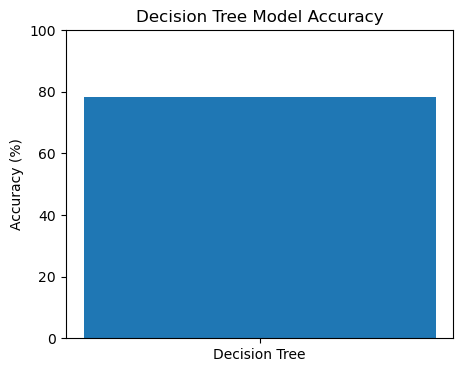
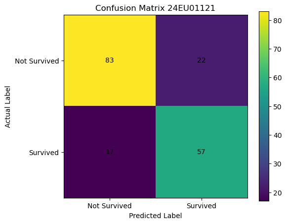

## Experiment: Perform Classification Task on Titanic Dataset
### Sub-Task 1: Import Libraries and Load Dataset


```python
import pandas as pd
import numpy as np
import matplotlib.pyplot as plt

from sklearn.model_selection import train_test_split
from sklearn.preprocessing import LabelEncoder
from sklearn.tree import DecisionTreeClassifier
from sklearn.metrics import accuracy_score, classification_report, confusion_matrix

# Load Titanic dataset
data_url = "https://raw.githubusercontent.com/datasciencedojo/datasets/master/titanic.csv"

titanic_df = pd.read_csv(data_url)

print("First 5 Records:")
display(titanic_df.head())

print("\nDataset Shape:", titanic_df.shape)

print("\nDataset Information:")
titanic_df.info()
```

    First 5 Records:
    


<div>
<style scoped>
    .dataframe tbody tr th:only-of-type {
        vertical-align: middle;
    }

    .dataframe tbody tr th {
        vertical-align: top;
    }

    .dataframe thead th {
        text-align: right;
    }
</style>
<table border="1" class="dataframe">
  <thead>
    <tr style="text-align: right;">
      <th></th>
      <th>PassengerId</th>
      <th>Survived</th>
      <th>Pclass</th>
      <th>Name</th>
      <th>Sex</th>
      <th>Age</th>
      <th>SibSp</th>
      <th>Parch</th>
      <th>Ticket</th>
      <th>Fare</th>
      <th>Cabin</th>
      <th>Embarked</th>
    </tr>
  </thead>
  <tbody>
    <tr>
      <th>0</th>
      <td>1</td>
      <td>0</td>
      <td>3</td>
      <td>Braund, Mr. Owen Harris</td>
      <td>male</td>
      <td>22.0</td>
      <td>1</td>
      <td>0</td>
      <td>A/5 21171</td>
      <td>7.2500</td>
      <td>NaN</td>
      <td>S</td>
    </tr>
    <tr>
      <th>1</th>
      <td>2</td>
      <td>1</td>
      <td>1</td>
      <td>Cumings, Mrs. John Bradley (Florence Briggs Th...</td>
      <td>female</td>
      <td>38.0</td>
      <td>1</td>
      <td>0</td>
      <td>PC 17599</td>
      <td>71.2833</td>
      <td>C85</td>
      <td>C</td>
    </tr>
    <tr>
      <th>2</th>
      <td>3</td>
      <td>1</td>
      <td>3</td>
      <td>Heikkinen, Miss. Laina</td>
      <td>female</td>
      <td>26.0</td>
      <td>0</td>
      <td>0</td>
      <td>STON/O2. 3101282</td>
      <td>7.9250</td>
      <td>NaN</td>
      <td>S</td>
    </tr>
    <tr>
      <th>3</th>
      <td>4</td>
      <td>1</td>
      <td>1</td>
      <td>Futrelle, Mrs. Jacques Heath (Lily May Peel)</td>
      <td>female</td>
      <td>35.0</td>
      <td>1</td>
      <td>0</td>
      <td>113803</td>
      <td>53.1000</td>
      <td>C123</td>
      <td>S</td>
    </tr>
    <tr>
      <th>4</th>
      <td>5</td>
      <td>0</td>
      <td>3</td>
      <td>Allen, Mr. William Henry</td>
      <td>male</td>
      <td>35.0</td>
      <td>0</td>
      <td>0</td>
      <td>373450</td>
      <td>8.0500</td>
      <td>NaN</td>
      <td>S</td>
    </tr>
  </tbody>
</table>
</div>


    
    Dataset Shape: (891, 12)
    
    Dataset Information:
    <class 'pandas.core.frame.DataFrame'>
    RangeIndex: 891 entries, 0 to 890
    Data columns (total 12 columns):
     #   Column       Non-Null Count  Dtype  
    ---  ------       --------------  -----  
     0   PassengerId  891 non-null    int64  
     1   Survived     891 non-null    int64  
     2   Pclass       891 non-null    int64  
     3   Name         891 non-null    object 
     4   Sex          891 non-null    object 
     5   Age          714 non-null    float64
     6   SibSp        891 non-null    int64  
     7   Parch        891 non-null    int64  
     8   Ticket       891 non-null    object 
     9   Fare         891 non-null    float64
     10  Cabin        204 non-null    object 
     11  Embarked     889 non-null    object 
    dtypes: float64(2), int64(5), object(5)
    memory usage: 83.7+ KB
    

### Sub-Task 2: Data Preprocessing


```python
# Handle missing values in Age
titanic_df['Age'] = titanic_df['Age'].fillna(titanic_df['Age'].median())

# Handle missing values in Embarked
titanic_df['Embarked'] = titanic_df['Embarked'].fillna(
    titanic_df['Embarked'].mode()[0]
)

# Remove Cabin column because it contains many missing values
titanic_df.drop('Cabin', axis=1, inplace=True)

# Remove columns that are not required for prediction
titanic_df.drop(
    ['PassengerId', 'Name', 'Ticket'],
    axis=1,
    inplace=True
)

print("Missing Values After Preprocessing:")
print(titanic_df.isnull().sum())

print("\nDataset After Preprocessing:")
display(titanic_df.head())
```

    Missing Values After Preprocessing:
    Survived    0
    Pclass      0
    Sex         0
    Age         0
    SibSp       0
    Parch       0
    Fare        0
    Embarked    0
    dtype: int64
    
    Dataset After Preprocessing:
    


<div>
<style scoped>
    .dataframe tbody tr th:only-of-type {
        vertical-align: middle;
    }

    .dataframe tbody tr th {
        vertical-align: top;
    }

    .dataframe thead th {
        text-align: right;
    }
</style>
<table border="1" class="dataframe">
  <thead>
    <tr style="text-align: right;">
      <th></th>
      <th>Survived</th>
      <th>Pclass</th>
      <th>Sex</th>
      <th>Age</th>
      <th>SibSp</th>
      <th>Parch</th>
      <th>Fare</th>
      <th>Embarked</th>
    </tr>
  </thead>
  <tbody>
    <tr>
      <th>0</th>
      <td>0</td>
      <td>3</td>
      <td>male</td>
      <td>22.0</td>
      <td>1</td>
      <td>0</td>
      <td>7.2500</td>
      <td>S</td>
    </tr>
    <tr>
      <th>1</th>
      <td>1</td>
      <td>1</td>
      <td>female</td>
      <td>38.0</td>
      <td>1</td>
      <td>0</td>
      <td>71.2833</td>
      <td>C</td>
    </tr>
    <tr>
      <th>2</th>
      <td>1</td>
      <td>3</td>
      <td>female</td>
      <td>26.0</td>
      <td>0</td>
      <td>0</td>
      <td>7.9250</td>
      <td>S</td>
    </tr>
    <tr>
      <th>3</th>
      <td>1</td>
      <td>1</td>
      <td>female</td>
      <td>35.0</td>
      <td>1</td>
      <td>0</td>
      <td>53.1000</td>
      <td>S</td>
    </tr>
    <tr>
      <th>4</th>
      <td>0</td>
      <td>3</td>
      <td>male</td>
      <td>35.0</td>
      <td>0</td>
      <td>0</td>
      <td>8.0500</td>
      <td>S</td>
    </tr>
  </tbody>
</table>
</div>


### Sub-Task 3: Encode Categorical Data


```python
# Create label encoder
label_encoder = LabelEncoder()

# Convert categorical columns into numerical values
titanic_df['Sex'] = label_encoder.fit_transform(titanic_df['Sex'])
titanic_df['Embarked'] = label_encoder.fit_transform(titanic_df['Embarked'])

print("Encoded Titanic Dataset:")
display(titanic_df.head())

print("\nData Types After Encoding:")
print(titanic_df.dtypes)
```

    Encoded Titanic Dataset:
    


<div>
<style scoped>
    .dataframe tbody tr th:only-of-type {
        vertical-align: middle;
    }

    .dataframe tbody tr th {
        vertical-align: top;
    }

    .dataframe thead th {
        text-align: right;
    }
</style>
<table border="1" class="dataframe">
  <thead>
    <tr style="text-align: right;">
      <th></th>
      <th>Survived</th>
      <th>Pclass</th>
      <th>Sex</th>
      <th>Age</th>
      <th>SibSp</th>
      <th>Parch</th>
      <th>Fare</th>
      <th>Embarked</th>
    </tr>
  </thead>
  <tbody>
    <tr>
      <th>0</th>
      <td>0</td>
      <td>3</td>
      <td>1</td>
      <td>22.0</td>
      <td>1</td>
      <td>0</td>
      <td>7.2500</td>
      <td>2</td>
    </tr>
    <tr>
      <th>1</th>
      <td>1</td>
      <td>1</td>
      <td>0</td>
      <td>38.0</td>
      <td>1</td>
      <td>0</td>
      <td>71.2833</td>
      <td>0</td>
    </tr>
    <tr>
      <th>2</th>
      <td>1</td>
      <td>3</td>
      <td>0</td>
      <td>26.0</td>
      <td>0</td>
      <td>0</td>
      <td>7.9250</td>
      <td>2</td>
    </tr>
    <tr>
      <th>3</th>
      <td>1</td>
      <td>1</td>
      <td>0</td>
      <td>35.0</td>
      <td>1</td>
      <td>0</td>
      <td>53.1000</td>
      <td>2</td>
    </tr>
    <tr>
      <th>4</th>
      <td>0</td>
      <td>3</td>
      <td>1</td>
      <td>35.0</td>
      <td>0</td>
      <td>0</td>
      <td>8.0500</td>
      <td>2</td>
    </tr>
  </tbody>
</table>
</div>


    
    Data Types After Encoding:
    Survived      int64
    Pclass        int64
    Sex           int64
    Age         float64
    SibSp         int64
    Parch         int64
    Fare        float64
    Embarked      int64
    dtype: object
    

### Sub-Task 4: Separate Features and Target Variable


```python
# Separate input features and output target
features = titanic_df.drop('Survived', axis=1)
target = titanic_df['Survived']

print("Feature Data:")
display(features.head())

print("\nTarget Data:")
display(target.head())
```

    Feature Data:
    


<div>
<style scoped>
    .dataframe tbody tr th:only-of-type {
        vertical-align: middle;
    }

    .dataframe tbody tr th {
        vertical-align: top;
    }

    .dataframe thead th {
        text-align: right;
    }
</style>
<table border="1" class="dataframe">
  <thead>
    <tr style="text-align: right;">
      <th></th>
      <th>Pclass</th>
      <th>Sex</th>
      <th>Age</th>
      <th>SibSp</th>
      <th>Parch</th>
      <th>Fare</th>
      <th>Embarked</th>
    </tr>
  </thead>
  <tbody>
    <tr>
      <th>0</th>
      <td>3</td>
      <td>1</td>
      <td>22.0</td>
      <td>1</td>
      <td>0</td>
      <td>7.2500</td>
      <td>2</td>
    </tr>
    <tr>
      <th>1</th>
      <td>1</td>
      <td>0</td>
      <td>38.0</td>
      <td>1</td>
      <td>0</td>
      <td>71.2833</td>
      <td>0</td>
    </tr>
    <tr>
      <th>2</th>
      <td>3</td>
      <td>0</td>
      <td>26.0</td>
      <td>0</td>
      <td>0</td>
      <td>7.9250</td>
      <td>2</td>
    </tr>
    <tr>
      <th>3</th>
      <td>1</td>
      <td>0</td>
      <td>35.0</td>
      <td>1</td>
      <td>0</td>
      <td>53.1000</td>
      <td>2</td>
    </tr>
    <tr>
      <th>4</th>
      <td>3</td>
      <td>1</td>
      <td>35.0</td>
      <td>0</td>
      <td>0</td>
      <td>8.0500</td>
      <td>2</td>
    </tr>
  </tbody>
</table>
</div>


    
    Target Data:
    


    0    0
    1    1
    2    1
    3    1
    4    0
    Name: Survived, dtype: int64


### Sub-Task 5: Split Dataset into Training and Testing Sets


```python
# Divide dataset into training and testing data
X_train, X_test, y_train, y_test = train_test_split(
    features,
    target,
    test_size=0.20,
    random_state=42
)

print("Training Set Shape:", X_train.shape)
print("Testing Set Shape :", X_test.shape)
```

    Training Set Shape: (712, 7)
    Testing Set Shape : (179, 7)
    

### Sub-Task 6: Create and Train Decision Tree Classifier


```python
# Create Decision Tree model
dt_classifier = DecisionTreeClassifier(random_state=42)

# Train the classifier
dt_classifier.fit(X_train, y_train)

print("Decision Tree Classifier trained successfully!")
```

    Decision Tree Classifier trained successfully!
    

### Sub-Task 7: Make Predictions


```python
# Generate predictions using test data
predictions = dt_classifier.predict(X_test)

print("First 10 Predicted Values:")
print(predictions[:10])

print("\nFirst 10 Actual Values:")
print(y_test.values[:10])
```

    First 10 Predicted Values:
    [0 1 1 1 1 1 1 0 1 1]
    
    First 10 Actual Values:
    [1 0 0 1 1 1 1 0 1 1]
    

### Sub-Task 8: Calculate Classification Accuracy


```python
# Calculate model accuracy
model_accuracy = accuracy_score(y_test, predictions)

print("Decision Tree Classification Accuracy:")
print(f"{model_accuracy:.4f}")

print(f"\nAccuracy Percentage: {model_accuracy * 100:.2f}%")
```

    Decision Tree Classification Accuracy:
    0.7821
    
    Accuracy Percentage: 78.21%
    


```python
plt.figure(figsize=(5, 4))

plt.bar(["Decision Tree"], [model_accuracy * 100])

plt.title("Decision Tree Model Accuracy")
plt.ylabel("Accuracy (%)")
plt.ylim(0, 100)

plt.show()
```


    

    


### Sub-Task 9: Generate Confusion Matrix


```python

```


```python
conf_matrix = confusion_matrix(y_test, predictions)

plt.figure(figsize=(6, 5))

plt.imshow(conf_matrix)

plt.title("Confusion Matrix 24EU01121")
plt.xlabel("Predicted Label")
plt.ylabel("Actual Label")

plt.xticks([0, 1], ["Not Survived", "Survived"])
plt.yticks([0, 1], ["Not Survived", "Survived"])

# Display values inside the matrix
for i in range(2):
    for j in range(2):
        plt.text(j, i, conf_matrix[i, j],
                 ha="center", va="center")

plt.colorbar()
plt.show()
```


    

    


### Sub-Task 10: Generate Classification Report


```python
# Display detailed classification performance
print("Classification Report:")
print(classification_report(y_test, predictions))
```

    Classification Report:
                  precision    recall  f1-score   support
    
               0       0.83      0.79      0.81       105
               1       0.72      0.77      0.75        74
    
        accuracy                           0.78       179
       macro avg       0.78      0.78      0.78       179
    weighted avg       0.79      0.78      0.78       179
    
    

### Sub-Task 11: Display Final Results


```python
print("=" * 45)
print("       TITANIC CLASSIFICATION RESULTS")
print("=" * 45)

print(f"Training Samples : {len(X_train)}")
print(f"Testing Samples  : {len(X_test)}")
print(f"Accuracy         : {model_accuracy * 100:.2f}%")

print("\nConfusion Matrix:")
print(conf_matrix)

print("\nClassification Report:")
print(classification_report(y_test, predictions))
```

    =============================================
           TITANIC CLASSIFICATION RESULTS
    =============================================
    Training Samples : 712
    Testing Samples  : 179
    Accuracy         : 78.21%
    
    Confusion Matrix:
    [[83 22]
     [17 57]]
    
    Classification Report:
                  precision    recall  f1-score   support
    
               0       0.83      0.79      0.81       105
               1       0.72      0.77      0.75        74
    
        accuracy                           0.78       179
       macro avg       0.78      0.78      0.78       179
    weighted avg       0.79      0.78      0.78       179
    
    


```python

```


```python

```


```python

```


```python

```
