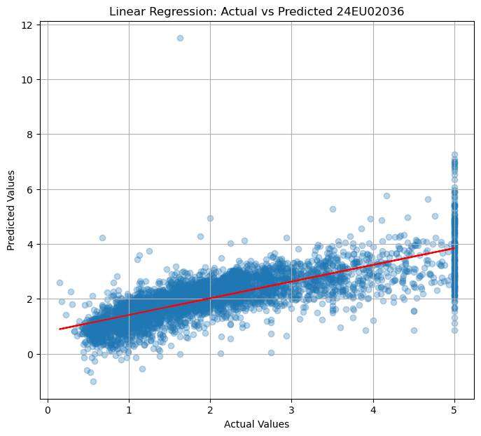

```python
 California Housing Regression

import pandas as pd
import numpy as np
import matplotlib.pyplot as plt

from sklearn.datasets import fetch_california_housing
from sklearn.model_selection import train_test_split
from sklearn.preprocessing import StandardScaler
from sklearn.linear_model import LinearRegression
from sklearn.svm import SVR
from sklearn.tree import DecisionTreeRegressor
from sklearn.metrics import mean_absolute_error, mean_squared_error, r2_score
```


```python
# --------------------------------------------------
# 1. Load California Housing Dataset
# --------------------------------------------------

data = fetch_california_housing(as_frame=True)

df = data.frame

print("Dataset Shape:", df.shape)
print(df.head())
```


```python
# --------------------------------------------------
# 2. Separate Features and Target
# --------------------------------------------------

X = df.drop("MedHouseVal", axis=1)
y = df["MedHouseVal"]
```


```python
# --------------------------------------------------
# 3. Split Dataset
# --------------------------------------------------

X_train, X_test, y_train, y_test = train_test_split(
    X,
    y,
    test_size=0.2,
    random_state=42
)
```


```python
# --------------------------------------------------
# 4. Feature Scaling
# --------------------------------------------------

scaler = StandardScaler()

X_train_scaled = scaler.fit_transform(X_train)
X_test_scaled = scaler.transform(X_test)
```


```python
# --------------------------------------------------
# 5. Linear Regression
# --------------------------------------------------

lr = LinearRegression()

lr.fit(X_train_scaled, y_train)

y_pred_lr = lr.predict(X_test_scaled)

mae_lr = mean_absolute_error(y_test, y_pred_lr)
mse_lr = mean_squared_error(y_test, y_pred_lr)
rmse_lr = np.sqrt(mse_lr)
r2_lr = r2_score(y_test, y_pred_lr)

print("\nLinear Regression")
print("MAE :", round(mae_lr, 4))
print("MSE :", round(mse_lr, 4))
print("RMSE:", round(rmse_lr, 4))
print("R² Score:", round(r2_lr, 4))
```


```python
# --------------------------------------------------
# 6. Support Vector Regression
# --------------------------------------------------

svr = SVR(kernel="rbf")

svr.fit(X_train_scaled, y_train)

y_pred_svr = svr.predict(X_test_scaled)

mae_svr = mean_absolute_error(y_test, y_pred_svr)
mse_svr = mean_squared_error(y_test, y_pred_svr)
rmse_svr = np.sqrt(mse_svr)
r2_svr = r2_score(y_test, y_pred_svr)

print("\nSupport Vector Regression")
print("MAE :", round(mae_svr, 4))
print("MSE :", round(mse_svr, 4))
print("RMSE:", round(rmse_svr, 4))
print("R² Score:", round(r2_svr, 4))
```


```python
# --------------------------------------------------
# 7. Decision Tree Regression
# --------------------------------------------------

dt = DecisionTreeRegressor(random_state=42)

dt.fit(X_train, y_train)

y_pred_dt = dt.predict(X_test)

mae_dt = mean_absolute_error(y_test, y_pred_dt)
mse_dt = mean_squared_error(y_test, y_pred_dt)
rmse_dt = np.sqrt(mse_dt)
r2_dt = r2_score(y_test, y_pred_dt)

print("\nDecision Tree Regression")
print("MAE :", round(mae_dt, 4))
print("MSE :", round(mse_dt, 4))
print("RMSE:", round(rmse_dt, 4))
print("R² Score:", round(r2_dt, 4))
```


```python
# --------------------------------------------------
# 8. Actual vs Predicted Plot
# --------------------------------------------------

plt.figure(figsize=(8, 7))

plt.scatter(y_test, y_pred_lr, alpha=0.3)

plt.xlabel("Actual Values")
plt.ylabel("Predicted Values")

plt.title("Linear Regression: Actual vs Predicted 24EU02036")

# Regression line
m, b = np.polyfit(y_test, y_pred_lr, 1)

plt.plot(
    y_test,
    m * y_test + b,
    color="red"
)

plt.grid(True)

plt.show()
```

    Dataset Shape: (20640, 9)
       MedInc  HouseAge  AveRooms  AveBedrms  Population  AveOccup  Latitude  \
    0  8.3252      41.0  6.984127   1.023810       322.0  2.555556     37.88   
    1  8.3014      21.0  6.238137   0.971880      2401.0  2.109842     37.86   
    2  7.2574      52.0  8.288136   1.073446       496.0  2.802260     37.85   
    3  5.6431      52.0  5.817352   1.073059       558.0  2.547945     37.85   
    4  3.8462      52.0  6.281853   1.081081       565.0  2.181467     37.85   
    
       Longitude  MedHouseVal  
    0    -122.23        4.526  
    1    -122.22        3.585  
    2    -122.24        3.521  
    3    -122.25        3.413  
    4    -122.25        3.422  
    
    Linear Regression
    MAE : 0.5332
    MSE : 0.5559
    RMSE: 0.7456
    R² Score: 0.5758
    
    Support Vector Regression
    MAE : 0.3986
    MSE : 0.357
    RMSE: 0.5975
    R² Score: 0.7276
    
    Decision Tree Regression
    MAE : 0.4547
    MSE : 0.4952
    RMSE: 0.7037
    R² Score: 0.6221
    


    

    


```python

```
